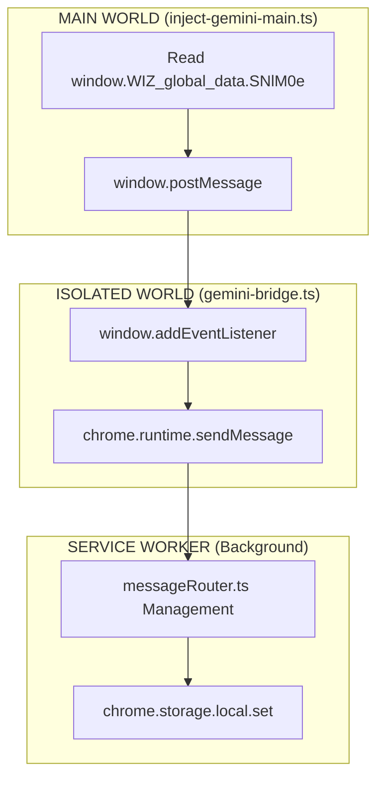

# Skill: Chrome Extension Development (Manifest V3)

## 1. MV3 Service Worker Lifecycle

### Critical Constraints
- **Lifecycle**: Service Worker се УБИВА след ~30 секунди idle.
- **Persistence**: НЯМА persistent background page (за разлика от MV2).
- **Memory**: Всичко в паметта се губи при restart.
- **Listeners**: `chrome.webRequest` listeners ОСТАВАТ регистрирани между restarts.
- **Alarms**: `chrome.alarms` ОЦЕЛЯВА между restarts.

### State Management Rules
**DO:**
- ✅ Пази state в `chrome.storage.local`.
- ✅ Регистрирай listeners в top-level scope (не в async функции).
- ✅ Използвай `chrome.alarms` за периодични задачи.
- ✅ Re-initialize managers при всяко стартиране на SW.

**DON'T:**
- ❌ Не пази state в class properties (ще се загуби).
- ❌ Не разчитай на `setTimeout`/`setInterval` > 30s.
- ❌ Не кеширай tokens в памет без storage backup.
- ❌ Не използвай global variables за persistence.

### Initialization Pattern
```typescript
// service-worker.ts — CORRECT
// All managers are instantiated at TOP LEVEL
// so they re-register listeners on every SW wake

const authManager = new AuthManager()      // Registers webRequest listeners
const messageRouter = new MessageRouter()  // Registers onMessage listener

authManager.initialize()    // Called every time SW starts
messageRouter.listen()      // Called every time SW starts

// Storage write to persist config across restarts
chrome.storage.local.set({ CONFIG_KEY: value })
```

### Alarm Pattern (for periodic tasks)
```typescript
// Token refresh every 4 minutes
chrome.alarms.create('token-refresh', { periodInMinutes: 4 })

chrome.alarms.onAlarm.addListener((alarm) => {
  if (alarm.name === 'token-refresh') {
    refreshTokenIfNeeded()  // Reads from storage, not memory
  }
})

// IMPORTANT: Check if alarm exists before creating
// (prevents duplicates on SW restart)
chrome.alarms.get('token-refresh', (existing) => {
  if (!existing) {
    chrome.alarms.create('token-refresh', { periodInMinutes: 4 })
  }
})
```

## 2. Content Script Worlds

### ISOLATED World (Default)
**Capabilities:**
- ✅ Access to `chrome.runtime.sendMessage`
- ✅ Access to `chrome.storage` (limited)
- ✅ Can read/modify DOM
- ✅ Separate JS context from page

**Limitations:**
- ❌ Cannot access `window.*` page variables
- ❌ Cannot intercept page's XHR/Fetch
- ❌ Cannot read page's JavaScript state

**Use For:**
- → Message relay (bridge pattern)
- → DOM reading (for conversation ID extraction)
- → Receiving commands from background

### MAIN World (via `chrome.scripting.executeScript`)
**Capabilities:**
- ✅ Full access to `window.*` variables
- ✅ Can intercept XHR/Fetch (monkey-patch)
- ✅ Can read page framework state (React, Angular)
- ✅ Can access cookies visible to page JS

**Limitations:**
- ❌ NO access to `chrome.runtime.sendMessage`
- ❌ NO access to `chrome.storage`
- ❌ Must communicate via `window.postMessage`

**Use For:**
- → Reading Gemini's `window.WIZ_global_data.SNlM0e`
- → Intercepting network responses (if needed)
- → Reading framework-specific state objects

**Injection:**
```typescript
await chrome.scripting.executeScript({
  target: { tabId },
  world: 'MAIN',
  files: ['src/content/inject-gemini-main.js'],
})
// File MUST be in web_accessible_resources
```

### Communication Bridge Pattern


## 3. webRequest API (Token Capture)

### What MV3 webRequest CAN Do
- ✅ Read request headers (`onBeforeSendHeaders`)
- ✅ Read request URL and method
- ✅ Read request body/formData (`onBeforeRequest` with `requestBody`)
- ✅ Filter by URL pattern
- ✅ Run in background (Service Worker)

### What MV3 webRequest CANNOT Do
- ❌ Read response body (removed in MV3)
- ❌ Modify request headers (without `declarativeNetRequest`)
- ❌ Block requests (without `declarativeNetRequest`)
- ❌ Access response headers reliably for all cases

### Token Capture Patterns

#### Pattern 1: Authorization Header (ChatGPT, DeepSeek, Perplexity)
```typescript
chrome.webRequest.onBeforeSendHeaders.addListener(
  (details) => {
    const auth = details.requestHeaders?.find(
      h => h.name.toLowerCase() === 'authorization'
    )
    if (auth?.value?.startsWith('Bearer ')) {
      chrome.storage.local.set({ platform_token: auth.value })
    }
  },
  { urls: ['https://platform.com/api/*'] },
  ['requestHeaders']
)
```

#### Pattern 2: Custom Headers (Grok CSRF, Qwen XSRF)
```typescript
chrome.webRequest.onBeforeSendHeaders.addListener(
  (details) => {
    const csrf = details.requestHeaders?.find(
      h => h.name.toLowerCase() === 'x-csrf-token'
    )
    if (csrf?.value) {
      chrome.storage.local.set({ grok_csrf: csrf.value })
    }
  },
  { urls: ['https://x.com/i/api/*'] },
  ['requestHeaders']
)
```

#### Pattern 3: URL Path Extraction (Claude org_id)
```typescript
chrome.webRequest.onBeforeRequest.addListener(
  (details) => {
    const match = details.url.match(/\/organizations\/([^\/]+)\//)
    if (match?.[1]) {
      chrome.storage.local.set({ claude_org_id: match[1] })
    }
  },
  { urls: ['https://claude.ai/api/organizations/*'] },
  []  // No extra info needed
)
```

#### Pattern 4: Request Body (Gemini dynamic key)
```typescript
chrome.webRequest.onBeforeRequest.addListener(
  (details) => {
    if (!details.url.includes('batchexecute')) return
    const formData = details.requestBody?.formData
    if (formData?.['f.req']) {
      const match = formData['f.req'][0].match(/"([a-zA-Z0-9]{5,6})",\s*"\[/)
      if (match) {
        chrome.storage.local.set({ gemini_dynamic_key: match[1] })
      }
    }
  },
  { urls: ['https://gemini.google.com/*'] },
  ['requestBody']  // Required to access formData
)
```

### Token Storage Convention
Key naming: `{platform}_{token_type}`

| Key | Description |
|-----|-------------|
| `chatgpt_token` | Full "Bearer ..." string |
| `claude_org_id` | Organization UUID |
| `gemini_at_token` | SNlM0e token value |
| `gemini_dynamic_key` | 5-6 char RPC ID |
| `grok_csrf_token` | CSRF value |
| `grok_auth_token` | Full auth header |
| `deepseek_token` | Full "Bearer ..." string |
| `deepseek_version` | x-client-version value |
| `perplexity_session` | Full "Bearer ..." or cookie string |
| `qwen_xsrf_token` | XSRF token value |
| `qwen_app_id` | X-App-Id value |

## 4. Platform Adapter Pattern

### Architecture
`platformAdapters/`
- `base.ts`          (Interface + base class)
- `index.ts`         (Registry + dispatcher)
- `gemini.adapter.ts`
- `chatgpt.adapter.ts`
- `claude.adapter.ts`
- `grok.adapter.ts`
- `perplexity.adapter.ts`
- `deepseek.adapter.ts`
- `qwen.adapter.ts`
- `lmarena.adapter.ts`

### Base Class Contract
```typescript
interface IPlatformAdapter {
  readonly platform: string
  fetchConversation(id: string, url?: string, payload?: unknown): Promise<Conversation>
}

abstract class BasePlatformAdapter implements IPlatformAdapter {
  // Read tokens from chrome.storage.local
  protected getStorageValues(keys: string[]): Promise<Record<string, string>>
  protected getStorageToken(key: string): Promise<string>  // throws if missing
  protected removeStorageKeys(keys: string[]): Promise<void>
}
```

### Adapter Implementation Checklist
1. □ Extend `BasePlatformAdapter`
2. □ Set `readonly platform = 'platform_id'`
3. □ Implement `fetchConversation()`:
   a. □ Read tokens from storage
   b. □ Build API request (URL, headers, body)
   c. □ Wrap in rate limiter: `limiters.platform.schedule(async () => {...})`
   d. □ Handle auth errors (400/401/403) — clear invalid tokens
   e. □ Parse response
   f. □ Call normalizer function
   g. □ Return `Conversation` object
4. □ Add to registry in `index.ts`
5. □ Add rate limiter in `rate-limiter.ts`
6. □ Add normalizer function in `normalizers.ts`
7. □ Add content bridge in `content/{platform}-bridge.ts`
8. □ Add to `manifest.json` `content_scripts`
9. □ Add `webRequest` listener in `authManager.ts`
10. □ Add URL pattern in `platformConfig.ts`

### Rate Limiting
```typescript
// Token bucket algorithm — per platform
export const limiters = {
  chatgpt:    new RateLimiter(60, 60000),   // 60 req/min
  claude:     new RateLimiter(30, 60000),   // 30 req/min
  gemini:     new RateLimiter(20, 60000),   // 20 req/min
  deepseek:   new RateLimiter(40, 60000),   // 40 req/min
  perplexity: new RateLimiter(30, 60000),   // 30 req/min
  grok:       new RateLimiter(20, 60000),   // 20 req/min (Twitter limits)
  qwen:       new RateLimiter(50, 60000),   // 50 req/min
  lmarena:    new RateLimiter(10, 60000),   // 10 req/min (Gradio slow)
  dashboard:  new RateLimiter(100, 60000),  // 100 req/min
}

// Usage in adapter:
async fetchConversation(id: string): Promise<Conversation> {
  return limiters.gemini.schedule(async () => {
    // ... actual fetch logic
  })
}
```

## 5. Context Menu API

### Menu Structure
Right-click on AI platform page:
- 💾 **Save Chat to BrainBox** (contexts: `['page']`, documentUrlPatterns: [AI URLs only])

Right-click with text selected:
- 📝 **Create Prompt from Selection** (contexts: `['selection']`)
- ✨ **AI Enhance Selection** (contexts: `['selection', 'editable']`)

Right-click in textarea:
- 🧠 **Inject Prompt** (contexts: `['editable']`)
  - 🔍 Search Prompts...
  - ————————
  - 📂 **Folder 1**
    - Prompt A
    - Prompt B
  - 📂 **Folder 2**
    - Prompt C
  - ————————
  - ⚡ **Quick (last 7)**
    - Recent Prompt 1
    - Recent Prompt 2

### Rebuild Strategy
```typescript
// Menus rebuild on storage changes (prompt sync, folder update)
chrome.storage.onChanged.addListener((changes, area) => {
  if (area === 'local' && relevantKeysChanged(changes)) {
    rebuildMenus()  // removeAll() → create fresh
  }
})

// Debounce: prevent concurrent rebuilds
private isRebuilding = false
private needsRebuild = false

async rebuildMenus() {
  if (this.isRebuilding) {
    this.needsRebuild = true
    return
  }
  this.isRebuilding = true
  // ... rebuild logic ...
  this.isRebuilding = false
  if (this.needsRebuild) this.rebuildMenus()
}
```

## 6. `chrome.storage.local` Best Practices

### Size Limits
- **Default**: 10 MB total
- **unlimitedStorage**: Unlimited (but slow for large data)

**Recommendation**:
- Tokens/settings: < 100 KB total (fast)
- Sync queue: < 1 MB (manageable)
- Full conversations: Use IndexedDB or send directly to API

### Read/Write Patterns
```typescript
// GOOD: Batch reads
const { token, key, orgId } = await chrome.storage.local.get([
  'gemini_at_token', 'gemini_dynamic_key', 'claude_org_id'
])

// BAD: Sequential reads
const t = await chrome.storage.local.get('gemini_at_token')
const k = await chrome.storage.local.get('gemini_dynamic_key')  // Extra IPC

// GOOD: Batch writes
await chrome.storage.local.set({
  accessToken: encrypted,
  refreshToken: encryptedRefresh,
  expiresAt: timestamp,
})
```

### Reactive Updates
```typescript
// Listen for changes (popup, content scripts)
chrome.storage.onChanged.addListener((changes, area) => {
  if (area !== 'local') return
  if (changes.accessToken) {
    // Auth state changed — update UI
  }
  if (changes.brainbox_prompts_cache) {
    // Prompts updated — rebuild menus
  }
})
```

## 7. CRXJS Build Pipeline

### How It Works
1. `manifest.json` → CRXJS reads as config
2. TypeScript content scripts → compiled to JS automatically
3. React popup → built as separate entry point
4. Service Worker → bundled as ES module
5. `web_accessible_resources` → copied to `dist/`
6. HMR in dev → auto-reload on file changes

### Common Issues
- **Module not found**: Check `vite.config.ts` aliases match `tsconfig.json` paths.
- **Injections failing**: Check `manifest.json` matches patterns; check `run_at` timing.
- **MAIN world script**: Must be in `web_accessible_resources` and injected via `chrome.scripting`.

## 8. Security Considerations

### Token Storage
- **Dashboard tokens**: AES-GCM encrypted before storage.
- **Platform tokens**: Stored as-is (intercepted from user's own requests).

**Why platform tokens aren't encrypted:**
- They're the user's own session tokens.
- They rotate frequently (every page visit).
- Encrypting would add latency to every API call.
- The risk model is different from dashboard auth.

### Content Security Policy (CSP)
```json
"content_security_policy": {
  "extension_pages": "script-src 'self'; object-src 'none'; frame-ancestors 'none';"
}
```

### Permission Justification Template
For Chrome Web Store review:
- `storage`: Store user preferences and cached data.
- `webRequest`: Detect when user visits AI platforms (token capture).
- `cookies`: Access session cookies for platforms using cookie auth.
- `contextMenus`: "Save Chat" and "Enhance" right-click options.
- `tabs`: Open dashboard login page.
- `scripting`: Inject token reader on Gemini (MAIN world).
- `activeTab`: Access current tab URL for platform detection.
- `alarms`: Periodic token refresh (4 min interval).
- `notifications`: Save success/failure notifications.