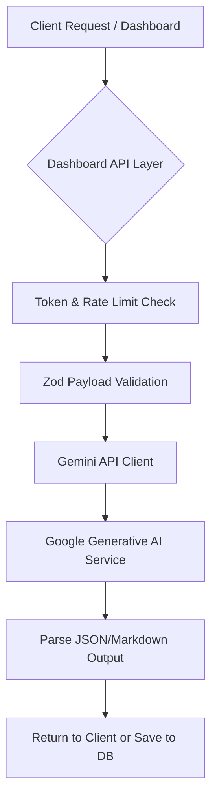

<!-- doc: AI_PIPELINE.md | version: 1.0 | last-updated: 2026-02-28 -->
# 📄 AI_PIPELINE.md

## 🤖 AI Pipeline Architecture

**Boundaries:** The Extension never calls the Gemini API directly with server credentials to prevent leakage. All AI processing flows through the Dashboard's `/api/` Next.js routes, where the server utilizes the Google SDK safely.

## 🔧 Gemini SDK Integration

- **Package**: `@google/generative-ai`
- **Initialization**: Centralized in `@brainbox/shared/src/services/ai.ts` exporting pre-configured SDK instances.
- **Keys**: Managed exclusively via the Dashboard `.env.local` `GEMINI_API_KEY`. Keys are rotated via Vercel config.

## 📡 API Routes & Endpoints

- `/api/prompts/enhance`: Receives raw prompt text, applies the `prompt_improvement` model, and returns an enhanced structural output.
- `/api/chats/analyze`: Receives full conversation history, applies the `analysis` model, and extracts tasks or summaries.
- **Validation**: Strict input schema boundaries using Zod (e.g., `content: z.string().max(8000)` to prevent excessive payload injection).

## ⚙️ ai_models_config.json

Location: `@brainbox/shared/src/config/ai_models_config.json`

| Field | Type | Description |
|---|---|---|
| `analysis` | `gemini-3-flash` (v1beta) | Chat analysis, summary generation, and task extraction. |
| `embedding` | `text-embedding-004` (v1beta) | Semantic embeddings for search. |
| `prompt_improvement` | `gemini-3-flash` (v1beta) | Enhancing and structuring user prompts. |

**Model Selection:** We utilize `gemini-3-flash` as our primary reasoning engine for both latency and cost-effectiveness. The fallback logic seamlessly downgrades to older versions if a temporal outage occurs, configurable centrally in this JSON.

## 🔄 Prompt Enhancement Pipeline

1. **Input**: User clicks "Enhance" -> `POST /api/prompts/enhance { "content": "..." }`.
2. **System Prefix**: We prepend a specialized metaprompt demanding structured markdown output, adherence to persona creation, and clarity.
3. **Execution**: SDK calls `gemini-3-flash` via `generateContentStream` or `generateContent` depending on UX needs. Defaults: `temperature: 0.7`, `topP: 0.95`.
4. **Parsing**: The API strips markdown code blocks wrappers surrounding the raw text if necessary before returning.

## 🛡️ Error Handling & Resilience

- **Rate Limiting**: Implementation relies on Upstash core limiters wrapping the API routes. Client-side fetch wrappers implement generic backoff.
- **Failures**: Google API 503/429 errors are caught and surfaced via standard `ProblemDetails` JSON format to trigger user-friendly toast errors.
- **Graceful Degradation**: If `gemini-3-flash` throws quota errors, the client avoids breaking the UI, offering standard non-enhanced saving instead.

## 💰 Cost & Usage Management

- **Token Limits**: We track usage implicitly via Vercel analytics logs and Google Cloud quotas. Hard stops triggered via GGC budget alarms. User-level token restriction via Supabase `usage_logs` is pending implementation.

## 🔒 Security Considerations

- **Prompt Injection**: System instructions emphatically declare separation between metaprompt rules and user input via structural delimiters (`=== USER INPUT ===`).
- **Content Filter**: Relying on default Gemini API blocklists (HATE, HARASSMENT, SEXUALLY_EXPLICIT) set to `BLOCK_MEDIUM_AND_ABOVE`.

## 🧪 Testing AI Features

We rely tightly on Vitest mocking strategies to unit-test AI routing:
- `vi.spyOn` the SDK's `generateContent` method returning static fixture data resolving deterministically instead of consuming network requests.

## 📎 Related Documents
- [ARCHITECTURE.md](./ARCHITECTURE.md)
- [PROMPTS.md](./PROMPTS.md)
