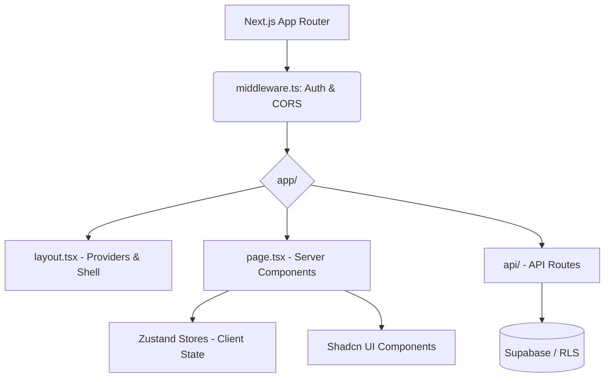

<!-- doc: DASHBOARD.md | version: 1.0 | last-updated: 2026-02-28 -->
# 📄 DASHBOARD.md

## 🏗️ Dashboard Architecture Overview

> For the complete system architecture, communication paths, and inter-package boundaries,
> see [ARCHITECTURE.md](./ARCHITECTURE.md).
> This document focuses on **Dashboard-specific** implementation details.



### Relationship to Extension
The Next.js Dashboard manages all business logic, persistent data ownership in Supabase, and UI state for power users. The Extension is a passive observer that solely captures AI chats and uses an HTTP API (Bearer JWT) to send them to the Dashboard's `/api/` routes. The Dashboard operates entirely independently and never relies on the extension to function.

## 🔧 Project Setup & Scripts

| Command | Description |
|---|---|
| `pnpm dev` | Starts Next.js development server with Fast Refresh. |
| `pnpm build` | Compiles the application for production deployment. |
| `pnpm start` | Runs the built production server locally. |
| `pnpm lint` | Runs ESLint and TypeScript checks across the dashboard. |

### Environment Variables
```typescript
// .env / .env.local schema
NEXT_PUBLIC_SUPABASE_URL=string
NEXT_PUBLIC_SUPABASE_ANON_KEY=string
// Server-only:
SUPABASE_SERVICE_ROLE_KEY=string
API_BASE_URL=string
DEBUG_MODE=boolean // MUST BE FALSE for prod
```

### Next.js Config Highlights
Next.js configuration (`next.config.js`) handles:
- Strict mode enabled.
- Tailwind v4 support and external package transpilations.
- Ignoring build errors is **forbidden** as per absolute core rules.

## 📡 Route Map

| Path | Component | Guard | Server/Client? |
|---|---|---|---|
| `/` | `Home` | Public / Redirects to `/dashboard` if auth'd | Server |
| `/dashboard` | `DashboardLayout` | Auth Required | Server + Client |
| `/extension-auth` | `ExtensionAuth` | Auth Required | Client |
| `/api/**` | `Route Handlers` | Auth/Bearer JWT check | Server Only |

### Route Guards Implementation
All route protections are managed centrally in `src/middleware.ts` running at the edge. It verifies the Supabase session token. Unauthenticated users are redirected to the login flow.

## 🗂️ Zustand Store Map

> ✅ **Ground truth** — extracted directly from `apps/dashboard/src/store/` on 2026-02-28.
> Every store listed here has a corresponding file that exists in the codebase.
> 
> **Architecture Note:** The `persist` middleware is implemented for all domain stores (`useAuthStore`, `useChatStore`, `useFolderStore`, `useImageStore`, `useListStore`, `usePromptStore`) to cache their primary data locally. `useUIStore` handles transient state only and is omitted.

### `useChatStore` — `src/store/useChatStore.ts`
```typescript
interface ChatStore {
  chats: Chat[];               // All loaded chats
  selectedChatId: string | null; // Single active chat (NOT activeChatId)
  selectedChatIds: Set<string>;  // Multi-select set
  isLoading: boolean;

  setChats: (chats: Chat[]) => void;
  addChat: (chat: Chat) => void;
  updateChat: (id: string, chat: Partial<Chat>) => Promise<void>; // optimistic
  deleteChat: (id: string) => Promise<void>;                       // optimistic
  deleteChats: (ids: string[]) => Promise<void>;                   // optimistic
  toggleChatSelection: (id: string) => void;
  selectAllChats: () => void;
  deselectAllChats: () => void;
  selectChat: (id: string | null) => void;
  setLoading: (loading: boolean) => void;
}
```

### `useFolderStore` — `src/store/useFolderStore.ts`
```typescript
interface FolderStore {
  folders: Folder[];
  selectedFolderId: string | null;
  isLoading: boolean;

  setFolders: (folders: Folder[]) => void;
  addFolder: (folder: Folder) => void;
  updateFolder: (id: string, folder: Partial<Folder>) => void; // optimistic
  deleteFolder: (id: string) => void;                          // optimistic
  selectFolder: (id: string | null) => void;
  setLoading: (loading: boolean) => void;
}
```

### `usePromptStore` — `src/store/usePromptStore.ts`
```typescript
interface PromptStore {
  prompts: Prompt[];
  selectedPromptIds: string[];
  isLoading: boolean;

  setPrompts: (prompts: Prompt[]) => void;
  addPrompt: (prompt: Prompt) => void;
  updatePrompt: (id: string, prompt: Partial<Prompt>) => Promise<void>; // optimistic
  deletePrompt: (id: string) => Promise<void>;                           // optimistic
  togglePromptSelection: (id: string) => void;
  clearSelection: () => void;
  setLoading: (loading: boolean) => void;
}
```

### `useImageStore` — `src/store/useImageStore.ts`
```typescript
interface ImageStore {
  images: Image[];
  selectedImageIds: Set<string>;
  isLoading: boolean;
  uploadQueue: UploadItem[];

  setImages: (images: Image[]) => void;
  addImage: (image: Image) => void;
  updateImage: (id: string, updates: Partial<Image>) => void;
  deleteImage: (id: string) => void;
  setLoading: (isLoading: boolean) => void;

  // Bulk operations
  toggleImageSelection: (id: string) => void;
  selectAllImages: (imageIds: string[]) => void;
  clearSelection: () => void;

  // Upload queue
  addToUploadQueue: (item: UploadItem) => void;
  updateUploadProgress: (id: string, progress: number, status?, error?) => void;
  removeFromUploadQueue: (id: string) => void;

  // Supabase integration (direct — note: images fetched directly, not via API route)
  fetchImages: (userId: string, folderId?: string) => Promise<void>;
  deleteImages: (imageIds: string[]) => Promise<void>;
  moveImages: (imageIds: string[], folderId: string | null) => Promise<void>;
}
```

### `useListStore` — `src/store/useListStore.ts`
```typescript
interface ListStore {
  lists: ListWithItems[];
  selectedListId: string | null;
  isLoading: boolean;

  // List CRUD
  setLists: (lists: ListWithItems[]) => void;
  addList: (list: ListWithItems) => void;
  updateList: (id: string, updates: Partial<ListWithItems>) => void;
  deleteList: (id: string) => void;
  selectList: (id: string | null) => void;

  // Item CRUD (all optimistic)
  addItemToList: (listId: string, item: ListItem) => void;
  updateItemInList: (listId: string, itemId: string, updates: Partial<ListItem>) => void;
  deleteItemFromList: (listId: string, itemId: string) => void;

  setLoading: (loading: boolean) => void;
}
```

### `useAuthStore` (`src/store/useAuthStore.ts`)
```typescript
interface AuthStore {
  user: User | null;
  session: Session | null;
  isLoading: boolean;
  
  setUser: (user: User | null) => void;
  setSession: (session: Session | null) => void;
  setLoading: (loading: boolean) => void;
  clearAuth: () => void;
}
```

### `useUIStore` (`src/store/useUIStore.ts`)
```typescript
interface UIStore {
  isMobileSidebarOpen: boolean;
  isGlobalBrainOpen: boolean;
  toggleMobileSidebar: () => void;
  toggleGlobalBrain: () => void;
  setMobileSidebarOpen: (isOpen: boolean) => void;
  setGlobalBrainOpen: (isOpen: boolean) => void;
}
```

> **Transient State Note:** Unlike domain stores above, `useAuthStore` and `useUIStore` deliberately **do NOT use** the `persist` middleware.
> Auth state is fetched cleanly from the server (Supabase `auth.getUser()`) on load to avoid stale sessions. UI state like sidebar visibility resets on reload by design. Theme switching is handled separately by `next-themes`.

### Persistence & Hydration
От 5-те активни stores, **нито един** не използва `persist` middleware към localStorage в момента. `useShallow` е задължителен при Zustand деструктуриране (CORE RULES §6).

## 🎨 UI State Management

- **Loading States**: Uses Skeleton components from Shadcn for content placeholders. Server components stream data with `<Suspense>`.
- **Error Boundary**: Global `error.tsx` file catches React errors per route segment.
- **Theme Switching**: Handled via `next-themes` and Tailwind v4 CSS variables. Dark mode is driven by semantic tokens.
- **Toast Notifications**: Managed by Shadcn's Toaster wrapper (`sonner` or `react-hot-toast`), tracking success/error states asynchronously via optimistic updates.

## 📦 Key Components Inventory

| Component | Path | Props | Used By |
|---|---|---|---|
| `Button` | `src/components/ui/button.tsx` | `variant`, `size`, `asChild` | Everywhere |
| `Card` | `src/components/ui/card.tsx` | standard div props | Dashboard views |
| `Sidebar` | `src/components/layout/sidebar.tsx` | `isOpen`, `user` | `DashboardLayout` |
| `ThemeToggle` | `src/components/theme-toggle.tsx` | none | Navbar/Sidebar |

These primitives follow the Shadcn UI design system utilizing Tailwind utility classes and CSS variables defined in `@brainbox/ui`.

## 🔌 Dashboard ↔ Extension Communication

**One-Way Sync**: The Extension communicates with the Dashboard strictly via secure HTTP POST requests to `/api/*` routes.
**Token Bridge**: During login or extension activation, the Dashboard `/extension-auth` page passes a secure JWT locally via the active DOM content script (`content-dashboard-auth.ts`) pushing to `chrome.runtime.sendMessage()`.
If the extension is absent, the dashboard operates normally as the single source of truth.

## ⚡ Performance Considerations

- **Server Components**: We bias heavily towards React Server Components (RSC) to minimize JS bundle sizes.
- **Bundle Size Target**: `< 250KB` main bundle. Client components are lazy-loaded where possible using `next/dynamic`.
- **LCP Target**: `< 2.5s` achieved through edge caching and optimal font/image loading strategies.

## 📎 Related Documents
- [ARCHITECTURE.md](./ARCHITECTURE.md)
- [UI_SYSTEM.md](./UI_SYSTEM.md)
- [CODE_GUIDELINES.md](./CODE_GUIDELINES.md)
