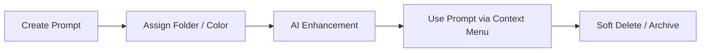

<!-- doc: PROMPTS.md | version: 1.0 | last-updated: 2026-02-28 -->
# 📄 PROMPTS.md

## 📚 Prompt Library — Domain Overview
A "prompt" in Brainbox acts as a reusable template or snippet of text that a user can quickly inject into AI chat interfaces (via the Chrome Extension) or use within the Dashboard for processing captured interactions.
Prompts are organized logically, colored for visual distinction, and optionally surfaced specifically in context menus.



## 📊 Data Models

The following TypeScript interfaces mirror the Zod validation schemas present in `@brainbox/validation/schemas/prompt.ts`.

```typescript
interface Prompt {
  id: string; // UUID
  title: string;
  content: string;
  color?: string; // Hex color matching /^#[0-9A-Fa-f]{6}$/
  folder_id?: string | null; // UUID referencing the Folder
  use_in_context_menu?: boolean;
  created_at: string;
  updated_at: string;
}

interface Folder {
  id: string;                         // UUID — auto-generated
  name: string;                       // Required — display name
  color: string;                      // Required — hex color code
  type?: 'chat' | 'list' | 'image' | 'prompt' | 'default' | 'custom'; // Optional — from folderTypeEnum
  icon?: string;                      // Optional — icon identifier string
  parent_id?: string | null;          // Optional — UUID of parent folder (nested folders)
}
```

| Field | Type | Required | Default | Description |
|---|---|---|---|---|
| `title` | `string` | Yes | - | Display name of the prompt (minimum 1 character). |
| `content` | `string` | Yes | - | Actual text content to be injected or used. |
| `color` | `string` | No | null | Optional hex code for UI badging/rendering. |
| `folder_id`| `uuid` | No | null | Categorization identifier. |
| `use_in_context_menu` | `boolean` | No | false | Flag deciding if the prompt appears in the Extension's quick injection popup/context menu. |

## 🔄 CRUD Operations

- **Create**: Validation driven via Zod `createPromptSchema`. `folder_id` and colors are optional. Handled exclusively by Dashboard `/api/prompts`.
- **Read**: Retrieval relies on Supabase RLS policies ensuring the user can only fetch their `auth.uid()` restricted entities. Searching leverages PostgreSQL full-text capabilities.
- **Update**: Patch updates allowed via `updatePromptSchema`.
- **Delete**: Prompts are permanently deleted securely behind an authenticated endpoint. Associated tags/links are ON DELETE CASCADE within the Supabase schema.

## 🏷️ Categorization System

- **Hierarchy**: Categorization uses a flat `Folder` hierarchy. A Prompt belongs to at most one Folder via `folder_id`.
- **UI Interaction**: Folders are represented in the left sidebar of the Prompts Manager inside the Dashboard.
- **Visuals**: Both Folders and Prompts support arbitrary Hex `color` fields mapped to border/background styles in Shadcn components.

## ⭐ Prompt Enhancement (AI)

"AI Enhance" functionality applies LLM augmentations to user-drafted prompts to make them more effective, structured, and clearer before saving.
- **User Flow**: User clicks "Enhance" -> Loader spinning -> Original text replaced with AI version.
- **Behavior**: Relies on a specific system prompt defined in the Dashboard backend instructing the LLM to format the prompt according to industry best practices (e.g. adding constraints, persona definition, structure).
- **Fallbacks**: Should the API fail, a toast error gracefully falls back to the user's unenhanced input.

## 📋 Prompt Templates
Variables interpolation is supported using the double-mustache syntax: `{{variable_name}}`.
- The Extension’s content script parser detects these blocks and can optionally prompt the user for variable inputs locally before submitting to the AI platform if advanced injection is built.
- <!-- TODO: Verify against actual variable interpolation implementation in Extension UI -->

## 📤 Import / Export
- **Formats**: Currently handled manually or via Dashboard capabilities fetching from standard JSON endpoints.
- <!-- TODO: Verify bulk CSV/JSON import functionality -->

## 🔍 Search & Discovery
- **Implementation**: Utilizes a search Zod query schema (`query: z.string().min(1)`).
- Provides frontend fuzzy-matching atop the fetched Zustand `usePromptStore` cache for real-time keystroke filtering.
- **Filters**: Users can toggle filters (e.g., `use_in_context_menu`) to sort their library.

## 📊 Usage Analytics
- While specific usage counts per prompt are not extensively tracked client-side, future integration heavily leans towards tracking local injections via a `last_used_at` timestamp.

## 📎 Related Documents
- [ARCHITECTURE.md](./ARCHITECTURE.md)
- [AI_PIPELINE.md](./AI_PIPELINE.md)
- [EXTENSION.md](./EXTENSION.md)
