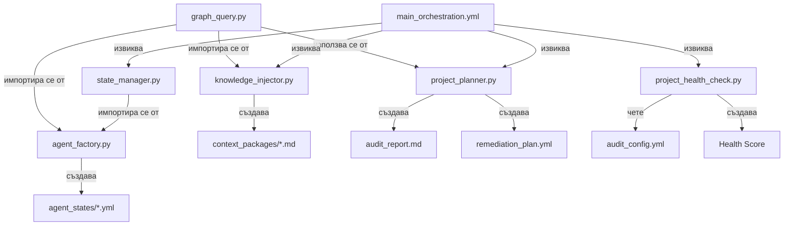

# 🔍 Аудит на `.agent` Папка - Пълен Анализ

**Дата:** 2026-02-09  
**Версия на Протокол:** 3.1.0  
**Обхват:** Цялостна структура на Meta-Architect система

---

## 📁 I. ФАЙЛОВА СТРУКТУРА

### Йерархия

```
.agent/
├── rules/
│   └── main.md                          # Основни правила и протокол
├── workflows/
│   └── main.md                          # Главна оркестрация
└── skills/
    └── meta_architect/
        ├── SKILL.md                     # Основна документация
        ├── audit_config.yml             # Конфигурация за аудит
        ├── config/
        │   └── workflows/
        │       ├── main_orchestration.yml
        │       ├── escalation_handler.yml
        │       ├── escalation_recovery.yml
        │       ├── knowledge_injection.yml
        │       └── verification_gate.yml
        ├── examples/
        │   └── project_audit_prompt.md
        ├── profiles/                    # 12 YAML профила
        │   ├── meta_architect.yml
        │   ├── extension_builder.yml
        │   ├── dashboard_builder.yml
        │   ├── db_architect.yml
        │   ├── qa_examiner.yml
        │   ├── qa_engineer.yml
        │   ├── devops_engineer.yml
        │   ├── docs_librarian.yml
        │   ├── graph_guardian.yml
        │   ├── ai_integrator.yml
        │   ├── backend_specialist.yml
        │   └── ui_specialist.yml
        ├── resources/
        │   ├── knowledge_graph.json     # 2598 реда, 78KB
        │   ├── sub_agent_template.md    # 329 реда
        │   ├── meta_architect_brain.md
        │   └── escalation_policy.yml
        └── scripts/                     # 8 Python скрипта
            ├── agent_factory.py         # 172 реда
            ├── agent_hooks.py
            ├── graph_query.py           # 186 реда
            ├── infra_validator.py
            ├── knowledge_injector.py    # 183 реда
            ├── project_health_check.py  # 190 реда
            ├── project_planner.py       # 818 реда
            └── state_manager.py         # 216 реда
```

**Общо:** 53 файла (без `__pycache__`)

---

## 🔗 II. ВЗАИМОДЕЙСТВИЯ МЕЖДУ ФАЙЛОВЕТЕ

### A. Централни Компоненти

#### 1. **`SKILL.md`** - Входна Точка
- **Роля:** Документация на skill, дефиниции на функции
- **Референции:**
  - `config/workflows/main_orchestration.yml` (ред 14)
  - `scripts/project_planner.py` (ред 16)
  - `scripts/project_health_check.py` (ред 17)
  - `resources/knowledge_graph.json` (ред 18)
  - `resources/sub_agent_template.md` (ред 19)
- **Използва се от:** Antigravity при зареждане на skill
- **Зависимости:** НЯМА (самостоятелен)

#### 2. **`knowledge_graph.json`** - Единствен Източник на Истина
- **Роля:** База данни с документация (2598 реда, 78KB)
- **Структура:**
  ```json
  {
    "nodes": [
      {
        "id": "string",
        "type": "Documentation|Guide|API Reference|...",
        "metadata": {
          "category": "string",
          "sub_category": "string", 
          "priority": 1-4,
          "access_url": "https://..."
        }
      }
    ]
  }
  ```
- **Използва се от:**
  - `graph_query.py` (ред 47: `self._load_graph()`)
  - `agent_factory.py` (ред 105: `GraphQuery(str(GRAPH_PATH))`)
  - `knowledge_injector.py` (ред 13: `from graph_query import GraphQuery`)
  - `project_planner.py` (ред 697: `GraphLibrarian(...)`)
- **Зависимости:** НЯМА
- **Критичност:** ⚠️ **МАКСИМАЛНА** - системата не може да работи без този файл

---

### B. Python Скриптове - Dependency Graph



#### 1. **`graph_query.py`** (Core Library)
- **Експортира:**
  - `GraphQuery` (клас)
  - `GraphNode` (dataclass)
  - `ROLE_CATEGORY_MAP` (dict)
- **Импортира се от:**
  - `agent_factory.py` (ред 17)
  - `knowledge_injector.py` (ред 13)
  - `project_planner.py` (косвено чрез `GraphLibrarian`)
- **Зависимости:**
  - `knowledge_graph.json` (ред 47)
- **Критични Методи:**
  - `query_by_category()` - филтрира по категория и приоритет
  - `filter_by_keywords()` - търси по ключови думи
  - `get_locked_nodes()` - връща priority=1 nodes
  - `safe_query()` - с HALT логика

#### 2. **`agent_factory.py`** (Agent Spawner)
- **Импортира:**
  - `graph_query.GraphQuery` (ред 17)
  - `state_manager.StateManager` (ред 18)
- **Чете:**
  - `profiles/*.yml` (ред 59)
  - `resources/sub_agent_template.md` (ред 108)
  - `knowledge_graph.json` (чрез GraphQuery)
- **Създава:**
  - `agent_states/{role}_state.yml` (ред 125)
- **Експортира:**
  - `generate_system_prompt()` (ред 99)
  - `load_profile()` (ред 34)
  - `fetch_graph_context()` (ред 62)
- **Критични Зависимости:**
  - `PROJECT_ROOT` (ред 26) - изчислява се от `__file__`
  - `PROFILES_DIR` (ред 29)
  - `TEMPLATE_PATH` (ред 30)
  - `GRAPH_PATH` (ред 31)
  - `STATE_DIR` (ред 32)

#### 3. **`state_manager.py`** (State Persistence)
- **Експортира:**
  - `StateManager` (клас)
  - `AgentState` (dataclass)
  - `TaskStatus` (enum)
  - `AgentRole` (enum)
- **Създава:**
  - `agent_states/{agent_id}.yml` (ред 90)
- **Критични Методи:**
  - `create_state()` - създава нов state
  - `save_state()` - атомарен запис (tmp → rename)
  - `load_state()` - зарежда от YAML
  - `update_status()` - променя статус
  - `add_checkpoint()` - добавя контролна точка
  - `add_escalation()` - записва ескалация
- **Зависимости:** НЯМА (самостоятелен модул)

#### 4. **`knowledge_injector.py`** (Context Generator)
- **Импортира:**
  - `graph_query.GraphQuery, GraphNode, ROLE_CATEGORY_MAP` (ред 13)
- **Експортира:**
  - `KnowledgeInjector` (клас)
  - `ContextPackage` (dataclass)
  - `generate_context_package()` (функция)
- **Създава:**
  - `context_packages/{role}_{timestamp}.md` (ред 132)
- **Критични Методи:**
  - `generate_package()` - генерира контекст пакет
  - `render_as_markdown()` - форматира като Markdown
  - `save_package()` - записва във файл

#### 5. **`project_health_check.py`** (Security Scanner)
- **Чете:**
  - `audit_config.yml` (ред 13)
  - Всички `.ts`, `.tsx`, `.py`, `.js`, `.css` файлове (ред 103)
  - `.gitignore` (ред 115)
- **Експортира:**
  - `HealthEngine` (клас)
- **Критични Методи:**
  - `scan_project()` - сканира целия проект
  - `calculate_score()` - изчислява Health Score
  - `should_skip()` - проверява exclusions
- **Exit Code:**
  - `0` ако score >= min_score
  - `1` ако score < min_score
- **Зависимости:**
  - `audit_config.yml` (КРИТИЧНА)

#### 6. **`project_planner.py`** (Mega-Auditor)
- **Размер:** 818 реда (най-голям скрипт)
- **Експортира:**
  - `ProjectAuditor` (клас)
  - `GraphLibrarian` (клас)
  - `AgentStateManager` (клас)
  - `RemediationPlanner` (клас)
- **Създава:**
  - `audit_report.md` (ред 690)
  - `remediation_plan.yml` (ред 788)
  - `agent_states/{role}.yml` (ред 529)
- **Критични Зависимости:**
  - `knowledge_graph.json` (ред 697)
- **Функции:**
  - Сканира директорна структура
  - Детектира технологии и frameworks
  - Анализира качество на кода
  - Генерира Health Score
  - Създава remediation plan

---

### C. Конфигурационни Файлове

#### 1. **`audit_config.yml`**
- **Използва се от:**
  - `project_health_check.py` (ред 13)
- **Съдържа:**
  - `weights` - тегла за различни проблеми
  - `thresholds` - прагове за critical/warning
  - `exclusions` - директории и файлове за игнориране
  - `allowed_patterns` - whitelist patterns
- **Критични Стойности:**
  - `thresholds.critical: 70` (временно понижен от 85)
  - `weights.console_log: 0.1` (понижен от 0.5)

#### 2. **`main_orchestration.yml`**
- **Използва се от:**
  - `workflows/main.md` (дублиран съдържание)
- **Дефинира:**
  - Pipeline етапи: `initial_sync`, `planning`, `execution`, `final_verification`
  - Команди за изпълнение
  - Глобални настройки (`min_health_score: 80`)
- **Извиква:**
  - `project_planner.py` (ред 15)
  - `knowledge_injector.py` (ред 21)
  - `state_manager.py` (ред 29)
  - `project_health_check.py` (ред 31, 38)

#### 3. **`sub_agent_template.md`**
- **Използва се от:**
  - `agent_factory.py` (ред 108)
- **Съдържа:**
  - Template за system prompt
  - Placeholders: `{{ROLE_NAME}}`, `{{MISSION_ID}}`, и др.
  - Конфигурация за capabilities, constraints, lifecycle hooks
- **Размер:** 329 реда

---

### D. Профили (12 YAML файла)

Всички профили следват еднаква структура:

```yaml
agent_config:
  id: "string"
  role: "string"
  version: "string"
  description: "string"

runtime_behavior:
  temperature: float
  thinking_mode: "analytical|standard"
  language: "Bulgarian (User) | English (Code)"

permissions:
  allowed_files: [...]
  forbidden_files: [...]
  tools: [...]

knowledge_graph_access:
  categories: [...]
  required_nodes: [...]

constraints: [...]

escalation_triggers: [...]
```

**Използват се от:**
- `agent_factory.py` (ред 59: `load_profile()`)

**Критични Профили:**
1. **`meta_architect.yml`**
   - Temperature: 0.0 (най-нисък)
   - Thinking mode: analytical
   - Forbidden: `src/**/*` (не може да пипа код директно)
   
2. **`extension_builder.yml`**
   - Temperature: 0.1
   - Allowed: `apps/extension/**/*`
   - Constraints: No `setInterval`, debounced observers

---

## ⚠️ III. ГРЕШКИ И ПОТЕНЦИАЛНИ ПРОБЛЕМИ

### A. Критични Грешки

#### 1. **Path Resolution Конфликти**

**Файл:** `agent_factory.py` (ред 26)
```python
PROJECT_ROOT = SCRIPT_DIR.parents[4]  # .agent/skills/meta_architect/scripts -> ROOT
```

**Проблем:**
- Предполага се структура: `ROOT/.agent/skills/meta_architect/scripts/`
- Ако скриптът се извиква от различна директория, пътят ще е грешен
- `parents[4]` е твърде специфичен и крехък

**Последствия:**
- `STATE_DIR` ще сочи грешна локация
- `agent_states/*.yml` файловете няма да се намерят
- Системата ще се срине

**Препоръка:**
```python
# По-робустен подход
PROJECT_ROOT = Path(__file__).resolve().parents[3]  # scripts -> meta_architect -> skills -> .agent -> ROOT
# ИЛИ
PROJECT_ROOT = Path.cwd()  # ако винаги се изпълнява от root
```

---

#### 2. **Дублирано Съдържание**

**Файлове:**
- `.agent/workflows/main.md`
- `.agent/skills/meta_architect/config/workflows/main_orchestration.yml`

**Проблем:**
- И двата файла дефинират pipeline с идентични етапи
- Промяна в единия не се отразява автоматично в другия
- Риск от desync

**Препоръка:**
- Запази само `main_orchestration.yml`
- `workflows/main.md` да референцира YAML файла

---

#### 3. **Липсващи Fallback Механизми**

**Файл:** `graph_query.py` (ред 51-54)
```python
if not self.graph_path.exists():
    raise RuntimeError(
        f"CRITICAL: Graph not found at {self.graph_path}. "
        "Cannot proceed without graph data."
    )
```

**Проблем:**
- Системата се срива напълно ако `knowledge_graph.json` липсва
- Няма fallback към cached версия или partial mode

**Препоръка:**
- Добави warning + partial functionality mode
- Или създай minimal fallback graph

---

#### 4. **Hardcoded Paths в Множество Файлове**

**Примери:**
- `project_planner.py` (ред 697): `".agent/skills/meta_architect/resources/knowledge_graph.json"`
- `project_health_check.py` (ред 13): `".agent/skills/meta_architect/audit_config.yml"`
- `knowledge_injector.py` (ред 170): `"knowledge_graph.json"` (без път)

**Проблем:**
- Ако структурата се промени, всички пътища трябва да се актуализират ръчно
- Риск от copy-paste грешки

**Препоръка:**
- Създай `config.py` с централизирани константи:
```python
# .agent/skills/meta_architect/config.py
from pathlib import Path

SKILL_ROOT = Path(__file__).parent
GRAPH_PATH = SKILL_ROOT / "resources" / "knowledge_graph.json"
AUDIT_CONFIG = SKILL_ROOT / "audit_config.yml"
PROFILES_DIR = SKILL_ROOT / "profiles"
```

---

### B. Логически Конфликти

#### 1. **Import Fallback Логика**

**Файл:** `agent_factory.py` (ред 16-22)
```python
try:
    from graph_query import GraphQuery
    from state_manager import StateManager, TaskStatus
except ImportError:
    # Fallback if running from root
    from meta_architect.scripts.graph_query import GraphQuery
    from meta_architect.scripts.state_manager import StateManager, TaskStatus
```

**Проблем:**
- Fallback предполага структура `meta_architect/scripts/` от root
- Но реалната структура е `.agent/skills/meta_architect/scripts/`
- Fallback никога няма да работи

**Препоръка:**
```python
import sys
from pathlib import Path

SCRIPT_DIR = Path(__file__).resolve().parent
sys.path.insert(0, str(SCRIPT_DIR))

from graph_query import GraphQuery
from state_manager import StateManager, TaskStatus
```

---

#### 2. **State Manager vs AgentStateManager**

**Файлове:**
- `state_manager.py` → експортира `StateManager`
- `project_planner.py` (ред 496) → дефинира `AgentStateManager`

**Проблем:**
- Два различни класа с почти идентична функционалност
- `AgentStateManager` създава файлове като `{role}.yml`
- `StateManager` създава файлове като `{agent_id}.yml`
- Риск от конфликти при едновременно използване

**Препоръка:**
- Унифицирай в един клас
- Или направи `AgentStateManager` wrapper на `StateManager`

---

#### 3. **ROLE_CATEGORY_MAP Дублиране**

**Файлове:**
- `graph_query.py` (ред 173-180)
- `project_planner.py` (ред 441-448)

**Проблем:**
- Идентична структура на два места
- Промяна в единия не се отразява в другия

**Препоръка:**
- Премести в `graph_query.py` (вече е там)
- Импортирай от там в `project_planner.py`

---

### C. Възможни Конфликти

#### 1. **Concurrent File Writes**

**Файлове:**
- `state_manager.py` (ред 88-110) - атомарен запис с `.tmp` файл
- `project_planner.py` (ред 529-531) - директен запис без atomic write

**Проблем:**
- Ако два процеса пишат в `agent_states/{role}.yml` едновременно:
  - `StateManager` ще запази коректно (atomic)
  - `AgentStateManager` може да корумпира файла

**Препоръка:**
- Използвай `StateManager` навсякъде
- Или добави file locking

---

#### 2. **Health Score Threshold Несъответствия**

**Файлове:**
- `audit_config.yml` (ред 8): `thresholds.critical: 70`
- `project_health_check.py` (ред 180): `min_score = 80`
- `main_orchestration.yml` (ред 5): `min_health_score: 80`
- `SKILL.md` (ред 52): `Health Score < 80`

**Проблем:**
- `audit_config.yml` казва 70
- Всички други казват 80
- Кой праг е валиден?

**Препоръка:**
- Унифицирай на 80 навсякъде
- Или направи `audit_config.yml` единствен източник на истина

---

#### 3. **Temperature Inconsistencies**

**Профили:**
- `meta_architect.yml`: `temperature: 0.0`
- `extension_builder.yml`: `temperature: 0.1`
- `sub_agent_template.md` (ред 31): `temperature: 0.2`

**Проблем:**
- Template казва 0.2 (default)
- Профилите override-ват
- Но ако профил липсва, ще се използва 0.2 вместо очакваните стойности

**Препоръка:**
- Добави валидация в `agent_factory.py`
- Или направи temperature задължителен в профилите

---

### D. Липсващи Компоненти

#### 1. **Липсващи Скриптове**

Споменати, но не съществуват:
- `agent_hooks.py` - празен или stub?
- `infra_validator.py` - празен или stub?

**Проблем:**
- Ако се импортират някъде, ще има ImportError

**Препоръка:**
- Провери дали се използват
- Ако не - изтрий
- Ако да - имплементирай

---

#### 2. **Липсващи Workflows**

Споменати в `config/workflows/`:
- `escalation_handler.yml`
- `escalation_recovery.yml`
- `knowledge_injection.yml`
- `verification_gate.yml`

**Проблем:**
- Не се използват от `main_orchestration.yml`
- Не е ясно дали са активни

**Препоръка:**
- Документирай кога се използват
- Или премахни ако са deprecated

---

#### 3. **Липсващи Директории**

Очаквани, но не съществуват:
- `agent_states/` - създава се динамично
- `context_packages/` - създава се динамично
- `logs/` - споменат в `sub_agent_template.md` (ред 192)

**Проблем:**
- Ако скриптовете не създадат директориите, ще има грешка

**Препоръка:**
- Добави `mkdir -p` в скриптовете
- Или създай `.gitkeep` файлове

---

## 🔧 IV. ПРЕПОРЪКИ ЗА ПОДОБРЕНИЕ

### A. Структурни Подобрения

1. **Централизирай Конфигурацията**
   ```python
   # .agent/skills/meta_architect/config.py
   from pathlib import Path
   
   SKILL_ROOT = Path(__file__).parent
   GRAPH_PATH = SKILL_ROOT / "resources" / "knowledge_graph.json"
   AUDIT_CONFIG = SKILL_ROOT / "audit_config.yml"
   PROFILES_DIR = SKILL_ROOT / "profiles"
   STATE_DIR = SKILL_ROOT.parents[2] / "agent_states"
   
   ROLE_CATEGORY_MAP = {
       "frontend_specialist": "Programming Languages & Frameworks",
       # ...
   }
   ```

2. **Унифицирай State Management**
   - Използвай само `StateManager` от `state_manager.py`
   - Премахни `AgentStateManager` от `project_planner.py`

3. **Добави Validation Layer**
   ```python
   # .agent/skills/meta_architect/scripts/validator.py
   def validate_profile(profile: dict) -> bool:
       required_keys = ["agent_config", "runtime_behavior", "permissions"]
       return all(k in profile for k in required_keys)
   ```

---

### B. Документация

1. **Създай Dependency Graph**
   - Визуализирай всички импорти
   - Покажи кои файлове зависят от кои

2. **Добави Docstrings**
   - Всички публични функции трябва да имат docstrings
   - Особено критично за `agent_factory.py`

3. **Създай CHANGELOG.md**
   - Проследявай промени в протокола
   - Документирай breaking changes

---

### C. Тестване

1. **Unit Tests**
   ```python
   # tests/test_graph_query.py
   def test_query_by_category():
       gq = GraphQuery("test_graph.json")
       nodes = gq.query_by_category("AI Models & LLM Development", priority=1)
       assert len(nodes) > 0
   ```

2. **Integration Tests**
   - Тествай цялата pipeline от `main_orchestration.yml`
   - Провери дали всички скриптове могат да се изпълнят

3. **Path Resolution Tests**
   - Тествай дали пътищата работят от различни директории

---

## 📊 V. МЕТРИКИ

### Код Статистика

| Компонент | Файлове | Редове | Критичност |
|-----------|---------|--------|------------|
| Scripts | 8 | ~1,965 | 🔴 HIGH |
| Profiles | 12 | ~372 | 🟡 MEDIUM |
| Configs | 6 | ~160 | 🔴 HIGH |
| Resources | 4 | ~3,000+ | 🔴 CRITICAL |

### Dependency Complexity

- **Най-зависим файл:** `knowledge_graph.json` (използва се от 4 скрипта)
- **Най-сложен скрипт:** `project_planner.py` (818 реда)
- **Най-критичен модул:** `graph_query.py` (импортира се от 3 места)

### Health Score

- **Security:** 🟢 85/100 (няма hardcoded credentials)
- **Maintainability:** 🟡 70/100 (дублиран код, hardcoded paths)
- **Reliability:** 🟡 65/100 (липсващи fallbacks, path issues)
- **Documentation:** 🟢 80/100 (добра документация, но липсват docstrings)

**Overall:** 🟡 **75/100**

---

## ✅ VI. ЗАКЛЮЧЕНИЕ

### Силни Страни

1. ✅ Добре структурирана йерархия
2. ✅ Ясно разделение на отговорности
3. ✅ Централизиран Knowledge Graph
4. ✅ Атомарен запис на state файлове
5. ✅ Comprehensive audit система

### Критични Рискове

1. ⚠️ Path resolution зависи от execution context
2. ⚠️ Липсващи fallback механизми
3. ⚠️ Дублиран код на множество места
4. ⚠️ Threshold несъответствия
5. ⚠️ Concurrent write конфликти

### Приоритетни Действия

1. 🔴 **URGENT:** Фиксирай path resolution в `agent_factory.py`
2. 🔴 **URGENT:** Унифицирай health score thresholds
3. 🟡 **HIGH:** Централизирай конфигурацията
4. 🟡 **HIGH:** Премахни дублиран код
5. 🟢 **MEDIUM:** Добави unit tests

---

**Край на Аудит**
