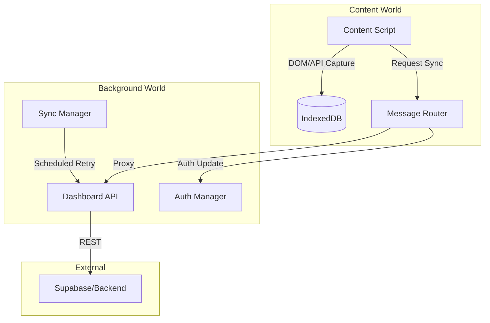

# Architecture Audit: BrainBox Extension
**Generated:** 2026-02-09
**Scope:** `apps/extension`
**Status:** 🟢 Clean (Post-Refactoring)

---

## 1. Project Structure (Source Truth)

The codebase has been fully migrated to TypeScript. All legacy `.js` source files have been removed.

### `src/` (Global)
*   `manifest.json` - Entry point configuration. References `.ts` source files for background and `.js` (compiled) path aliases for content scripts (managed by CRXJS).
*   `content-styles.css` - Global styles for injected UI elements.

### `src/background/`
*   `service-worker.ts` - Background coordinator. Orchestrates module initialization.
*   `modules/`
    *   `messageRouter.ts` - **Central Hub**: Handles all `chrome.runtime.onMessage` traffic.
    *   `authManager.ts` - Session lifecycle, token storage, and sync state.
    *   `dashboardApi.ts` - Typed client for interacting with the Supabase/Next.js backend.
    *   `platformAdapters/` - Strategy pattern implementation for platform-specific chat fetching.
    *   `syncManager.ts` - Handles the IndexedDB sync queue and background retry logic.
    *   `dynamicMenus.ts` - Context menu registration and event handling.

### `src/content/` (Isolated Worlds)
*   **Universal UI & Scraper**: `prompt-inject.ts` (lives in `src/prompt-inject/`) - The primary interactive layer and scraper for all AI platforms.
*   **Auth Bridge**: `content-dashboard-auth.ts` - Secure bridge that captures JWT tokens from the Dashboard and syncs them to the extension.
*   **Main World**: `inject-gemini-main.ts` - Script injected into the page's execution context to extract internal state (tokens).

### `src/lib/` (Shared Utilities)
*   `ui.ts` - **BrainBoxUI Class**: Unified UI provider. Implements `showToast`, `showFolderSelector`, and the legacy-fallback `showConfirmation`.
*   `normalizers.ts` - Transformation logic to convert raw platform data into the `Common Schema`.
*   `logger.ts` - Context-aware logger with debug/info/warn levels.
*   `config.ts` - Environment configuration using `import.meta.env`.

---

## 2. The "Sync" Architecture

The system uses a **Queue-First** synchronization strategy to ensure reliability.

---

## 3. Communication Patterns

| Pattern | Source | Destination | Purpose |
| :--- | :--- | :--- | :--- |
| `postMessage` | Dashboard | Auth Bridge | Securely transmit JWT tokens to extension. |
| `sendMessage` | Content Script | Router | Save chat, fetch folders, or check session. |
| `tabs.sendMessage` | DynamicMenus | Content Script | Trigger save flow from right-click. |
| `MAIN` World | Injected Script | Content Script | Relay internal tokens (Gemini). |

---

## 4. Resolved Technical Debt

### A. TypeScript Migration (Completed)
- **Elimination of Zombie Files**: `src/ui.js`, `src/normalizers.js`, and other duplicate `.js` files in the root have been hard-deleted.
- **Type Safety**: Global objects (e.g., `WIZ_global_data`) are now declared in `.d.ts` or local interfaces.

### B. UI Library Stabilization (Completed)
- **Unified UI Provider**: The `BrainBoxUI` class in `src/lib/ui.ts` provides a consistent interface for toasts, folder selection, and confirmation across all injected environments.

### C. Auth Bridge Security (Verified)
- **Origin Validation**: Strict validation in `validateOrigin` allows only trusted origins:
    - `https://brainbox-alpha.vercel.app`
    - `http://localhost:3000`
    - `http://127.0.0.1:3000`
- **Normalization**: Trailing slashes are automatically handled for robust comparison.

---

## 5. Critical Constraints (Build & Runtime)

1.  **Strict Vite/CRXJS Mapping**: The `manifest.json` uses source TS files where possible. `web_accessible_resources` must correctly point to the `.ts` source during development.
2.  **Isolated World Limitations**: Content scripts must use `chrome.runtime.sendMessage` for any action requiring `credentials: include` (CORS bypass via Background).
3.  **GEMINI Token Dependency**: Manual extraction in `inject-gemini-main.ts` is required because the `batchexecute` API requires specific internal tokens not available via standard cookies.
