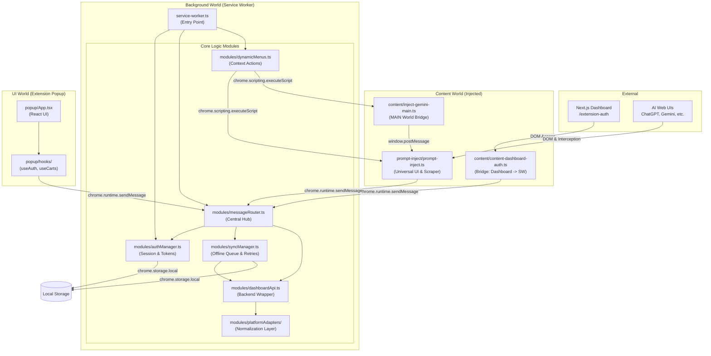

# BrainBox Extension Architecture (v3.1.2)

> [!IMPORTANT]
> Тази документация е **Identity-Locked**. Всяка промяна във файловата структура на `apps/extension` трябва да бъде отразена тук незабавно.

## 🏗️ Technical Architecture Graph

Тази схема описва преките зависимости и комуникационни канали между конкретните файлове в разширението.

---

## � Granular File Responsibilities

### 1. Входни точки (Entry Points)
- **`manifest.json`**: Декларативен корен. Дефинира разрешенията (`storage`, `scripting`, `alarms`) и кои скриптове къде работят.
- **`src/background/service-worker.ts`**: Първият код, който се изпълнява. Инициира модулите и слуша за системни събития (`onInstalled`, `onStartup`).

### 2. Комуникационен център (Background Modules)
- **`modules/messageRouter.ts`**: Единственият слушател за `chrome.runtime.onMessage`. Разпределя задачите към съответните мениджъри.
- **`modules/authManager.ts`**: "Скарбищницата" на разширението. Слуша за токени от Dashboard-а и поддържа сесията жива.
- **`modules/syncManager.ts`**: Използва `chrome.alarms` за периодична синхронизация на опашката от чатове (`brainbox_sync_queue`).
- **`modules/platformAdapters/`**: Колекция от адаптери (за всяка AI платформа), които превръщат специфичния JSON/HTML в каноничен BrainBox формат.

### 3. Инжекционна логика (Content Scripts)
- **`src/prompt-inject/prompt-inject.ts`**: Тежък скрипт, който изгражда плаващото меню върху ChatGPT/Gemini. Извлича историята на чата чрез DOM обхождане или прихващане на събития.
- **`src/content/inject-gemini-main.ts`**: Специализиран скрипт за Gemini, който се инжектира в `MAIN` света на страницата, за да прочете скрити токени от `window.WIZ_global_data`.
- **`src/content/content-dashboard-auth.ts`**: Малък мост, който работи само на Dashboard домейна, за да прехвърли JWT токена към разширението при вход.

### 4. Потребителски интерфейс (Popup)
- **`src/popup/App.tsx`**: React приложение, което се отваря при натискане на иконата. Използва хукове за комуникация с Background процеса, за да покаже папките и статуса на синхронизация.

---

## ⚡ Data Flow Patterns

1.  **Auth Flow**:
    `Dashboard` → `content-dashboard-auth.ts` → `messageRouter.ts` → `authManager.ts` → `LocalStorage`.
2.  **Save Chat Flow**:
    `User Click` → `prompt-inject.ts` → `messageRouter.ts` → `syncManager.ts` (Queue) → `dashboardApi.ts` → `Supabase`.
3.  **Prompt Injection**:
    `Popup/Menu` → `dynamicMenus.ts` → `chrome.scripting` → `prompt-inject.ts` → `DOM (TextArea)`.

---
*Документът е актуализиран на 11.02.2026 от Meta-Architect.*
