# Context Map Documentation

**Project**: BrainBox AI Chat Organizer  
**Version**: 2.1.0 (Monorepo Migration)  
**Architecture**: Chrome Extension (Manifest V3) + Next.js PWA (App Router)  
**Generated**: 2026-01-31  
**Authority**: Meta-Architect (Priority 1 - Boundary Definition)

---

## ⚠️ CRITICAL NOTICE FOR AI AGENTS

**PURPOSE**: This document prevents "code blur" between Extension and PWA by defining strict ownership boundaries.

**AGENTS MUST**:
1. **Read this FIRST** before starting any task
2. **Limit scope** to 5-10 relevant files (not 500)
3. **Respect No-Go Zones** (explicit approval required)
4. **Follow Entry Points** for new features

**VIOLATION OF BOUNDARIES** = Architecture degradation + merge conflicts + security risks

---

## 1. Project Topology Overview

```mermaid
graph TB
    subgraph Extension["🧩 Chrome Extension (Manifest V3)"]
        SW[service-worker.js<br/>Background Logic]
        CS_GPT[content-chatgpt.js<br/>ChatGPT Scripts]
        CS_CLU[content-claude.js<br/>Claude Scripts]
        CS_GEM[brainbox_master.js<br/>Gemini Scripts]
        AUTH_EXT[content-dashboard-auth.js<br/>Token Bridge]
        NORM[normalizers.js<br/>Platform Parsers]
        CONFIG[config.js<br/>Dashboard URL]
    end
    
    subgraph PWA["🌐 Next.js PWA (App Router)"]
        API[src/app/api/<br/>API Routes]
        STORE[src/store/<br/>Zustand State]
        LIB_AUTH[src/lib/supabase/<br/>Supabase Client]
        VALID[src/lib/validation/<br/>Zod Schemas]
        COMP[src/components/<br/>UI Components]
    end
    
    subgraph Shared["📚 Shared Logic (Identity-Locked)"]
        TYPES[src/types/database.types.ts<br/>TypeScript Interfaces]
        SCHEMA_DOC[docs/technical/DATA_SCHEMA.md<br/>Canonical Models]
    end
    
    CS_GPT -->|Captures Data| NORM
    CS_CLU -->|Captures Data| NORM
    CS_GEM -->|Captures Data| NORM
    NORM -->|Sends via| SW
    SW -->|POST /api/chats| API
    SW -->|Uses Bearer Token| AUTH_EXT
    AUTH_EXT -->|Fetches Session| LIB_AUTH
    
    API -->|Validates with| VALID
    API -->|Persists to| Supabase[(Supabase PostgreSQL)]
    API -->|Enforces| TYPES
    
    STORE -->|Reads from| API
    COMP -->|Displays from| STORE
    
    TYPES -.->|Defines Schema| SCHEMA_DOC
    VALID -.->|Enforces Schema| SCHEMA_DOC
    
    CONFIG -->|Points to| API
    
    style SW fill:#ffd700,stroke:#333,stroke-width:3px
    style API fill:#4169e1,stroke:#333,stroke-width:3px
    style LIB_AUTH fill:#32cd32,stroke:#333,stroke-width:3px
    style SCHEMA_DOC fill:#ff6347,stroke:#333,stroke-width:3px
```



---

## 2. Responsibility Matrix

**Format**: `Functionality` → `Owner` (File Path) → `Access Rule`

| Functionality | Owner | File Path | Access Rule | Identity-Locked |
|---------------|-------|-----------|-------------|-----------------|
| **Auth: Supabase Session** | PWA | [`src/lib/supabase/client.ts`](file:///home/stefanov/Projects/Chat%20Organizer%20Cursor/src/lib/supabase/client.ts) | Single Source of Truth | ⚠️ YES |
| **Auth: Token Bridge** | Extension | [`extension/content/content-dashboard-auth.js`](file:///home/stefanov/Projects/Chat%20Organizer%20Cursor/extension/content/content-dashboard-auth.js) | Read-only from PWA session | ⚠️ YES |
| **State: Global App State** | PWA | [`src/store/useChatStore.ts`](file:///home/stefanov/Projects/Chat%20Organizer%20Cursor/src/store/useChatStore.ts), `usePromptStore.ts`, `useFolderStore.ts` | Zustand stores only | NO |
| **API: Chat Sync** | PWA | [`src/app/api/chats/route.ts`](file:///home/stefanov/Projects/Chat%20Organizer%20Cursor/src/app/api/chats/route.ts) | Dual auth (Bearer/cookies) | NO |
| **API: Prompt Management** | PWA | [`src/app/api/prompts/route.ts`](file:///home/stefanov/Projects/Chat%20Organizer%20Cursor/src/app/api/prompts/route.ts) | Dual auth (Bearer/cookies) | NO |
| **Validation: Zod Schemas** | PWA | [`src/lib/validation/chat.ts`](file:///home/stefanov/Projects/Chat%20Organizer%20Cursor/src/lib/validation/chat.ts), `prompt.ts`, `folder.ts` | Shared with API routes | NO |
| **Platform: ChatGPT Capture** | Extension | [`extension/content/content-chatgpt.js`](file:///home/stefanov/Projects/Chat%20Organizer%20Cursor/extension/content/content-chatgpt.js) | Isolated content script | NO |
| **Platform: Claude Capture** | Extension | [`extension/content/content-claude.js`](file:///home/stefanov/Projects/Chat%20Organizer%20Cursor/extension/content/content-claude.js) | Isolated content script | NO |
| **Platform: Gemini Capture** | Extension | [`extension/content/brainbox_master.js`](file:///home/stefanov/Projects/Chat%20Organizer%20Cursor/extension/content/brainbox_master.js) | Isolated content script | NO |
| **Normalization: Platform→Canonical** | Extension | [`extension/lib/normalizers.js`](file:///home/stefanov/Projects/Chat%20Organizer%20Cursor/extension/lib/normalizers.js) | Must output canonical schema | ⚠️ YES |
| **Normalization: Canonical Schema** | Extension | [`extension/lib/schemas.js`](file:///home/stefanov/Projects/Chat%20Organizer%20Cursor/extension/lib/schemas.js) | Factory functions | ⚠️ YES |
| **Bridge: Extension→API** | Extension | [`extension/background/service-worker.js`](file:///home/stefanov/Projects/Chat%20Organizer%20Cursor/extension/background/service-worker.js) | Token interceptors, rate limiting | ⚠️ YES |
| **Config: Dashboard URL** | Extension | [`extension/lib/config.js`](file:///home/stefanov/Projects/Chat%20Organizer%20Cursor/extension/lib/config.js) | Production vs dev URLs | NO |
| **Types: Database Schema** | Shared | [`src/types/database.types.ts`](file:///home/stefanov/Projects/Chat%20Organizer%20Cursor/src/types/database.types.ts) | Auto-generated from Supabase | ⚠️ YES |
| **Types: Application Types** | Shared | [`src/types/index.ts`](file:///home/stefanov/Projects/Chat%20Organizer%20Cursor/src/types/index.ts) | Exports DB types | NO |
| **UI: PWA Components** | PWA | [`src/components/features/`](file:///home/stefanov/Projects/Chat%20Organizer%20Cursor/src/components/features) | React components | NO |
| **UI: Extension Popup** | Extension | [`extension/ui/`](file:///home/stefanov/Projects/Chat%20Organizer%20Cursor/extension/ui) | Vanilla HTML/JS | NO |

### 2.1 Access Rules Legend

- **Single Source of Truth**: Only modify in designated location
- **Read-only**: Can read but not modify (consume via API/message passing)
- **Isolated**: No direct dependencies, communicates via chrome.runtime
- **Shared**: Used by both Extension and PWA (changes require dual testing)
- **Dual auth**: Supports both Bearer tokens (extension) and cookies (web app)

---

## 3. Cross-Project Dependencies

### 3.1 Extension → PWA Dependencies

```mermaid
flowchart LR
    subgraph EXT[Extension]
        SW[service-worker.js]
        NORM[normalizers.js]
        SCHEMA[schemas.js]
    end
    
    subgraph PWA_API[PWA API Layer]
        ROUTES[/api/chats<br/>/api/prompts]
        VALID[validation/chat.ts]
    end
    
    subgraph PWA_SHARED[PWA Shared Types]
        TYPES[types/database.types.ts]
    end
    
    SCHEMA -->|Output matches| TYPES
    NORM -->|Produces schema via| SCHEMA
    SW -->|POST requests to| ROUTES
    ROUTES -->|Validates against| VALID
    VALID -.->|References| TYPES
    
    style TYPES fill:#ff6347,stroke:#333,stroke-width:2px
    style SCHEMA fill:#ffd700,stroke:#333,stroke-width:2px
```

**Key Point**: Extension MUST NOT import PWA code directly. Communication is via:
1. **HTTP APIs** (extension → Next.js routes)
2. **Shared schema definition** (canonical models in `docs/technical/DATA_SCHEMA.md`)

### 3.2 Monorepo Shared Packages (v2.1.0+)

**The Immutable Core**: Starting with v2.1.0, common code is extracted into `packages/`:

```mermaid
flowchart TB
    subgraph Packages["@brainbox/* Shared Packages"]
        DB[@brainbox/database\u003cbr/\u003edatabase.types.ts]
        VAL[@brainbox/validation\u003cbr/\u003eZod schemas]
        SHARED[@brainbox/shared\u003cbr/\u003eExtension schemas]
    end
    
    subgraph Apps[Applications]
        DASH[apps/dashboard\u003cbr/\u003eNext.js PWA]
        EXT[apps/extension\u003cbr/\u003eChrome Extension]
    end
    
    DASH -->|import| DB
    DASH -->|import| VAL
    EXT -->|import| SHARED
    
    VAL -.->|uses types from| DB
    
    style DB fill:#ff6347,stroke:#333,stroke-width:2px
    style VAL fill:#ffd700,stroke:#333,stroke-width:2px
    style SHARED fill:#32cd32,stroke:#333,stroke-width:2px
```

**Package Responsibilities**:

| Package | Contents | Consumers | Identity-Locked |
|---------|----------|-----------|----------------|
| `@brainbox/database` | `database.types.ts` (Supabase-generated types) | Dashboard API routes, server components | ⚠️ YES (auto-generated) |
| `@brainbox/validation` | Zod schemas: `createChatSchema`, `promptSchema`, `folderSchema`, `listSchema` | Dashboard forms, API validation | ⚠️ YES (canonical schemas) |
| `@brainbox/shared` | `schemas.js` - Extension schemas (`createConversation`, `createMessage`) | Extension normalizers | ⚠️ YES (platform contract) |

**Migration Notes**:
- `@/lib/validation/*` → `@brainbox/validation`
- `@/types/database.types` → `@brainbox/database`
- Extension local schemas → `@brainbox/shared/schemas`

### 3.3 Shared Logic Ownership

**File**: `src/types/database.types.ts`

**Consumers**:
- ✅ PWA: `src/app/api/chats/route.ts` (imports `Chat`, `ChatInsert`)
- ✅ Extension: Logic reference only (doesn't import, follows schema spec)

**Modification Process**:
1. Update Supabase schema (via migration)
2. Regenerate `database.types.ts` (`supabase db pull`)
3. Update `docs/technical/DATA_SCHEMA.md`
4. Update Extension normalizers to output new fields
5. Test: Extension → API → Database

---

## 4. No-Go Zones (Explicit Approval Required)

**Definition**: Files that are critical to system integrity and MUST NOT be modified without:
1. Updating corresponding documentation
2. Running full integration tests
3. Meta-Architect approval (or explicit user approval)

### 4.1 Critical Files List

| File | Reason | Approval Level | Documentation Link |
|------|--------|----------------|-------------------|
| [`service-worker.js`](file:///home/stefanov/Projects/Chat%20Organizer%20Cursor/extension/background/service-worker.js) | Core sync logic, token interceptors, rate limiting | Meta-Architect | [`SYNC_PROTOCOL.md`](file:///home/stefanov/Projects/Chat%20Organizer%20Cursor/docs/technical/SYNC_PROTOCOL.md) |
| [`normalizers.js`](file:///home/stefanov/Projects/Chat%20Organizer%20Cursor/extension/lib/normalizers.js) | Platform data transformation (ChatGPT, Claude, Gemini) | Meta-Architect | [`DATA_SCHEMA.md:6`](file:///home/stefanov/Projects/Chat%20Organizer%20Cursor/docs/technical/DATA_SCHEMA.md#L428-L487) |
| [`schemas.js`](file:///home/stefanov/Projects/Chat%20Organizer%20Cursor/extension/lib/schemas.js) | Canonical model factories (`createConversation`, `createMessage`) | Meta-Architect | [`DATA_SCHEMA.md:3.3`](file:///home/stefanov/Projects/Chat%20Organizer%20Cursor/docs/technical/DATA_SCHEMA.md#L318-L339) |
| [`database.types.ts`](file:///home/stefanov/Projects/Chat%20Organizer%20Cursor/src/types/database.types.ts) | Auto-generated Supabase types (modify via migration, not manually) | User + Migration | [`DATA_SCHEMA.md:5`](file:///home/stefanov/Projects/Chat%20Organizer%20Cursor/docs/technical/DATA_SCHEMA.md#L374-L531) |
| [`client.ts`](file:///home/stefanov/Projects/Chat%20Organizer%20Cursor/src/lib/supabase/client.ts) | Supabase client initialization (SSR + browser) | User | [`SYNC_PROTOCOL.md:2`](file:///home/stefanov/Projects/Chat%20Organizer%20Cursor/docs/technical/SYNC_PROTOCOL.md#L45-L93) |
| [`manifest.json`](file:///home/stefanov/Projects/Chat%20Organizer%20Cursor/extension/manifest.json) | Extension permissions, content script injection, host permissions | User | [`SYNC_PROTOCOL.md:3.2`](file:///home/stefanov/Projects/Chat%20Organizer%20Cursor/docs/technical/SYNC_PROTOCOL.md#L170-L213) |
| `docs/technical/*.md` | Architectural documentation (update BEFORE code changes) | Meta-Architect | N/A (self-referential) |

### 4.2 Rationale

**service-worker.js** (795 lines):
- Token management for 3 platforms (ChatGPT, Claude, Gemini)
- Message passing orchestration
- Rate limiting (Bottleneck.js)
- API call retry logic

**normalizers.js** (526 lines):
- Platform-specific parsing (tree traversal, regex extraction)
- Role determination heuristics (Bulgarian/English patterns)
- Deduplication logic
- Image URL filtering

**database.types.ts** (486 lines):
- Generated from Supabase schema (`supabase gen types typescript`)
- Manual edits are OVERWRITTEN on next generation
- Source of truth is PostgreSQL schema

---

## 5. Entry Points (Where to Start)

### 5.1 Add New AI Platform (e.g., DeepSeek)

**Goal**: Sync conversations from new platform

**Entry Point Sequence**:

1. **Create content script**: `extension/content/content-deepseek.js`
   - Reference: [`content-chatgpt.js`](file:///home/stefanov/Projects/Chat%20Organizer%20Cursor/extension/content/content-chatgpt.js) (structure template)
   - Responsibilities: DOM scraping, sendMessage to service-worker

2. **Add normalizer function**: `extension/lib/normalizers.js:528+`
   - Function signature: `export function normalizeDeepSeek(rawData) { ... }`
   - Output: Must use `createConversation()` from `schemas.js`
   - Reference: [`normalizeChatGPT()`](file:///home/stefanov/Projects/Chat%20Organizer%20Cursor/extension/lib/normalizers.js#L10-L49)

3. **Register in service-worker**: `extension/background/service-worker.js`
   - Add message handler: `case 'deepseek': { ... }`
   - Import normalizer: `import { normalizeDeepSeek } from '../lib/normalizers.js';`
   - Reference: [ChatGPT handler](file:///home/stefanov/Projects/Chat%20Organizer%20Cursor/extension/background/service-worker.js#L270-L306)

4. **Update manifest**: `extension/manifest.json`
   - Add content script injection:
     ```json
     {
       "matches": ["https://deepseek.com/*"],
       "js": ["content/content-deepseek.js"]
     }
     ```
   - Add host permissions: `"https://deepseek.com/*"`

5. **Update Platform enum**: `src/types/index.ts`
   - Add: `DeepSeek = 'deepseek',`

6. **Test extraction**: Use browser DevTools console
   - Inject: `chrome.runtime.sendMessage({ action: 'saveToDashboard', data: {...} })`
   - Verify: Check API route receives valid payload

**DO NOT MODIFY**:
- ❌ `schemas.js` (use existing `createConversation`)
- ❌ `database.types.ts` (platform is stored as string, not enum in DB)
- ❌ API routes (already support arbitrary platform values)

---

### 5.2 Add New Data Field to Chat (e.g., `ai_model`)

**Goal**: Store model metadata (GPT-4, Claude Opus, Gemini Pro)

**Entry Point Sequence**:

1. **Update DATA_SCHEMA.md**: `docs/technical/DATA_SCHEMA.md:2.1`
   - Add field to Chat Object TypeScript definition
   - Add to validation rules
   - Add to JSON example

2. **Create Supabase migration**:
   ```bash
   supabase migration create add_ai_model_to_chats
   ```
   ```sql
   ALTER TABLE chats ADD COLUMN ai_model text;
   ```

3. **Regenerate TypeScript types**:
   ```bash
   supabase db pull
   ```
   - Updates: `src/types/database.types.ts`

4. **Update Zod schema**: `src/app/api/chats/route.ts:15`
   - Add: `ai_model: z.string().optional(),`

5. **Update normalizers**: `extension/lib/normalizers.js`
   - ChatGPT: Extract from `rawData.model_slug`
   - Claude: Extract from `rawData.model`
   - Gemini: Extract from metadata (if available)

6. **Update UI components**: `src/components/features/ChatCard.tsx`
   - Display model badge (optional)

**Verification**:
- Extension: Save chat from ChatGPT
- API: Check POST `/api/chats` payload includes `ai_model`
- Database: Query `SELECT ai_model FROM chats LIMIT 5;`

---

### 5.3 Add New API Route (e.g., `/api/presets`)

**Goal**: CRUD operations for custom chat presets

**Entry Point Sequence**:

1. **Create Supabase table**:
   ```sql
   CREATE TABLE presets (
     id uuid PRIMARY KEY DEFAULT gen_random_uuid(),
     user_id uuid REFERENCES users(id) ON DELETE CASCADE,
     name text NOT NULL,
     system_prompt text,
     temperature numeric,
     created_at timestamptz DEFAULT now()
   );
   ```

2. **Regenerate types**: `supabase db pull` → updates `database.types.ts`

3. **Create API route**: `src/app/api/presets/route.ts`
   - Template: Copy structure from `src/app/api/prompts/route.ts`
   - Implement: GET, POST, PUT, DELETE handlers
   - Add dual auth (Bearer token + cookies)

4. **Create Zod schema**: `src/lib/validation/preset.ts`
   ```typescript
   export const presetSchema = z.object({
     name: z.string().min(1),
     system_prompt: z.string(),
     temperature: z.number().min(0).max(2),
   });
   ```

5. **Create Zustand store**: `src/store/usePresetStore.ts`
   - Template: Copy structure from `usePromptStore.ts`
   - Actions: `fetchPresets`, `createPreset`, `updatePreset`, `deletePreset`

6. **Create UI page**: `src/app/presets/page.tsx`
   - Use existing components from `src/components/features/`

**DO NOT**:
- ❌ Add to extension (unless presets need to be injected into platforms)
- ❌ Modify service-worker.js (extension doesn't manage presets)

---

### 5.4 Modify Folder Hierarchy Logic

**Goal**: Change max nesting depth from 4 to 6 levels

**Entry Point Sequence**:

1. **Update DATA_SCHEMA.md**: `docs/technical/DATA_SCHEMA.md:2.3`
   - Change: "CONSTRAINT: Maximum nesting depth = 4" → "= 6"

2. **Update UI validation**: `src/components/features/FolderTree.tsx`
   - Find: `const MAX_DEPTH = 4;`
   - Change to: `const MAX_DEPTH = 6;`

3. **Update database check constraint** (if exists):
   ```sql
   ALTER TABLE folders DROP CONSTRAINT IF EXISTS folder_max_depth;
   -- Add new constraint (recursive SQL query to enforce depth)
   ```

4. **Test**:
   - Create nested folders: Root → L1 → L2 → L3 → L4 → L5 → L6
   - Verify: UI allows creation, database accepts

**DO NOT**:
- ❌ Modify extension (folders are PWA-only feature)

---

## 6. Agent Scope Limitation Strategy

**Problem**: BrainBox has ~500 files. Agents reading everything = slow + context overflow

**Solution**: Use this CONTEXT_MAP to filter files by concern

### 6.1 Filtering Rules

**Task Type** → **Relevant Files** (max 10)

#### 6.1.1 Authentication Issues

**Scope**:
- `src/lib/supabase/client.ts` (SSR client)
- `src/lib/supabase/server.ts` (browser client, if exists)
- `extension/content/content-dashboard-auth.js` (token bridge)
- `src/middleware.ts` (auth middleware)
- `src/app/api/chats/route.ts:117-159` (dual auth logic example)

**Exclusions**: UI components, stores, other API routes

#### 6.1.2 Chat Sync Failures

**Scope**:
- `extension/background/service-worker.js` (API calls)
- `extension/lib/normalizers.js` (data transformation)
- `extension/lib/schemas.js` (validation)
- `src/app/api/chats/route.ts` (API endpoint)
- `src/lib/validation/chat.ts` (Zod schema)
- `src/types/database.types.ts` (type definitions)
- `docs/technical/SYNC_PROTOCOL.md` (protocol spec)

**Exclusions**: PWA components, stores, other platforms

#### 6.1.3 UI Layout/Styling

**Scope**:
- `src/app/layout.tsx` (root layout)
- `src/components/layout/` (structural components)
- `tailwind.config.ts` (styles)
- `src/app/globals.css` (global styles)

**Exclusions**: Extension files, API routes, stores

#### 6.1.4 Platform-Specific Capture (ChatGPT)

**Scope**:
- `extension/content/content-chatgpt.js` (DOM scraping)
- `extension/lib/normalizers.js:10-70` (ChatGPT normalizer)
- `extension/background/service-worker.js:30-44` (token interceptor)
- `extension/manifest.json` (content script injection)

**Exclusions**: Claude/Gemini files, PWA, API routes

### 6.2 File Discovery Commands

**Find auth-related files**:
```bash
find src -name "*auth*" -o -name "*supabase*"
```

**Find platform normalizers**:
```bash
find extension -name "*normalizer*" -o -name "content-*.js"
```

**Find API routes**:
```bash
find src/app/api -name "route.ts"
```

**Find Zustand stores**:
```bash
find src/store -name "*.ts"
```

### 6.3 Context Injection Template

**Before starting task**, ask:

1. **What layer am I working on?**
   - Extension (Chrome APIs, content scripts)
   - PWA (React, Next.js, API routes)
   - Shared (TypeScript types, documentation)

2. **What concern am I addressing?**
   - Auth (→ filter to auth files)
   - Data sync (→ filter to sync pipeline files)
   - UI (→ filter to components)
   - Platform capture (→ filter to specific platform files)

3. **What files do I NEED to read?**
   - Entry point (from section 5)
   - Immediate dependencies (from section 3)
   - Related documentation (from `docs/technical/`)

4. **What files should I IGNORE?**
   - Other layers (if working on Extension, ignore PWA stores)
   - Other platforms (if fixing ChatGPT, ignore Claude/Gemini)
   - Tests (unless verification is the task)

**Example Agent Prompt**:
```
TASK: Fix ChatGPT sync duplicates

CONTEXT_MAP FILTER:
- Layer: Extension + PWA API
- Concern: Data sync
- Read: service-worker.js, normalizers.js (ChatGPT only), /api/chats route, DATA_SCHEMA.md
- Ignore: UI components, stores, Claude/Gemini files, auth files
```

---

## 7. Documentation as "The Brain"

**Hierarchy**:

```
docs/
├── technical/               # THE BRAIN (Architecture Truth)
│   ├── CONTEXT_MAP.md      # THIS FILE (Boundary definitions)
│   ├── DATA_SCHEMA.md      # Canonical models (6 tables)
│   ├── SYNC_PROTOCOL.md    # Extension↔API protocol
│   └── [FUTURE]
│       ├── CONVERSATION_EXTRACTION.md  # Platform scraping logic
│       └── DATABASE_SCHEMA.md          # SQL schema + RLS policies
├── project/                # Project management
│   ├── FOLDER_STRUCTURE.md # Directory tree
│   ├── Specification.md    # Functional requirements
│   └── MASTER_TODO.md      # Task tracking
└── user/                   # User guides
    └── [USER_DOCS]
```

### 7.1 The Brain Rules

**Rule 1**: Code changes MUST be preceded by documentation updates

**Example**: Adding `ai_model` field
```
WRONG: ❌ Modify database → Update code → Update docs (if remembered)
RIGHT: ✅ Update DATA_SCHEMA.md → Migrate database → Update code → Verify
```

**Rule 2**: Documentation is the contract between agents

**Example**: Agent A defines `Chat` schema in `DATA_SCHEMA.md`, Agent B implements API route referencing that doc.

**Rule 3**: Documentation violations = reverted changes

**Example**: If `service-worker.js` is modified without updating `SYNC_PROTOCOL.md`, the code change is rejected.

### 7.2 Documentation References

**When writing code**, cite documentation:

```typescript
// Reference: DATA_SCHEMA.md:2.1 (Chat Object specification)
export async function POST(request: Request) {
  const createChatSchema = z.object({
    title: z.string().min(1),       // Required per DATA_SCHEMA.md
    content: z.string(),
    messages: z.array(z.any()),     // Structure: DATA_SCHEMA.md:2.1.2
    platform: z.string().optional(), // 'chatgpt' | 'claude' | 'gemini'
  });
  // ...
}
```

---

## 8. Boundary Enforcement Checklist

**Before modifying ANY file**, ask:

- [ ] Is this file in the No-Go Zone? (Section 4.1)
  - If YES → Get approval + update docs first
- [ ] What layer does this belong to? (Extension / PWA / Shared)
  - Extension files MUST NOT import from `src/`
  - PWA files MUST NOT import from `extension/`
- [ ] Does this change affect canonical models? (Section 2)
  - If YES → Update `DATA_SCHEMA.md` first
- [ ] Does this change affect sync protocol? (Section 3)
  - If YES → Update `SYNC_PROTOCOL.md`
- [ ] Am I following the correct entry point? (Section 5)
  - Use templates from existing implementations
- [ ] Have I limited my scope to <10 files? (Section 6)
  - Use filtering rules to ignore irrelevant files

**After modifying files**:

- [ ] Run type check: `npm run type-check` (PWA)
- [ ] Test extension: Load unpacked extension in Chrome
- [ ] Test API: `curl -X POST http://localhost:3000/api/chats`
- [ ] Verify database: `SELECT * FROM chats ORDER BY created_at DESC LIMIT 5;`
- [ ] Update relevant documentation (if schema/protocol changed)

---

## 9. Common Boundary Violations (Anti-Patterns)

### 9.1 Violation: Extension Imports PWA Code

**WRONG**:
```javascript
// extension/background/service-worker.js
import { createChatSchema } from '../../src/lib/validation/chat.ts'; // ❌ FORBIDDEN
```

**Reason**: Extension cannot bundle Next.js/React dependencies

**CORRECT**:
```javascript
// extension/lib/schemas.js
export function validateConversation(conversation) {
  // Standalone validation (no external dependencies)
  if (!conversation.id || !conversation.title) {
    return { valid: false, error: 'Missing required fields' };
  }
  return { valid: true };
}
```

### 9.2 Violation: PWA Duplicates Extension Logic

**WRONG**:
```typescript
// src/lib/parsers/chatgpt.ts (hypothetical)
export function parseChatGPTData(rawData) { // ❌ Duplicates normalizers.js
  // ... same logic as extension/lib/normalizers.js
}
```

**Reason**: Logic duplication = double maintenance burden

**CORRECT**:
- Extension owns platform parsing
- PWA receives already-normalized data via API
- Shared contract: `docs/technical/DATA_SCHEMA.md`

### 9.3 Violation: Modifying Auto-Generated Files

**WRONG**:
```typescript
// src/types/database.types.ts
export type Chat = {
  id: string;
  ai_model: string; // ❌ Manual edit (will be overwritten)
  // ...
};
```

**Reason**: `supabase db pull` regenerates this file

**CORRECT**:
```sql
-- supabase/migrations/20260131_add_ai_model.sql
ALTER TABLE chats ADD COLUMN ai_model text;
```
Then: `supabase db pull` → auto-updates `database.types.ts`

### 9.4 Violation: Bypassing Validation Layers

**WRONG**:
```typescript
// src/app/api/chats/route.ts
export async function POST(request: Request) {
  const data = await request.json();
  // ❌ No Zod validation
  await supabase.from('chats').insert(data);
}
```

**Reason**: Unsafe data reaches database

**CORRECT**:
```typescript
const createChatSchema = z.object({ /* ... */ });
const validatedData = createChatSchema.parse(await request.json());
await supabase.from('chats').insert(validatedData);
```

---

## 10. Integration with Knowledge Graph

**File**: `AI Knowlage/knowledge_graph.json`

**Identity-Locked Patterns** (Priority 1 nodes):

From knowledge graph analysis, the following patterns are Priority 1:

| Category | Sub-Category | Nodes (Priority 1) | Relevance to BrainBox |
|----------|--------------|-------------------|----------------------|
| **AI Models** | Commercial Models | OpenAI, Claude, Gemini docs | Platform integration source material |
| **AI Models** | Prompt Engineering | Prompt guides, function calling | Context menu prompt injection |
| **AI Models** | Agent Frameworks | LangChain, CrewAI, AutoGen | Future: multi-agent orchestration |
| **Frameworks** | Frontend | React, Next.js | PWA implementation stack |
| **Frameworks** | Backend | Node.js, Express, NestJS | API route alternatives (currently Next.js) |
| **Standards** | MCP | Model Context Protocol spec | Used by this agent (filesystem, memory MCP) |

**Usage in Context Map**:
- When adding new platform (e.g., DeepSeek), consult Priority 1 docs for API patterns
- When designing prompt injection, reference prompt engineering guides
- When modifying Next.js routes, consult Next.js Priority 1 docs

**Knowledge Graph Integration**:
- This `CONTEXT_MAP.md` is a **Priority 1** document (boundary enforcement)
- Cross-reference with `DATA_SCHEMA.md` (Priority 1), `SYNC_PROTOCOL.md` (Priority 1)
- Future agents should query Memory MCP for `BrainBox-Context-Map` entity

---

## Appendix A: Quick Reference - File Ownership

### Extension-Owned (Do Not Touch from PWA)

```
extension/
├── background/service-worker.js       # Token mgmt, sync orchestration
├── content/
│   ├── brainbox_master.js             # Gemini capture
│   ├── content-chatgpt.js             # ChatGPT capture
│   ├── content-claude.js              # Claude capture
│   └── content-dashboard-auth.js      # Token bridge
├── lib/
│   ├── normalizers.js                 # Platform→Canonical transformation
│   ├── schemas.js                     # Canonical model factories
│   ├── config.js                      # Dashboard URL
│   └── rate-limiter.js                # Bottleneck.js wrapper
├── prompt-inject/inject.js            # Context menu prompt injection
└── manifest.json                      # Extension configuration
```

### PWA-Owned (Do Not Touch from Extension)

```
src/
├── app/api/                           # Next.js API routes (chats, prompts, folders)
├── components/                        # React UI components
├── lib/
│   ├── supabase/                      # Supabase client (SSR + browser)
│   └── validation/                    # Zod schemas
├── store/                             # Zustand state management
└── middleware.ts                      # Auth middleware
```

### Shared (Modify with Caution)

```
src/types/
├── database.types.ts                  # Auto-generated from Supabase (modify via migration)
└── index.ts                           # Type exports

docs/technical/
├── CONTEXT_MAP.md                     # THIS FILE
├── DATA_SCHEMA.md                     # Canonical models
└── SYNC_PROTOCOL.md                   # Sync architecture
```

---

## Appendix B: Agent Onboarding Checklist

**New Agent Starting Task**:

1. [ ] Read `CONTEXT_MAP.md` (this file)
2. [ ] Identify task layer (Extension / PWA / Shared)
3. [ ] Apply scope filter (Section 6) → List <10 relevant files
4. [ ] Check if task touches No-Go Zone (Section 4) → Get approval if yes
5. [ ] Find entry point (Section 5) → Use template
6. [ ] Read relevant technical docs:
   - [ ] `DATA_SCHEMA.md` (if touching data models)
   - [ ] `SYNC_PROTOCOL.md` (if touching extension↔API)
   - [ ] `FOLDER_STRUCTURE.md` (if unfamiliar with project layout)
7. [ ] Before ANY code change → Check boundary enforcement (Section 8)
8. [ ] After code change → Run verification checklist (Section 8)
9. [ ] Update documentation if:
   - [ ] Schema changed → Update `DATA_SCHEMA.md`
   - [ ] Sync flow changed → Update `SYNC_PROTOCOL.md`
   - [ ] New entry point added → Update this file (Section 5)

---

**End of Document**  
**Last Updated**: 2026-01-31  
**Maintained By**: Superior Meta-Architect+ (Priority 1)
