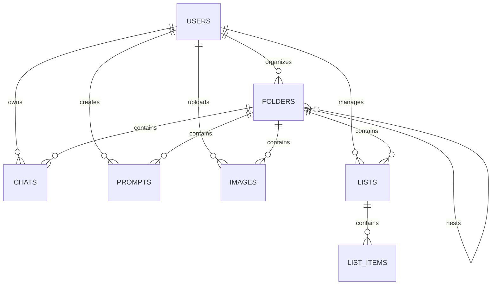

# Data Schema Documentation

**Project**: BrainBox AI Chat Organizer  
**Version**: 3.1.0  
**Type System**: TypeScript + Zod + Supabase PostgreSQL  
**Generated**: 2026-02-10  
**Authority**: Meta-Architect (Priority 1 - Identity-Locked)

---

## 1. Entity-Relationship Diagram



---

## 2. Canonical Models (TypeScript)

### 2.1 Core Entities (`@brainbox/shared`)
Всички типове са деривати на `Database` типовете от Supabase.

- **`Chat`**: Основен обект за съхранение на разговори. Поддържа:
    - **Platforms**: `chatgpt`, `claude`, `gemini`, `deepseek`, `grok`, `perplexity`, `qwen`, `lmarena`.
    - **AI Enhancement**: `summary`, `detailed_summary`, `tags` (jsonb), `tasks` (jsonb), `embedding` (vector).
- **`Prompt`**: Шаблони с метаданни за `context_menu`.
- **`Folder`**: Йерархична структура (до 4 нива).
- **`List` / `ListItem`**: Управление на задачи.
- **`User`**: Профил, синхронизиран с `auth.users`.

### 2.2 Message Structure
```typescript
interface Message {
  id: string;
  role: 'user' | 'assistant' | 'system';
  content: string;
  timestamp: number;
  metadata?: {
    model?: string;
    images?: string[];
    [key: string]: any;
  };
}
```

---

## 3. Platform Adapters (`apps/extension`)

Трансформират специфични за платформата данни към `Chat` обекта.

| Платформа | Адаптер (Background) | Нормализатор (Content) |
|-----------|--------------------|-----------------------|
| **Gemini** | `gemini.adapter.ts` | `normalizers.ts` (Recursive Extraction) |
| **ChatGPT**| `chatgpt.adapter.ts`| `normalizers.ts` (Tree Traversal) |
| **Claude** | `claude.adapter.ts` | `normalizers.ts` (Linear Array) |
| **DeepSeek**| `deepseek.adapter.ts`| `brainbox_master.ts` (JSON Intercept) |

---

## 4. Validation & Database

### 4.1 Zod Schemas (`@brainbox/validation`)
- `createChatSchema`, `createPromptSchema`, `createFolderSchema`, `listSchema`.

### 4.2 Security & Constraints
- **RLS**: Всички заявки се филтрират по `user_id` чрез `auth.uid()`.
- **Unique Constraint**: `(user_id, source_id)` за предотвратяване на дубликати.
- **Identity-Locked Fields**: `id`, `user_id`, `source_id`, `email`. Пряка промяна е забранена.

---

## 5. Workflow за промяна
1.  **DB Migration**: `ALTER TABLE ...`
2.  **Type Gen**: `pnpm db:gen` (актуализира `database.types.ts`).
3.  **Validation**: Обновяване на Zod схемите.
4.  **Adapters**: Актуализиране на платформените нормализатори.
