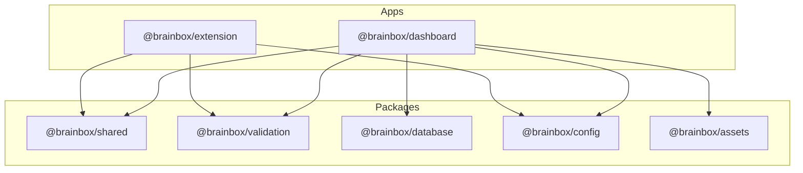

# Monorepo Dependencies Documentation

**Project**: BrainBox AI Chat Organizer  
**Version**: 3.1.0  
**Manager**: pnpm 10.17.0  
**Orchestrator**: Turborepo 2.8.1

---

## 1. Core Stack Versions

| Technology | Version | Role |
|------------|---------|------|
| **Node.js** | `>=22.0.0` | Runtime |
| **pnpm** | `>=10.17.0` | Package Management |
| **TypeScript** | `~5.9.3` | Type Safety |
| **Next.js** | `^14.2.18` | Dashboard (App Router) |
| **Vite** | `^7.3.1` | Extension Bundler |
| **Supabase** | `^2.47.10` | Database & Auth |
| **Tailwind** | `^4.1.18` | Styling (v4 Engine) |
| **Zustand** | `^5.0.2` | State Management |

---

## 2. Project Topology

---

## 3. Internal Workspace Dependencies

| Package | Purpose |
| :--- | :--- |
| **`@brainbox/shared`** | Кананични типове и обща логика (Chat, Message, Platform). |
| **`@brainbox/validation`** | Централизирани Zod схеми (Single Source of Truth). |
| **`@brainbox/database`** | Supabase TypeScript дефиниции (Generated). |
| **`@brainbox/config`** | Споделени конфигурации (Tailwind, TS, PostCSS, Models). |
| **`@brainbox/assets`** | UI активи, брандинг и икони. |

---

## 4. External Library Highlights

- **`@crxjs/vite-plugin`**: Изключително важен за Vite + Manifest V3 разработка.
- **`@supabase/ssr`**: Управление на сесиите в Next.js App Router.
- **`dompurify`**: Санитизация на прихванато съдържание в разширението.
- **`lucide-react`**: Обединена система за икони.

---

## 5. Maintenance Commands

- `pnpm install` - Стандартна инсталация.
- `pnpm verify` - Проверка на здравето на проекта (Min Score: 80).
- `turbo build` - Проверка на билда в целия monorepo.

---
*Документът е актуализиран на 10.02.2026 от Meta-Architect.*
