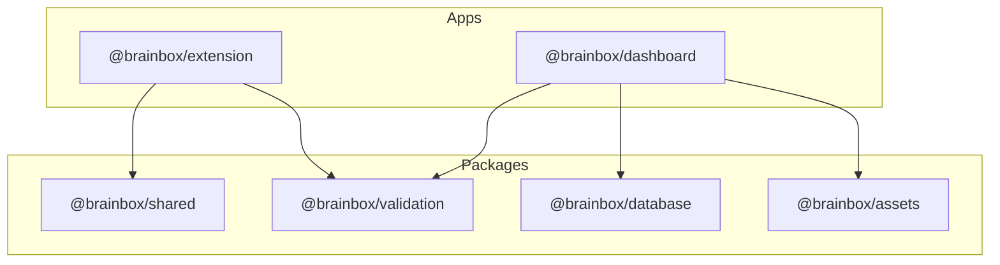

# 📦 MONOREPO_DEPS.md - Карта на зависимостите

Този документ описва архитектурата на зависимостите в monorepo структурата на BrainBox, включително споделените пакети и външните библиотеки.

---

## 🗺️ Графика на вътрешните зависимости

---

## 🔗 Вътрешни Workspace връзки

| Пакет/Приложение | Зависи от (Internal) | Предначертание |
| :--- | :--- | :--- |
| **apps/extension** | `@brainbox/shared`, `@brainbox/validation` | Глобални типове и Zod валидация на чатове. |
| **apps/dashboard** | `@brainbox/database`, `@brainbox/validation`, `@brainbox/assets` | Supabase SSR, Zod схеми и дизайн активи. |
| **packages/shared** | - | Утилити и дефиниции за Chrome API/Services. |
| **packages/validation**| - | Централизирани **Zod** схеми (Single Source of Truth). |
| **packages/database** | - | Типове и клиенти за Supabase. |
| **packages/assets** | - | Икони и статични активи. |

---

## 🌍 Споделени външни зависимости (External)

Тези библиотеки се използват на множество места и версиите им трябва да са синхронизирани:

| Библиотека | Extension | Dashboard | Validation/DB | Версия (Root) |
| :--- | :---: | :---: | :---: | :--- |
| **React** | ✅ | ✅ | - | `^18.3.1` |
| **Zod** | (via val) | ✅ | ✅ | `^3.25.76` |
| **Supabase JS** | - | ✅ | ✅ | `^2.47.10` |
| **TailwindCSS** | ✅ | ✅ | - | `^3.4.17` |
| **TypeScript** | ✅ | ✅ | ✅ | `~5.8.2` |
| **Lucide React** | - | ✅ | - | `^0.561.0` |

---

## 🛠️ Технологичен стек по компоненти

### apps/extension (Vite + CRXJS)
- **Vite**: Бързо билдване и Hot Reload за Chrome Extension.
- **CRXJS**: Плъгин за автоматично управление на `manifest.json`.
- **Vitest**: Тестване на контент скриптове и фонова логика.

### apps/dashboard (Next.js 14)
- **Next.js**: App Router с SSR поддръжка.
- **Zustand**: Олекотено управление на състоянието (State Management).
- **Framer Motion**: Премиум анимации за интерфейса.

### packages/validation
- **Zod**: Използва се за валидиране на API заявки и форма в реално време.

---

> [!NOTE]
> Всички зависимости се управляват чрез **pnpm (Workspaces)**. Използвайте `pnpm install` от корена за инсталация.
