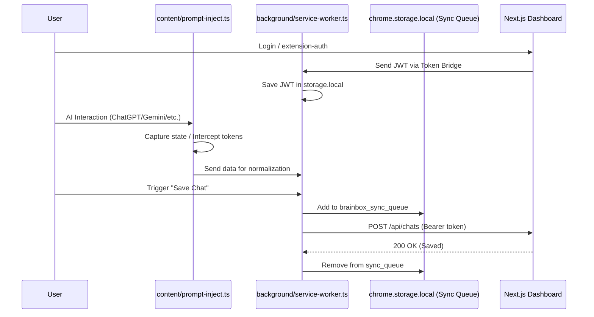

# Sync Protocol Documentation

**Project**: BrainBox AI Chat Organizer  
**Version**: 3.1.0  
**Stack**: Chrome Extension (Manifest V3) ↔ Next.js PWA  
**Generated**: 2026-02-11

---

## 1. Overview

### High-Level Data Flow (v3.1.0)



---

## 2. Authentication Bridge

### 2.1 Token Flow: Dashboard → Extension

**Problem**: Chrome extensions cannot access HTTPOnly cookies from web pages.
**Solution**: Сигурен трансфер на токени през `content-dashboard-auth.ts`, който работи на специалната страница `/extension-auth`.

**Handshake Steps**:
1. Потребителят се логва в Dashboard-а.
2. `content-dashboard-auth.ts` прихваща сесията и я изпраща към Background Service Worker.
3. `authManager.ts` съхранява JWT токена в `chrome.storage.local`.
4. Всички следващи заявки към API-то използват `Authorization: Bearer <JWT>`.

---

## 3. Data Capture & Local Caching

### 3.1 `prompt-inject.ts` (Universal Coordinator)
- **State Capture**: Следи промените в конверсацията и извлича уникалните ID-та.
- **Interception**: Работи в тандем с `inject-gemini-main.ts` за извличане на токени в Gemini.
- **Local Storage**: Използва `chrome.storage.local` за временно съхранение на опашката за синхронизация (`brainbox_sync_queue`).

### 3.2 Sync States
| Състояние | Описание |
|-----------|----------|
| **QUEUED** | Данните са в локалната опашка за синхронизация. |
| **NORMALIZED** | Данните са превърнати в каноничен `Chat` обект (в паметта на SW). |
| **SYNCED** | Данните са успешно записани в Supabase. |

---

## 4. Security Considerations

- **CSP Bypass**: Разширението изпълнява всички тежки заявки (API calls) от Background контекста, за да избегне стриктните CSP политики на AI платформите.
- **Fail-Fast**: Ако сесията е изтекла, `AuthManager` автоматично изпраща съобщение към потребителя за повторен лог-ин.
- **Encryption**: Данните в локалното хранилище са достъпни само за разширението (изолиран контекст).
- **Traffic Interception**: Използва се `RELEVANT_API_REGEX` за филтриране на мрежовия трафик.

## 5. RELEVANT_API_REGEX Definition

Използва се от `AuthManager` и `NetworkObserver` за прихващане на специфичните API заявки на AI платформите:

```javascript
const RELEVANT_API_REGEX = /((chatgpt\.com\/backend-api\/conversation|claude\.ai\/api\/organizations\/[^\/]+\/chat_conversations|gemini\.google\.com\/_\/GeminiWebGuiUi\/data\/batchexecute|chat\.deepseek\.com\/api\/v0\/chat\/history|perplexity\.ai\/api\/v1\/search|x\.com\/i\/api\/|grok\.com\/api\/|chat\.qwenlm\.ai\/api\/|chat\.lmsys\.org\/run\/predict))/i;
```

Тази дефиниция гарантира, че разширението реагира само на "интересни" заявки, съдържащи данни за чатове или сесийни токени.

## 6. Security Gaps & Mitigation

### 6.1 Encryption at Rest (Policy)
- **Current State**: Токените и кешираните чатове се съхраняват в **plain-text** (`chrome.storage.local`). Защитата разчита единствено на изолацията на Chrome Extension Sandbox.
- **Planned Mitigation**: Въвеждане на **AES-GCM** криптиране чрез `Web Crypto API (SubtleCrypto)`. Всяко записване в `storage.local` ще бъде преминало през `encrypt(data, masterKey)`.

### 6.2 Token Rotation Policy
- **JWT Rotation**: `AuthManager` автоматично ротира `access_token` при всяко изтичане, използвайки `refresh_token`.
- **Session Life**: Сесиите са валидни 1 час (Supabase default), като опресняването става при оставащи < 5 минути (Grace Period).
- **Hard Expiry**: При невалиден или липсващ `refresh_token`, потребителят се прехвърля автоматично към `/auth/signin`.

### 6.3 Key Management Lifecycle
- **Storage**: Ключовете за криптиране (бъдещи) ще се съхраняват в `chrome.storage.session` (само в паметта), за да не се записват на диска.
- **Entropy**: Ключовете ще се генерират локално при първия лог-ин и ще се изтриват при `Logout`.
- **Isolation**: Платформените токени (ChatGPT/Gemini) са изолирани в `AuthManager` и никога не се изпращат към Dashboard-а, освен ако не са нужни за сървърна синхронизация.

---
*Документът е актуализиран на 11.02.2026.*

