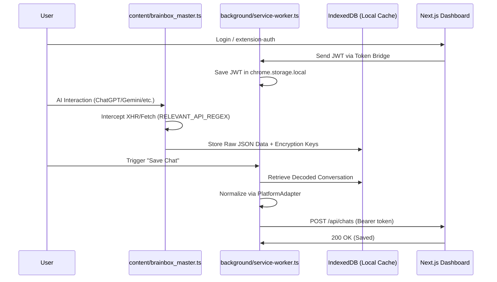

# Sync Protocol Documentation

**Project**: BrainBox AI Chat Organizer  
**Version**: 3.1.0  
**Stack**: Chrome Extension (Manifest V3) ↔ Next.js PWA  
**Generated**: 2026-02-10

---

## 1. Overview

### High-Level Data Flow (v3.1.0)

---

## 2. Authentication Bridge

### 2.1 Token Flow: Dashboard → Extension

**Problem**: Chrome extensions cannot access HTTPOnly cookies from web pages.
**Solution**: Сигурен трансфер на токени през `content-dashboard-auth.ts`, който работи на специалната страница `/extension-auth`.

**Handshake Steps**:
1. Потребителят се логва в Dashboard-а.
2. `content-dashboard-auth.ts` прихваща сесията и я изпраща към Background Service Worker.
3. `authManager.ts` съхранява JWT токена в `chrome.storage.local`.
4. Всички следващи заявки към API-то използват `Authorization: Bearer <JWT>`.

---

## 3. Data Capture & Local Caching

### 3.1 `brainbox_master.ts` (Traffic Coordinator)
- **Regex Guard**: Използва `RELEVANT_API_REGEX` за филтриране на мрежовия трафик.
- **Interception**: Прихваща и `XMLHttpRequest`, и `fetch`.
- **IndexedDB**: Използва база данни `BrainBoxGeminiMaster` за временно съхранение на сурови отговори и ключове за декриптиране (специално за Gemini).

### 3.2 Sync States
| Състояние | Описание |
|-----------|----------|
| **CAPTURED** | Суровите данни са в IndexedDB. |
| **NORMALIZED** | Данните са превърнати в каноничен `Chat` обект (в паметта на SW). |
| **SYNCED** | Данните са успешно записани в Supabase. |

---

## 4. Security Considerations

- **CSP Bypass**: Разширението изпълнява всички тежки заявки (API calls) от Background контекста, за да избегне стриктните CSP политики на AI платформите.
- **Fail-Fast**: Ако сесията е изтекла, `AuthManager` автоматично изпраща съобщение към потребителя за повторен лог-ин.
- **No Global Leakage**: Данните в IndexedDB са достъпни само за разширението и се изчистват автоматично след успешна синхронизация.

---
*Документът е актуализиран на 10.02.2026 от Meta-Architect.*
