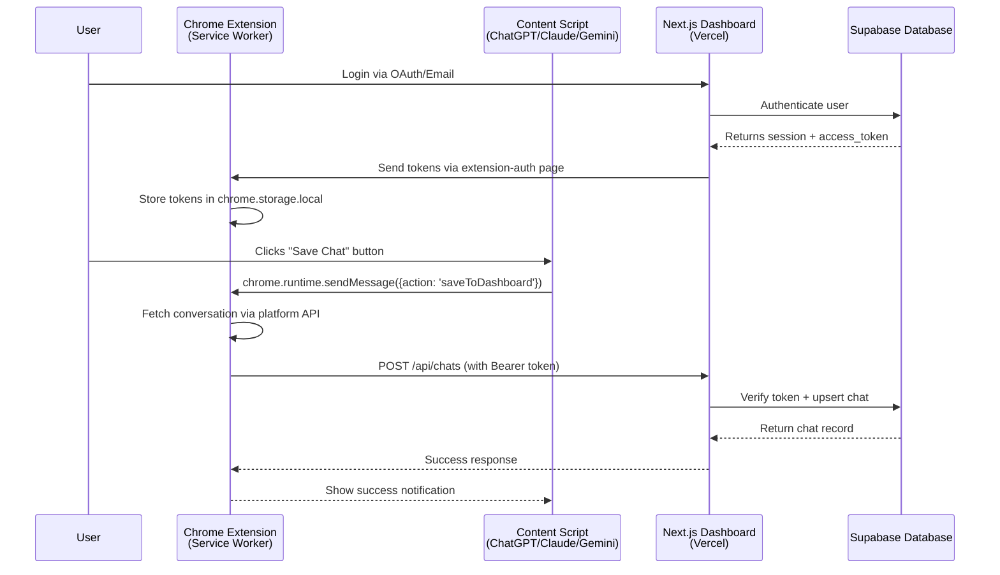
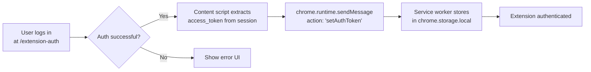
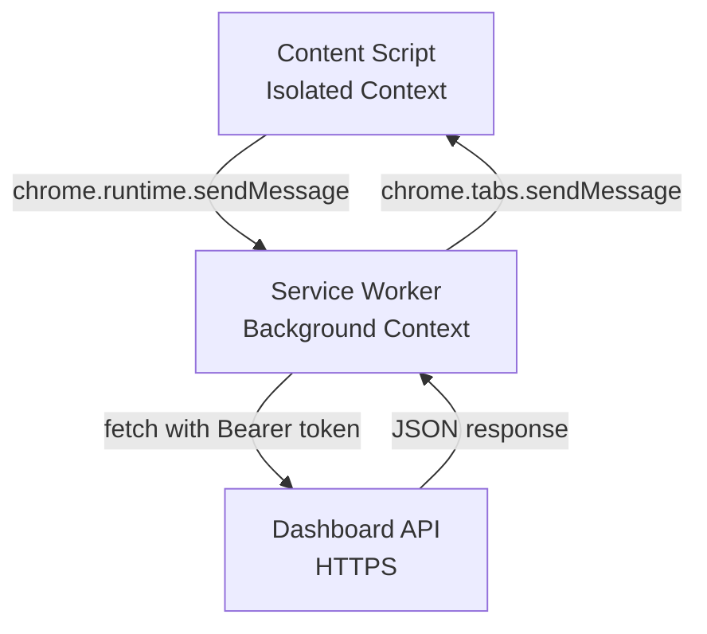

# Sync Protocol Documentation

**Project**: BrainBox AI Chat Organizer  
**Version**: 2.0.6  
**Stack**: Chrome Extension (Manifest V3) ↔ Next.js 15 + Supabase  
**Author**: Meta-Architect  
**Date**: 2026-01-31

---

## 1. Overview

### High-Level Data Flow



### Key Components

| Component | Responsibility | Technology |
|-----------|---------------|------------|
| **Service Worker** | Token interceptor, API orchestrator, message router | JavaScript (Manifest V3 background script) |
| **Content Scripts** | UI injection, conversation extraction, user interaction | JavaScript (isolated DOM context) |
| **Dashboard API** | Authentication, CRUD operations, CORS handling | Next.js 15 App Router + Supabase SSR |
| **Supabase** | User sessions, database, Row-Level Security (RLS) | PostgreSQL + Auth |

---

## 2. Authentication Bridge

### 2.1 Token Flow: Dashboard → Extension

**Problem**: Chrome extensions cannot access HTTPOnly cookies from web pages due to browser security.

**Solution**: Explicit token transfer via dedicated auth page.

#### Implementation



#### Code Reference: Token Storage

**File**: `extension/background/service-worker.js:270-280`

```javascript
if (request.action === 'setAuthToken') {
    chrome.storage.local.set({
        accessToken: request.accessToken,
        refreshToken: request.refreshToken,
        expiresAt: request.expiresAt
    });
    startTokenRefreshCheck();  // Auto-refresh before expiry
    sendResponse({ success: true });
    return true;
}
```

**File**: `src/app/extension-auth/page.tsx:27-40`

```typescript
const supabase = createClient();
const { data: { session } } = await supabase.auth.getSession();

if (session?.access_token) {
    chrome.runtime.sendMessage({
        action: 'setAuthToken',
        accessToken: session.access_token,
        refreshToken: session.refresh_token,
        expiresAt: session.expires_at * 1000  // Convert to ms
    });
}
```

### 2.2 Token Usage: Extension → Dashboard

**Dual Authentication Pattern** (API routes support both web + extension):

**File**: `src/app/api/chats/route.ts:117-159`

```typescript
// Scenario 1: Extension Request (Bearer Token)
if (token) {
    const { createClient } = await import('@supabase/supabase-js');
    supabase = createClient(
        process.env.NEXT_PUBLIC_SUPABASE_URL!,
        process.env.NEXT_PUBLIC_SUPABASE_ANON_KEY!,
        {
            global: {
                headers: { Authorization: `Bearer ${token}` }
            }
        }
    );
    const { data: { user: tokenUser }, error } = await supabase.auth.getUser();
    user = tokenUser;
}
// Scenario 2: Web App Request (Cookies via SSR)
else {
    supabase = createServerClient(..., { cookies: {...} });
    const { data: { user: cookieUser } } = await supabase.auth.getUser();
    user = cookieUser;
}
```

### 2.3 Edge Case: Token Expiration

**File**: `extension/background/service-worker.js:784-790`

```javascript
if (response.status === 401) {
    await chrome.storage.local.remove(['accessToken']);
    if (!silent) {
        chrome.tabs.create({ url: `${DASHBOARD_URL}/extension-auth` });
    }
    throw new Error('Session expired. Please re-authenticate.');
}
```

---

## 3. Message Passing Interface

### 3.1 Architecture



### 3.2 Message Types

#### 3.2.1 Save Chat Command

**Sender**: Content Script  
**Handler**: `service-worker.js:300-305`

```javascript
// Content script sends
chrome.runtime.sendMessage({
    action: 'saveToDashboard',
    data: conversationData,  // Normalized chat object
    folderId: 'uuid' | null,
    silent: false
}, (response) => {
    if (response.success) {
        showNotification('Chat saved!');
    }
});
```

**Data Schema** (see section 4.1):

```typescript
interface ConversationData {
    id: string;              // Platform conversation ID
    title: string;
    platform: 'chatgpt' | 'claude' | 'gemini';
    messages: Message[];
    created_at: string;      // ISO 8601
    url: string;             // Deep link to conversation
}
```

#### 3.2.2 Fetch Prompts (Bypass CSP)

**Problem**: Content scripts cannot make cross-origin requests to dashboard API due to CSP.

**Solution**: Delegate to service worker (which has `<all_urls>` permission).

**File**: `extension/background/service-worker.js:377-382`

```javascript
if (request.action === 'fetchPrompts') {
    handleFetchPrompts()
        .then(data => sendResponse({ success: true, data }))
        .catch(error => sendResponse({ success: false, error: error.message }));
    return true;  // Keep channel open for async response
}
```

### 3.3 Robust Messaging (Retry Logic)

**File**: `extension/background/service-worker.js:388-402`

```javascript
async function sendMessageToTab(tabId, message, retries = 3, delay = 500) {
    for (let i = 0; i < retries; i++) {
        try {
            await chrome.tabs.sendMessage(tabId, message);
            return true;
        } catch (error) {
            if (i === retries - 1) {
                console.log(`Message failed after ${retries} attempts:`, message.action);
                return false;
            }
            await new Promise(r => setTimeout(r, delay));
        }
    }
    return false;
}
```

---

## 4. Data Schemas

### 4.1 Chat Sync Payload

**File**: `extension/background/service-worker.js:764-771`

```javascript
const requestBody = {
    title: conversationData.title || 'Untitled Chat',
    content: formattedContent,      // Formatted as markdown text
    messages: conversationData.messages || [],
    platform: conversationData.platform,
    url: chatUrl,
    folder_id: folderId || null
};
```

**API Validation**: `src/app/api/chats/route.ts:15-23`

```typescript
const createChatSchema = z.object({
    title: z.string().min(1),
    content: z.string(),
    platform: z.string().optional(),
    url: z.string().url().optional().or(z.literal('')),
    folder_id: z.string().uuid().nullable().optional(),
    source_id: z.string().optional(),
    messages: z.array(z.any()).optional(),
});
```

### 4.2 Message Format (Platform-Agnostic)

**File**: `extension/lib/schemas.js`

```javascript
{
    role: 'user' | 'assistant' | 'system',
    content: string,           // Plain text or markdown
    created_at: string,        // ISO 8601 timestamp
    attachments?: Array<{      // Images, files (future)
        type: string,
        url: string
    }>
}
```

### 4.3 Prompt Sync Payload

**API Validation**: `src/app/api/prompts/route.ts:24-30`

```typescript
const createPromptSchema = z.object({
    title: z.string().min(1),
    content: z.string(),
    color: z.string().regex(/^#[0-9A-Fa-f]{6}$/).optional(),
    folder_id: z.string().uuid().nullable().optional(),
    use_in_context_menu: z.boolean().optional(),
});
```

---

## 5. Smart Save Implementation

### 5.1 Manual Scroll Detection (Gemini-Specific)

**Context**: Gemini conversations load progressively. User may scroll to load older messages.

**File**: `extension/content/brainbox_master.js` (Gemini content script)

```javascript
// MISSING_IMPLEMENTATION (Based on specification notes)
// Expected behavior:
// 1. Detect scroll to bottom
// 2. Wait for XHR to complete (batchexecute responses)
// 3. Re-extract conversation
// 4. Compare message count with previous save
// 5. If count > previous, trigger auto-save
```

> **⚠️ ARCHITECTURE GAP**: Manual scroll detection not fully implemented in current codebase. Specification in [`docs/technical/CONVERSATION_EXTRACTION.md`](file:///home/stefanov/Projects/Chat%20Organizer%20Cursor/docs/technical/) (if exists) or needs definition.

### 5.2 Duplicate Prevention

**File**: `src/app/api/chats/route.ts:174-199`

```typescript
// 1. Check for existing chat
let existingChat: any = null;
if (sourceId) {
    const { data } = await supabase
        .from('chats')
        .select('id, messages, title, platform, url, folder_id, content')
        .eq('user_id', user.id)
        .eq('source_id', sourceId)  // Unique constraint
        .maybeSingle();
    existingChat = data;
}

// 2. DATA LOSS PREVENTION
if (existingChat && incomingMessages.length < existingMessages.length) {
    return NextResponse.json({
        ...existingChat,
        is_duplicate: true,
        is_downgrade: true,
        message: 'Stored version is more complete. Update skipped.'
    });
}

// 3. Upsert only if new or more complete
await supabase.from('chats').upsert({...}, { onConflict: 'user_id, source_id' });
```

---

## 6. Edge Cases

### 6.1 Network Timeout

**File**: `extension/lib/rate-limiter.js`

```javascript
export const limiters = {
    chatgpt: new Bottleneck({ minTime: 500, maxConcurrent: 2, reservoir: 60, reservoirRefreshAmount: 60, reservoirRefreshInterval: 60 * 1000 }),
    claude: new Bottleneck({ minTime: 1000, maxConcurrent: 1, reservoir: 30, reservoirRefreshAmount: 30, reservoirRefreshInterval: 60 * 1000 }),
    gemini: new Bottleneck({ minTime: 2000, maxConcurrent: 1, reservoir: 20, reservoirRefreshAmount: 20, reservoirRefreshInterval: 60 * 1000 }),
    dashboard: new Bottleneck({ minTime: 300, maxConcurrent: 5 })
};
```

**Behavior**: If sync fails due to timeout, user sees error notification. No automatic retry (prevents duplicate saves).

### 6.2 Missing API Key (BYOK Mode)

**Context**: BrainBox allows users to provide their own platform API keys for enhanced features.

**File**: `extension/background/service-worker.js:573-584`

```javascript
if (!gemini_at_token) {
    throw new Error('Gemini AT token not found. Please refresh the page.');
}

if (!gemini_dynamic_key) {
    throw new Error('Gemini dynamic key not discovered. Please open any conversation first.');
}
```

**User Flow**:
1. Extension detects missing token via webRequest interceptors
2. Shows notification: "Please interact with the platform to enable sync"
3. Once user loads a conversation, token is auto-captured (example: Gemini dynamic key via batchexecute requests)

### 6.3 CORS Preflight Failures

**File**: `src/app/api/chats/route.ts:57-59`

```typescript
export async function OPTIONS(request: NextRequest) {
    return NextResponse.json({}, { headers: corsHeaders });
}
```

**Headers**: `src/app/api/chats/route.ts:7-12`

```typescript
const corsHeaders = {
    'Access-Control-Allow-Origin': '*',
    'Access-Control-Allow-Methods': 'GET, POST, PUT, DELETE, OPTIONS',
    'Access-Control-Allow-Headers': 'Content-Type, Authorization',
    'Access-Control-Allow-Credentials': 'true',
};
```

---

## 7. Platform-Specific Token Discovery

### 7.1 ChatGPT (Bearer Token)

**Method**: Intercept Authorization header via `webRequest.onBeforeSendHeaders`

**File**: `extension/background/service-worker.js:30-44`

```javascript
chrome.webRequest.onBeforeSendHeaders.addListener(
    (details) => {
        const authHeader = details.requestHeaders.find(
            h => h.name.toLowerCase() === 'authorization'
        );
        if (authHeader && authHeader.value.startsWith('Bearer ')) {
            tokens.chatgpt = authHeader.value;
            chrome.storage.local.set({ chatgpt_token: authHeader.value });
        }
    },
    { urls: ['https://chatgpt.com/backend-api/*'] },
    ['requestHeaders']
);
```

### 7.2 Claude (Organization ID Extraction)

**Specification Pattern**: `/api/organizations/([^/]+)/`

**File**: `extension/background/service-worker.js:51-75`

```javascript
chrome.webRequest.onBeforeRequest.addListener(
    (details) => {
        if (details.url.includes('/api/organizations/')) {
            const match = details.url.match(/\/api\/organizations\/([^\/]+)\//);
            if (match && match[1]) {
                const orgId = match[1];
                tokens.claude_org_id = orgId;
                chrome.storage.local.set({
                    claude_org_id: orgId,
                    org_id_discovered_at: Date.now()
                });
            }
        }
    },
    { urls: ['https://claude.ai/api/organizations/*'] },
    []
);
```

### 7.3 Gemini (Dynamic Key Discovery)

**Specification Pattern**: `/"([a-zA-Z0-9]{5,6})",\s*"\[/` in batchexecute requests

**File**: `extension/background/service-worker.js:95-209`

```javascript
chrome.webRequest.onBeforeRequest.addListener(
    (details) => {
        if (!details.url.includes('batchexecute')) return;
        
        if (details.requestBody) {
            const formData = details.requestBody.formData;
            if (formData && formData['f.req']) {
                const reqData = formData['f.req'][0];
                const specPattern = /"([a-zA-Z0-9]{5,6})",\s*"\[/;
                const match = reqData.match(specPattern);
                
                if (match) {
                    const key = match[1];
                    const hasConversationId = /(?:\\?"|\")c_([a-zA-Z0-9_-]{16,})(?:\\?"|")/.test(reqData);
                    
                    if (hasConversationId) {
                        tokens.gemini_key = key;
                        chrome.storage.local.set({
                            gemini_dynamic_key: key,
                            key_discovered_at: Date.now()
                        });
                    }
                }
            }
        }
    },
    { urls: ['https://gemini.google.com/*'] },
    ['requestBody']
);
```

---

## 8. Security Considerations

### 8.1 Token Exposure

- **Storage**: `chrome.storage.local` (not `chrome.storage.sync` to avoid cloud exposure)
- **Transmission**: HTTPS only (enforced by manifest `host_permissions`)
- **Lifetime**: Tokens expire server-side (Supabase default: 1 hour); extension implements auto-refresh

### 8.2 Content Security Policy (CSP)

**Manifest V3 Restrictions**:
- No eval() or inline scripts
- Service worker cannot access DOM
- Content scripts isolated from page JavaScript (except via `postMessage`)

**File**: `extension/manifest.json:24-27`

```json
"background": {
    "service_worker": "background/service-worker.js",
    "type": "module"  // ES6 modules allowed
}
```

### 8.3 Row-Level Security (RLS)

**Supabase Policy** (not in codebase, configured via dashboard):

```sql
-- Example RLS policy
CREATE POLICY "Users can only access their own chats"
ON chats FOR ALL
USING (auth.uid() = user_id);
```

Ensures even if extension sends malicious `user_id`, database rejects it.

---

## 9. Known Limitations

| Issue | Impact | Workaround |
|-------|--------|------------|
| **Gemini key rotation** | Key expires unpredictably (minutes to hours) | User must reload conversation; extension re-discovers key |
| **Claude session cookies** | Not accessible from extension | Uses fetch with `credentials: 'include'` + org_id |
| **Rate limiting** | Aggressive syncing triggers 429 errors | Bottleneck.js rate limiter (see section 6.1) |
| **Large conversations** | ChatGPT 4k+ messages cause timeout | **MISSING_IMPLEMENTATION**: Pagination or streaming |

---

## 10. Future Enhancements

1. **WebSocket Sync**: Real-time updates when user saves chat from dashboard
2. **Conflict Resolution**: Local-first IndexedDB cache with CRDT-style merging
3. **Batch Operations**: Save multiple chats in one API call
4. **Image Sync**: Upload conversation screenshots to Supabase Storage

---

## Appendix: Quick Reference

### Service Worker Message Actions

| Action | Sender | Handler | Purpose |
|--------|--------|---------|---------|
| `setAuthToken` | Dashboard auth page | Service worker | Store Supabase session |
| `saveToDashboard` | Content script | Service worker | Sync conversation |
| `fetchPrompts` | Content script | Service worker | Get user prompts (CSP bypass) |
| `getConversation` | Content script | Service worker | Fetch via platform API |
| `openLoginPage` | Content script | Service worker | Open /extension-auth (tabs API) |

### API Endpoints

| Endpoint | Method | Auth | Purpose |
|----------|--------|------|---------|
| `/api/chats` | POST | Bearer or Cookie | Create/update chat |
| `/api/chats` | GET | Bearer or Cookie | List user chats |
| `/api/chats` | DELETE | Bearer or Cookie | Delete chat(s) |
| `/api/prompts` | GET | Optional | List prompts (filtered by `use_in_context_menu`) |
| `/api/prompts` | POST | Bearer or Cookie | Create prompt |
| `/api/folders` | GET | Bearer or Cookie | List folders |

---

**End of Document**
