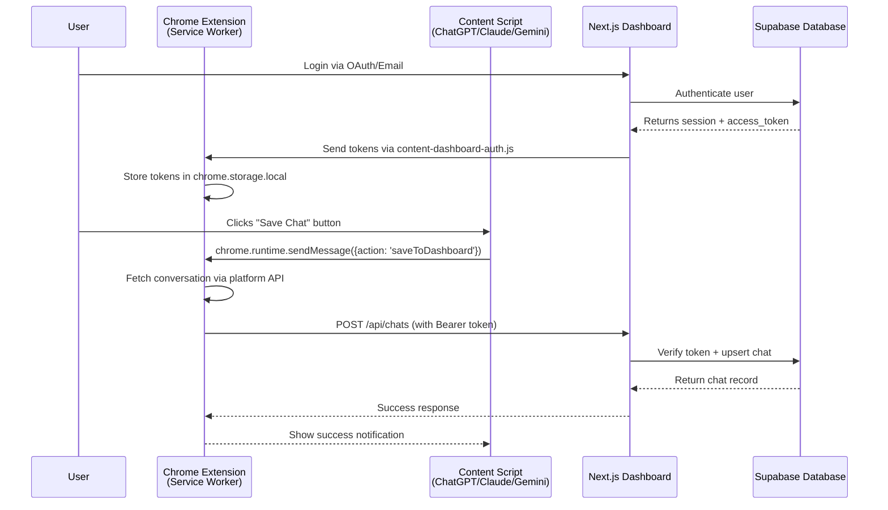
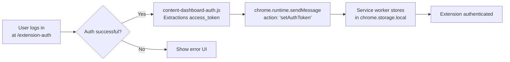
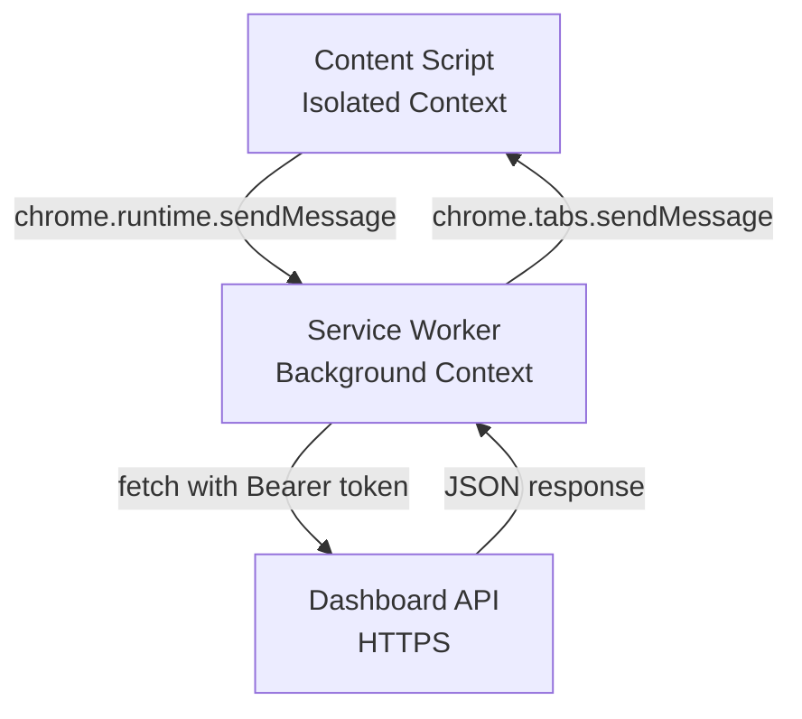

# Sync Protocol Documentation

**Project**: BrainBox AI Chat Organizer  
**Version**: 2.1.0-beta (Monorepo Migration)  
**Stack**: Chrome Extension (Manifest V3) ↔ Next.js PWA  
**Author**: Meta-Architect  
**Date**: 2026-01-31

---

## 1. Overview

### High-Level Data Flow



---

## 2. Authentication Bridge

### 2.1 Token Flow: Dashboard → Extension

**Problem**: Chrome extensions cannot access HTTPOnly cookies from web pages.
**Solution**: Explicit token transfer via `content-dashboard-auth.js` on `/extension-auth` page.

#### Implementation



#### Code Reference

**Extension (Service Worker)**:
`apps/extension/src/background/service-worker.js` listens for `setAuthToken`.

**Dashboard (Auth Page)**:
`apps/dashboard/src/app/extension-auth/page.tsx` exposes session to content script (securely).

---

## 3. Message Passing Interface

### 3.1 Architecture



### 3.2 Message Types

| Action | Sender | Handler | Purpose |
|--------|--------|---------|---------|
| `setAuthToken` | Auth Content Script | Service Worker | Store Supabase session |
| `saveToDashboard` | Platform Content Script | Service Worker | Sync conversation |
| `fetchPrompts` | Content Script | Service Worker | Get user prompts (CSP bypass) |

---

## 4. Data Schemas

### 4.1 Chat Sync Payload

**Constraint**: Must match `@brainbox/validation` schema.

```typescript
// See @brainbox/validation/src/chat.ts
interface CreateChatInput {
    title: string;
    content: string;
    messages: any[];
    platform: string;
    url: string;
    folder_id?: string;
}
```

---

## 5. Security Considerations

### 5.1 Token Exposure
- **Storage**: `chrome.storage.local` (local only, no sync).
- **Lifetime**: Handled by Supabase expiration. Extension auto-refreshes if possible or prompts re-login.

### 5.2 Content Security Policy (CSP)
- **Manifest V3**: No inline scripts. logic isolated in Service Worker.

---
**Version**: v.2.1.0-beta
