# Sync Protocol Documentation

**Project**: BrainBox AI Chat Organizer  
**Version**: 3.1.0  
**Stack**: Chrome Extension (Manifest V3) ↔ Next.js Dashboard  
**Updated**: 2026-02-23

---

## 1. High-Level Data Flow

The extension operates statelessly regarding persistent storage. It relies entirely on the Next.js Dashboard API for truth.

1. **Capture**: Content scripts (`prompt-inject.ts`) capture DOM state.
2. **Normalize**: Platform Adapters (`background/platforms/`) normalize raw AI JSON into the canonical `Message[]` schema.
3. **Sync**: `dashboardApi.ts` sends a `POST /api/chats/extension` request using the Bearer token.

```mermaid
sequenceDiagram
    participant User
    participant Ext_CS as content/prompt-inject.ts
    participant Ext_SW as background/service-worker.ts
    participant Storage as chrome.storage.local
    participant Dashboard as Next.js Dashboard

    User->>Dashboard: Login
    Dashboard->>Ext_SW: Send JWT via Token Bridge (SET_SESSION)
    Ext_SW->>Storage: Save JWT as BRAINBOX_SESSION

    User->>Ext_CS: AI Interaction (ChatGPT/Gemini/etc.)
    Ext_CS->>Ext_SW: Send raw data for normalization
    Ext_SW->>Ext_SW: Platform Adapter → canonical Message[]

    User->>Ext_SW: Trigger "Save Chat"
    Ext_SW->>Dashboard: POST /api/chats/extension (Bearer token)
    Dashboard-->>Ext_SW: 200 OK (Saved)
```



---

## 2. Authentication Bridge (The Token Bridge)

- **Mechanism**: `content-dashboard-auth.ts` reads `localStorage` on the Dashboard domain and sends `SET_SESSION` to the Extension Background.
- **Storage**: The JWT is stored in `chrome.storage.local` under `BRAINBOX_SESSION`.
- **Refresh Logic**: The extension **MUST** proactively check `expires_at`. If the token is within 5 minutes of expiry, it must call `POST /api/auth/refresh` to rotate the token. If it fails, the user is logged out locally.

### Token Bridge Security

| Mechanism | Status |
|-----------|--------|
| `event.origin` validation on window messages | ✅ Implemented |
| Storage: plain-text in `chrome.storage.local` | ⚠️ Planned: AES-GCM via SubtleCrypto |
| Background JWT auto-refresh (<5 min expiry) | 🔲 Required — see Refresh Logic above |

---

## 3. Network Interception

Traffic is filtered via `RELEVANT_API_REGEX`, used by `AuthManager` and `NetworkObserver`:

```javascript
const RELEVANT_API_REGEX = /((chatgpt\.com\/backend-api\/conversation|claude\.ai\/api\/organizations\/[^\/]+\/chat_conversations|gemini\.google\.com\/_\/GeminiWebGuiUi\/data\/batchexecute|chat\.deepseek\.com\/api\/v0\/chat\/history|perplexity\.ai\/api\/v1\/search|x\.com\/i\/api\/|grok\.com\/api\/|chat\.qwenlm\.ai\/api\/|chat\.lmsys\.org\/run\/predict))/i;
```

---

## 4. Sync States

| State | Description |
|-------|-------------|
| **QUEUED** | Data is in `brainbox_sync_queue` in `chrome.storage.local`. |
| **NORMALIZED** | Data has been converted to canonical `Chat` object (in SW memory). |
| **SYNCED** | Data successfully written to Supabase via Dashboard API. |

---

## 5. Deprecation Notice

> [!CAUTION]
> The following components are **DEPRECATED** and must not be used in new code.

| Component | Replacement | Status |
|-----------|-------------|--------|
| `BrainBoxGeminiMaster` IndexedDB | `chrome.storage.local` via SyncManager | 🚫 DEPRECATED |
| `brainbox_master.ts` (monolithic XHR/Fetch patcher) | Modular Platform Adapters (`background/platforms/`) | 🚫 DEPRECATED |

**IndexedDB is DEPRECATED**: The extension no longer uses `BrainBoxGeminiMaster` IndexedDB. All sync queues are managed in memory or `chrome.storage.local`.

**`brainbox_master.ts` is DEPRECATED**: Replaced by modular Platform Adapters located in `src/background/modules/platformAdapters/`.

---

*Документът е актуализиран на 23.02.2026 от Meta-Architect.*
