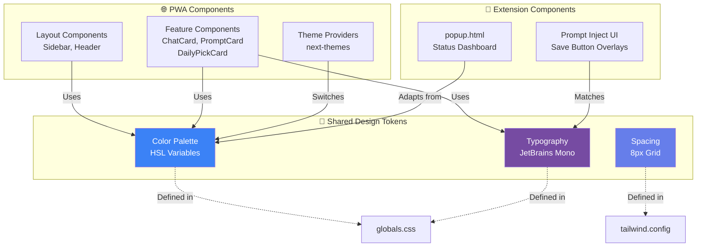

# UI Standards Documentation

**Project**: BrainBox AI Chat Organizer  
**Version**: 2.0.6  
**Design System**: Custom (Tailwind CSS + HSL Variables)  
**Component Library**: Custom components (no Shadcn)  
**Generated**: 2026-01-31  
**Authority**: Meta-Architect (Priority 1 - Visual Identity)

---

## ⚠️ CRITICAL NOTICE FOR AI AGENTS

**PURPOSE**: This document is the Single Source of Truth for BrainBox visual identity.

**AGENTS MUST**:
1. **Use ONLY** colors from the palette (No ad-hoc colors)
2. **Follow** component blueprints exactly (padding, border-radius, shadows)
3. **Respect** Dark Mode logic (automatic theme switching)
4. **Update** this document BEFORE adding new visual patterns

**Using colors outside the palette** = Brand degradation + inconsistent UX

---

## 1. Color Palette

BrainBox uses an **HSL-based palette** with CSS variables for dynamic theming.

### 1.1 Color System Overview

```mermaid
graph TB
    subgraph Light["☀️ Light Mode"]
        L_BG[Background<br/>hsl(0 0% 100%)<br/>#FFFFFF]
        L_FG[Foreground<br/>hsl(222.2 84% 4.9%)<br/>#020817]
        L_PRIMARY[Primary<br/>hsl(221.2 83.2% 53.3%)<br/>#3B82F6]
        L_CARD[Card<br/>hsl(0 0% 100%)<br/>#FFFFFF]
    end
    
    subgraph Dark["🌙 Dark Mode"]
        D_BG[Background<br/>hsl(222.2 84% 4.9%)<br/>#020817]
        D_FG[Foreground<br/>hsl(210 40% 98%)<br/>#F8FAFC]
        D_PRIMARY[Primary<br/>hsl(217.2 91.2% 59.8%)<br/>#60A5FA]
        D_CARD[Card<br/>hsl(222.2 84% 4.9%)<br/>#020817]
    end
    
    L_BG -->|Theme Switch| D_BG
    L_FG -->|Theme Switch| D_FG
    L_PRIMARY -->|Theme Switch| D_PRIMARY
    L_CARD -->|Theme Switch| D_CARD
    
    style L_PRIMARY fill:#3B82F6,color:#fff
    style D_PRIMARY fill:#60A5FA,color:#000
    style L_BG fill:#FFFFFF,color:#000
    style D_BG fill:#020817,color:#fff
```

### 1.2 Core Colors (Light Mode)

| Variable | HSL Value | HEX Equivalent | Usage |
|----------|-----------|----------------|-------|
| `--background` | `0 0% 100%` | `#FFFFFF` | Page background |
| `--foreground` | `222.2 84% 4.9%` | `#020817` | Primary text color |
| `--primary` | `221.2 83.2% 53.3%` | `#3B82F6` | **Brand color** (buttons, links, focus rings) |
| `--primary-foreground` | `210 40% 98%` | `#F8FAFC` | Text on primary backgrounds |
| `--secondary` | `210 40% 96.1%` | `#F1F5F9` | Secondary buttons, badges |
| `--secondary-foreground` | `222.2 47.4% 11.2%` | `#0F172A` | Text on secondary |
| `--accent` | `210 40% 96.1%` | `#F1F5F9` | Hover states, highlights |
| `--accent-foreground` | `222.2 47.4% 11.2%` | `#0F172A` | Text on accents |
| `--muted` | `210 40% 96.1%` | `#F1F5F9` | Disabled states, placeholders |
| `--muted-foreground` | `215.4 16.3% 46.9%` | `#64748B` | Secondary text |
| `--card` | `0 0% 100%` | `#FFFFFF` | Card backgrounds |
| `--card-foreground` | `222.2 84% 4.9%` | `#020817` | Card text |
| `--popover` | `0 0% 100%` | `#FFFFFF` | Dropdown/modal backgrounds |
| `--popover-foreground` | `222.2 84% 4.9%` | `#020817` | Dropdown text |
| `--border` | `214.3 31.8% 91.4%` | `#E2E8F0` | Border color |
| `--input` | `214.3 31.8% 91.4%` | `#E2E8F0` | Input border |
| `--ring` | `221.2 83.2% 53.3%` | `#3B82F6` | Focus ring (matches primary) |
| `--destructive` | `0 84.2% 60.2%` | `#EF4444` | Delete/error actions |
| `--destructive-foreground` | `210 40% 98%` | `#F8FAFC` | Text on destructive |

### 1.3 Core Colors (Dark Mode)

| Variable | HSL Value | HEX Equivalent | Usage |
|----------|-----------|----------------|-------|
| `--background` | `222.2 84% 4.9%` | `#020817` | Page background |
| `--foreground` | `210 40% 98%` | `#F8FAFC` | Primary text color |
| `--primary` | `217.2 91.2% 59.8%` | `#60A5FA` | **Brand color** (lighter for dark mode) |
| `--primary-foreground` | `222.2 47.4% 11.2%` | `#0F172A` | Text on primary (dark) |
| `--secondary` | `217.2 32.6% 17.5%` | `#1E293B` | Secondary buttons |
| `--secondary-foreground` | `210 40% 98%` | `#F8FAFC` | Text on secondary |
| `--accent` | `217.2 32.6% 17.5%` | `#1E293B` | Hover states |
| `--accent-foreground` | `210 40% 98%` | `#F8FAFC` | Text on accents |
| `--muted` | `217.2 32.6% 17.5%` | `#1E293B` | Disabled states |
| `--muted-foreground` | `215 20.2% 65.1%` | `#94A3B8` | Secondary text |
| `--card` | `222.2 84% 4.9%` | `#020817` | Card backgrounds (matches bg) |
| `--card-foreground` | `210 40% 98%` | `#F8FAFC` | Card text |
| `--popover` | `222.2 84% 4.9%` | `#020817` | Dropdown backgrounds |
| `--popover-foreground` | `210 40% 98%` | `#F8FAFC` | Dropdown text |
| `--border` | `217.2 32.6% 17.5%` | `#1E293B` | Border color |
| `--input` | `217.2 32.6% 17.5%` | `#1E293B` | Input border |
| `--ring` | `224.3 76.3% 48%` | `#2563EB` | Focus ring (darker blue) |
| `--destructive` | `0 62.8% 30.6%` | `#991B1B` | Delete/error actions (darker) |
| `--destructive-foreground` | `210 40% 98%` | `#F8FAFC` | Text on destructive |

### 1.4 State Variations (Auto-Generated)

Tailwind utilities automatically handle state variations:

| State | Class Example | Effect |
|-------|---------------|--------|
| **Default** | `bg-primary` | Uses `--primary` |
| **Hover** | `hover:bg-primary/90` | 90% opacity |
| **Active** | `active:bg-primary/80` | 80% opacity (pressed) |
| **Disabled** | `disabled:bg-muted disabled:text-muted-foreground` | Muted colors, `cursor-not-allowed` |
| **Focus** | `focus-visible:ring-2 focus-visible:ring-ring` | 2px ring in `--ring` color |

### 1.5 Extension Popup Gradient

**File**: [`extension/ui/popup.html`](file:///home/stefanov/Projects/Chat%20Organizer%20Cursor/extension/ui/popup.html#L18)

```css
background: linear-gradient(135deg, #667eea 0%, #764ba2 100%);
```

**Colors**:
- Start: `#667eea` (Purple-Blue)
- End: `#764ba2` (Indigo-Purple)

**Button Primary** (white on gradient):
```css
background: white;
color: #667eea; /* Matches gradient start */
```

---

## 2. Typography

### 2.1 Font Families

**Primary Font**: **JetBrains Mono** (monospace)

**Declaration** ([`globals.css:80-84`](file:///home/stefanov/Projects/Chat%20Organizer%20Cursor/src/app/globals.css#L80-L84)):
```css
:root {
  --font-mono: 'JetBrains Mono', monospace;
}

body {
  font-family: var(--font-mono);
  letter-spacing: -0.02em; /* Tighter tracking */
}
```

**Fallback Stack**:
- Extension Popup: `-apple-system, BlinkMacSystemFont, 'Segoe UI', Roboto, sans-serif`

### 2.2 Font Sizes

| Tailwind Class | Size | Usage |
|----------------|------|-------|
| `text-xs` | 0.75rem (12px) | Captions, timestamps |
| `text-sm` | 0.875rem (14px) | Secondary text, badges |
| `text-base` | 1rem (16px) | Body text (default) |
| `text-lg` | 1.125rem (18px) | Subheadings |
| `text-xl` | 1.25rem (20px) | Card titles |
| `text-2xl` | 1.5rem (24px) | Page headings |
| `text-3xl` | 1.875rem (30px) | Hero text |

**Markdown Content** ([`globals.css:88-91`](file:///home/stefanov/Projects/Chat%20Organizer%20Cursor/src/app/globals.css#L88-L91)):
```css
.markdown-content {
  font-size: 0.95rem; /* 15.2px */
  line-height: 1.6;
}
```

### 2.3 Font Weights

| Tailwind Class | Weight | Usage |
|----------------|--------|-------|
| `font-normal` | 400 | Body text |
| `font-medium` | 500 | Emphasized text |
| `font-semibold` | 600 | Button text, labels |
| `font-bold` | 700 | Headings |

**Extension Popup Buttons**: `font-weight: 600` (semibold)

---

## 3. Component Blueprints

### 3.1 Button Component

**No dedicated Button component** - Uses inline Tailwind classes.

#### 3.1.1 Primary Button (PWA)

**Visual Spec**:
```tsx
<button className="
  px-4 py-2 
  bg-primary text-primary-foreground 
  rounded-lg 
  font-semibold 
  hover:bg-primary/90 
  active:bg-primary/80 
  focus-visible:ring-2 focus-visible:ring-ring focus-visible:ring-offset-2
  transition-all duration-200
  disabled:bg-muted disabled:text-muted-foreground disabled:cursor-not-allowed
">
  Save Chat
</button>
```

**Breakdown**:
- **Padding**: `px-4 py-2` (16px horizontal, 8px vertical)
- **Background**: Primary color (blue)
- **Text**: Primary foreground (white/light)
- **Border Radius**: `8px` (rounded-lg)
- **Font**: Semibold (600)
- **Hover**: 90% opacity, slight lift
- **Active**: 80% opacity
- **Focus**: 2px ring with 2px offset
- **Disabled**: Muted colors, no pointer

#### 3.1.2 Secondary Button (PWA)

```tsx
<button className="
  px-4 py-2 
  bg-secondary text-secondary-foreground 
  rounded-lg 
  font-medium 
  hover:bg-accent 
  transition-colors duration-200
">
  Cancel
</button>
```

**Difference**: Medium weight font, `bg-secondary` (gray), hover changes background (not opacity).

#### 3.1.3 Extension Popup Button

**Primary** ([`popup.html:79-101`](file:///home/stefanov/Projects/Chat%20Organizer%20Cursor/extension/ui/popup.html#L79-L101)):
```css
.btn-primary {
  background: white;
  color: #667eea; /* Matches gradient */
  padding: 12px;
  border-radius: 8px;
  font-weight: 600;
  transition: all 0.2s;
}

.btn-primary:hover {
  transform: translateY(-2px); /* Lift effect */
  box-shadow: 0 4px 12px rgba(0, 0, 0, 0.2);
}
```

**Secondary** ([`popup.html:103-110`](file:///home/stefanov/Projects/Chat%20Organizer%20Cursor/extension/ui/popup.html#L103-L110)):
```css
.btn-secondary {
  background: rgba(255, 255, 255, 0.2); /* Glass effect */
  color: white;
}

.btn-secondary:hover {
  background: rgba(255, 255, 255, 0.3);
}
```

### 3.2 Card Component

**Custom Cards** in `features/` directory.

#### 3.2.1 Standard Card (Inferred from ChatCard.tsx)

**Visual Pattern**:
```tsx
<div className="
  bg-card text-card-foreground 
  border border-border 
  rounded-lg 
  p-4 
  shadow-sm 
  hover:shadow-md 
  transition-shadow duration-200
">
  {/* Card content */}
</div>
```

**Breakdown**:
- **Background**: Card color (white/dark)
- **Border**: 1px solid border color
- **Border Radius**: `8px`
- **Padding**: `16px`
- **Shadow**: Small shadow, grows on hover
- **Transition**: Smooth shadow change (200ms)

#### 3.2.2 Glassmorphism Card

**Class**: `.glass-card` ([`globals.css:134-146`](file:///home/stefanov/Projects/Chat%20Organizer%20Cursor/src/app/globals.css#L134-L146))

**Light Mode**:
```css
.glass-card {
  background: rgba(255, 255, 255, 0.7); /* 70% white */
  backdrop-filter: blur(10px);
  border: 1px solid rgba(255, 255, 255, 0.3);
  box-shadow: 0 8px 32px 0 rgba(31, 38, 135, 0.07);
}
```

**Dark Mode**:
```css
.dark .glass-card {
  background: rgba(30, 41, 59, 0.4); /* 40% dark slate */
  border: 1px solid rgba(255, 255, 255, 0.05);
  box-shadow: 0 8px 32px 0 rgba(0, 0, 0, 0.3);
}
```

**Usage**: Overlay cards, modals, floating elements.

### 3.3 Input Component

**No dedicated component** - Inline Tailwind.

**Standard Input**:
```tsx
<input className="
  w-full 
  px-3 py-2 
  bg-background text-foreground 
  border border-input 
  rounded-md 
  focus-visible:ring-2 focus-visible:ring-ring focus-visible:ring-offset-2 
  focus-visible:outline-none
  placeholder:text-muted-foreground
  disabled:bg-muted disabled:cursor-not-allowed
" />
```

**Breakdown**:
- **Padding**: `12px` horizontal, `8px` vertical
- **Border**: 1px input color
- **Border Radius**: `6px` (rounded-md = `--radius` - 2px)
- **Focus**: 2px ring, no browser outline
- **Placeholder**: Muted foreground color

### 3.4 Extension Popup Status Card

**Class**: `.status` ([`popup.html:37-42`](file:///home/stefanov/Projects/Chat%20Organizer%20Cursor/extension/ui/popup.html#L37-L42))

```css
.status {
  background: rgba(255, 255, 255, 0.2); /* Glass effect */
  border-radius: 8px;
  padding: 12px;
  margin-bottom: 16px;
}

.status-item {
  display: flex;
  justify-content: space-between;
  padding: 8px 0;
  border-bottom: 1px solid rgba(255, 255, 255, 0.1);
}
```

**Pattern**: Glassmorphic container with list items separated by subtle dividers.

---

## 4. Spacing & Layout

### 4.1 Border Radius

**Tailwind Config** ([`tailwind.config.ts:46-50`](file:///home/stefanov/Projects/Chat%20Organizer%20Cursor/tailwind.config.ts#L46-L50)):

| Class | Value | Calculation | Usage |
|-------|-------|-------------|-------|
| `rounded-sm` | `2px` | `--radius` - 4px | Badges, tags |
| `rounded-md` | `6px` | `--radius` - 2px | Inputs |
| `rounded-lg` | `8px` | `--radius` (0.5rem) | **Default** (buttons, cards) |
| `rounded-xl` | `12px` | Tailwind default | Larger containers |
| `rounded-2xl` | `16px` | Tailwind default | Hero sections |

**Base Radius**: `--radius: 0.5rem` (8px)

### 4.2 Shadows

**Tailwind Defaults**:

| Class | Value | Usage |
|-------|-------|-------|
| `shadow-sm` | `0 1px 2px 0 rgb(0 0 0 / 0.05)` | Cards (default) |
| `shadow` | `0 1px 3px 0 rgb(0 0 0 / 0.1)` | Elevated cards |
| `shadow-md` | `0 4px 6px -1px rgb(0 0 0 / 0.1)` | Cards on hover |
| `shadow-lg` | `0 10px 15px -3px rgb(0 0 0 / 0.1)` | Modals, dropdowns |
| `shadow-xl` | `0 20px 25px -5px rgb(0 0 0 / 0.1)` | Prominent elements |

**Extension Popup Primary Button Hover**:
```css
box-shadow: 0 4px 12px rgba(0, 0, 0, 0.2);
```

### 4.3 Spacing Scale

BrainBox uses **Tailwind's default spacing** (based on 0.25rem = 4px):

| Class | Value | Usage |
|-------|-------|-------|
| `p-2` | 8px | Compact padding |
| `p-4` | 16px | **Default** card/button padding |
| `p-6` | 24px | Section padding |
| `gap-2` | 8px | Tight element spacing |
| `gap-4` | 16px | **Default** grid/flex gap |
| `gap-6` | 24px | Loose spacing |

**Extension Popup**: 16px (`padding: 16px;` on body, 12px on status card)

---

## 5. Animations & Transitions

### 5.1 Custom Animation: pulse-scale

**Keyframes** ([`globals.css:62-75`](file:///home/stefanov/Projects/Chat%20Organizer%20Cursor/src/app/globals.css#L62-L75)):
```css
@keyframes pulse-scale {
  0%, 100% {
    transform: scale(1);
    opacity: 1;
  }
  50% {
    transform: scale(1.05); /* 5% growth */
    opacity: 0.8;
  }
}

.animate-pulse-scale {
  animation: pulse-scale 0.6s ease-in-out;
}
```

**Usage**: Apply to elements on user interaction (save confirmation, success feedback).

**Example**:
```tsx
<div className="animate-pulse-scale">
  ✅ Chat saved!
</div>
```

### 5.2 Standard Transitions

**Button Hover** (PWA):
```css
transition-all duration-200
/* Equivalent to: transition: all 0.2s; */
```

**Card Shadow**:
```css
transition-shadow duration-200
/* Transitions only box-shadow */
```

**Extension Popup Refresh Button Spin**:
```css
.btn-refresh:active {
  transform: rotate(180deg);
  transition: transform 0.3s;
}
```

**Duration Standard**: `200ms` (0.2s) for most interactions.

---

## 6. Dark Mode Logic

### 6.1 Activation

**Provider**: `next-themes` ([`package.json:37`](file:///home/stefanov/Projects/Chat%20Organizer%20Cursor/package.json#L37))

**Mechanism**:
1. User toggles theme (light/dark/system)
2. `next-themes` adds `.dark` class to `<html>` element
3. CSS variables switch values via `.dark` selector

**Tailwind Config** ([`tailwind.config.ts:3`](file:///home/stefanov/Projects/Chat%20Organizer%20Cursor/tailwind.config.ts#L3)):
```javascript
darkMode: ['class'], // Uses .dark class strategy
```

### 6.2 Color Switching Example

**Light Mode**:
```css
:root {
  --primary: 221.2 83.2% 53.3%; /* #3B82F6 - Brighter blue */
}
```

**Dark Mode**:
```css
.dark {
  --primary: 217.2 91.2% 59.8%; /* #60A5FA - Lighter blue for dark bg */
}
```

**Usage in Components**:
```tsx
<button className="bg-primary">
  {/* Automatically uses #3B82F6 in light, #60A5FA in dark */}
</button>
```

### 6.3 Manual Dark Mode Styles

**Markdown Code Blocks** ([`globals.css:102-105`](file:///home/stefanov/Projects/Chat%20Organizer%20Cursor/src/app/globals.css#L102-L105)):
```css
.markdown-content pre {
  background: rgba(15, 23, 42, 0.05); /* Light mode: subtle gray */
}

.dark .markdown-content pre {
  background: rgba(0, 0, 0, 0.3); /* Dark mode: darker */
}
```

**Pattern**: Use `.dark` prefix for overrides not handled by CSS variables.

---

## 7. Iconography

### 7.1 Icon Library

**Primary**: **Lucide React** ([`package.json:33`](file:///home/stefanov/Projects/Chat%20Organizer%20Cursor/package.json#L33))

**Version**: `^0.561.0`

**Import Example**:
```tsx
import { MessageSquare, Folder, Trash2 } from 'lucide-react';

<MessageSquare className="w-5 h-5" />
```

### 7.2 Size Standards

| Tailwind Class | Size | Usage |
|----------------|------|-------|
| `w-4 h-4` | 16px | Inline icons, badges |
| `w-5 h-5` | 20px | **Default** button/card icons |
| `w-6 h-6` | 24px | Emphasized actions |
| `w-8 h-8` | 32px | Hero icons, empty states |

### 7.3 Stroke Width

**Lucide Default**: `strokeWidth={2}` (2px)

**Thinner Icons**:
```tsx
<Trash2 className="w-5 h-5" strokeWidth={1.5} />
```

**Thicker Icons** (emphasis):
```tsx
<AlertCircle className="w-6 h-6" strokeWidth={2.5} />
```

### 7.4 Color Patterns

**Primary Action**:
```tsx
<Save className="w-5 h-5 text-primary" />
```

**Destructive Action**:
```tsx
<Trash2 className="w-5 h-5 text-destructive" />
```

**Muted/Inactive**:
```tsx
<Clock className="w-4 h-4 text-muted-foreground" />
```

**Inherit Parent**:
```tsx
<button className="text-white">
  <Check className="w-5 h-5" /> {/* Inherits white */}
</button>
```

### 7.5 Extension Popup Icons

**Emoji-based** (no Lucide in popup):
- Status indicators: ⚪ (inactive), 🟢 (active), 🔴 (error)
- Refresh button: 🔄
- Header: 🧠 (brain emoji)

**Rationale**: Avoids bundling React in extension popup (vanilla JS).

---

## 8. Markdown Content Styling

### 8.1 Typography Overrides

**Class**: `.markdown-content` ([`globals.css:88-132`](file:///home/stefanov/Projects/Chat%20Organizer%20Cursor/src/app/globals.css#L88-L132))

```css
.markdown-content {
  font-size: 0.95rem;
  line-height: 1.6;
}

.markdown-content h1, h2, h3 {
  font-weight: 700;
  margin-top: 1.5rem;
  margin-bottom: 0.75rem;
}

.markdown-content p {
  margin-bottom: 1rem;
}

.markdown-content ul, ol {
  margin-left: 1.5rem;
  margin-bottom: 1rem;
}
```

### 8.2 Code Blocks

**Inline Code**:
```css
.markdown-content code {
  font-family: var(--font-mono);
  background: rgba(15, 23, 42, 0.05);
  padding: 0.2rem 0.4rem;
  border-radius: 0.25rem;
  font-size: 0.85em;
}
```

**Block Code** (`<pre>`):
```css
.markdown-content pre {
  background: rgba(15, 23, 42, 0.05);
  border: 1px solid rgba(0, 0, 0, 0.1);
  border-radius: 0.75rem;
  padding: 1rem;
  overflow-x: auto;
}
```

**Dark Mode Adjustments**:
```css
.dark .markdown-content code {
  background: rgba(255, 255, 255, 0.1);
}

.dark .markdown-content pre {
  background: rgba(0, 0, 0, 0.3);
  border: 1px solid rgba(255, 255, 255, 0.1);
}
```

---

## 9. Extension Compatibility

### 9.1 Challenge: Shadow DOM Isolation

**Problem**: Extension popup (`popup.html`) runs in Chrome's UI context, not web page.

**Constraints**:
- Cannot use Tailwind build (too large)
- Must avoid conflicts with host page styles
- No framework dependencies (vanilla JS)

**Solution**: **Inline CSS** with scoped styles.

### 9.2 Tailwind → Inline CSS Mapping

#### 9.2.1 Colors

**PWA (Tailwind)**:
```tsx
<button className="bg-primary text-primary-foreground">
```

**Extension (Inline CSS)**:
```css
.btn-primary {
  background: white; /* Equivalent to primary-foreground in gradient context */
  color: #667eea; /* Custom brand color (gradient start) */
}
```

**Conversion Table**:

| PWA Tailwind | Extension Inline CSS | Notes |
|--------------|---------------------|-------|
| `bg-primary` | `background: #667eea;` | Use HEX from gradient |
| `text-foreground` | `color: white;` | On gradient background |
| `border-border` | `border: 1px solid rgba(255,255,255,0.1);` | Glass border |
| `rounded-lg` | `border-radius: 8px;` | Direct pixel value |
| `shadow-md` | `box-shadow: 0 4px 12px rgba(0,0,0,0.2);` | Manual shadow |

#### 9.2.2 Spacing

**PWA**:
```tsx
<div className="p-4 gap-2">
```

**Extension**:
```css
.container {
  padding: 16px; /* p-4 = 1rem = 16px */
}

.actions {
  gap: 8px; /* gap-2 = 0.5rem = 8px */
}
```

#### 9.2.3 Hover Effects

**PWA**:
```tsx
<button className="hover:bg-primary/90">
```

**Extension**:
```css
.btn:hover {
  background: rgba(white, 0.9); /* 90% opacity */
  /* Or use filter: brightness(0.9); */
}
```

### 9.3 Extension Gradient Override

**PWA** uses dark/light mode. **Extension** uses fixed gradient:

```css
body {
  background: linear-gradient(135deg, #667eea 0%, #764ba2 100%);
  color: white; /* Always white text */
}
```

**Buttons adapt to gradient**:
- Primary: White background, gradient color text
- Secondary: Glass effect (`rgba(255,255,255,0.2)`)

### 9.4 No Dark Mode Toggle in Extension

**Rationale**: Popup is ephemeral (opens/closes quickly), gradient works in all contexts.

**PWA**: Full dark mode support via `next-themes`.

---

## 10. Component Hierarchy



### 10.1 Component Ownership

| Component Type | Location | Styling Method |
|----------------|----------|----------------|
| **Layout** | `src/components/layout/` | Tailwind classes |
| **Feature Cards** | `src/components/features/` | Tailwind + custom classes |
| **Theme Provider** | `src/components/providers/` | `next-themes` wrapper |
| **Extension Popup** | `extension/ui/popup.html` | Inline CSS (scoped) |
| **Prompt Inject UI** | `extension/prompt-inject/` | Inline CSS (Shadow DOM) |

---

## 11. Anti-Patterns (Forbidden)

### 11.1 Ad-Hoc Colors

**WRONG**:
```tsx
<div className="bg-[#FF5733]"> {/* ❌ Random hex color */}
```

**CORRECT**:
```tsx
<div className="bg-destructive"> {/* ✅ Uses palette */}
```

**Reason**: Breaks theme consistency, ignores dark mode.

### 11.2 Hardcoded Border Radius

**WRONG**:
```css
.custom-card {
  border-radius: 12px; /* ❌ Doesn't scale with --radius */
}
```

**CORRECT**:
```tsx
<div className="rounded-lg"> {/* ✅ Uses theme radius */}
```

### 11.3 Inline Styles in React

**WRONG**:
```tsx
<button style={{ backgroundColor: '#3B82F6' }}> {/* ❌ Bypasses theme */}
```

**CORRECT**:
```tsx
<button className="bg-primary"> {/* ✅ Theme-aware */}
```

**Exception**: Extension popup (requires inline CSS for isolation).

### 11.4 Mixing Font Families

**WRONG**:
```css
.special-text {
  font-family: 'Comic Sans MS'; /* ❌ Off-brand */
}
```

**CORRECT**: Use `var(--font-mono)` (JetBrains Mono) or system fallback.

### 11.5 Custom Shadows Without Rationale

**WRONG**:
```css
box-shadow: 0 15px 50px rgba(255, 0, 0, 0.5); /* ❌ Arbitrary, red glow */
```

**CORRECT**: Use Tailwind shadow utilities (`shadow-sm`, `shadow-md`).

---

## 12. Accessibility Considerations

### 12.1 Focus Rings

**All interactive elements** must have visible focus rings:

```tsx
focus-visible:ring-2 focus-visible:ring-ring focus-visible:ring-offset-2
```

**Colors**:
- Light mode: `--ring: #3B82F6` (blue)
- Dark mode: `--ring: #2563EB` (darker blue)

### 12.2 Color Contrast

**WCAG AA Compliance** (4.5:1 for normal text):

| Combination | Light Mode | Dark Mode | Passes WCAG AA |
|-------------|------------|-----------|----------------|
| Foreground / Background | `#020817` / `#FFFFFF` | `#F8FAFC` / `#020817` | ✅ Yes |
| Primary / Background | `#3B82F6` / `#FFFFFF` | `#60A5FA` / `#020817` | ✅ Yes |
| Muted Foreground / Background | `#64748B` / `#FFFFFF` | `#94A3B8` / `#020817` | ✅ Yes |

**Extension Popup** (white text on gradient):
- Gradient is dark enough for white text to pass WCAG AA.

### 12.3 Disabled States

**Must be visually distinct**:

```tsx
disabled:bg-muted disabled:text-muted-foreground disabled:cursor-not-allowed disabled:opacity-50
```

**Example**:
- Background: `#F1F5F9` (light) / `#1E293B` (dark)
- Text: `#64748B` (light) / `#94A3B8` (dark)
- Cursor: `not-allowed`
- Opacity: 50%

---

## 13. Design Tokens Reference

**Single Source of Truth**: [`globals.css`](file:///home/stefanov/Projects/Chat%20Organizer%20Cursor/src/app/globals.css)

### 13.1 CSS Variables (Exported for JS)

```javascript
// Read current theme color in JavaScript
const primaryColor = getComputedStyle(document.documentElement)
  .getPropertyValue('--primary');
// Returns: "221.2 83.2% 53.3%" (HSL without 'hsl()')
```

**Usage**: Dynamic theming, chart colors, canvas overlays.

### 13.2 Tailwind Config Reference

**File**: [`tailwind.config.ts`](file:///home/stefanov/Projects/Chat%20Organizer%20Cursor/tailwind.config.ts)

**Key Exports**:
- `colors`: Maps to CSS variables
- `borderRadius`: `--radius` (8px)
- `darkMode`: `'class'` (uses `.dark` selector)

---

## 14. Future-Proofing Rules

### 14.1 Adding New Colors

**Process**:
1. Update `globals.css` (add `--new-color` in `:root` and `.dark`)
2. Update `tailwind.config.ts` (map to `hsl(var(--new-color))`)
3. Update this file (add to Color Palette table)
4. Test in light + dark mode

**Example** (adding `--info` color):

**`globals.css`**:
```css
:root {
  --info: 200 98% 39%; /* #0891B2 - Cyan */
  --info-foreground: 0 0% 100%; /* White */
}

.dark {
  --info: 200 94% 56%; /* #22D3EE - Lighter cyan */
  --info-foreground: 0 0% 0%; /* Black */
}
```

**`tailwind.config.ts`**:
```javascript
colors: {
  info: {
    DEFAULT: 'hsl(var(--info))',
    foreground: 'hsl(var(--info-foreground))',
  },
}
```

**Usage**:
```tsx
<div className="bg-info text-info-foreground">
  Info message
</div>
```

### 14.2 Adding New Animations

**Process**:
1. Add `@keyframes` to `globals.css` in `@layer utilities`
2. Create utility class (e.g., `.animate-custom-name`)
3. Document in this file (Section 5)

**Example**:
```css
@layer utilities {
  @keyframes slide-in {
    from { transform: translateX(-100%); }
    to { transform: translateX(0); }
  }
  
  .animate-slide-in {
    animation: slide-in 0.3s ease-out;
  }
}
```

### 14.3 Updating Component Patterns

**Before** modifying a component's visual style:
1. Check if pattern exists in this document
2. If yes, update this document FIRST
3. Then update all instances in code
4. Test light + dark mode

**Example**: Changing button border-radius from 8px → 12px:
1. Update `--radius` in `globals.css` → `0.75rem`
2. Update Section 3.1.1 in this doc
3. Verify all buttons now use `rounded-lg` (not hardcoded `rounded-[12px]`)

---

## 15. Quick Reference: Common Patterns

### 15.1 Button

```tsx
<button className="px-4 py-2 bg-primary text-primary-foreground rounded-lg font-semibold hover:bg-primary/90 transition-all duration-200">
  Action
</button>
```

### 15.2 Card

```tsx
<div className="bg-card border border-border rounded-lg p-4 shadow-sm hover:shadow-md transition-shadow">
  {content}
</div>
```

### 15.3 Input

```tsx
<input className="w-full px-3 py-2 bg-background border border-input rounded-md focus-visible:ring-2 focus-visible:ring-ring" />
```

### 15.4 Glassmorphism Card

```tsx
<div className="glass-card rounded-lg p-6">
  {content}
</div>
```

### 15.5 Icon Button

```tsx
<button className="p-2 rounded-md hover:bg-accent transition-colors">
  <Trash2 className="w-5 h-5 text-destructive" />
</button>
```

### 15.6 Extension Popup Gradient Background

```css
body {
  background: linear-gradient(135deg, #667eea 0%, #764ba2 100%);
}
```

---

## Appendix A: Color Reference Chart

### A.1 Light Mode Palette

| Color | HEX | HSL | Preview |
|-------|-----|-----|---------|
| Background | `#FFFFFF` | `0 0% 100%` |  |
| Foreground | `#020817` | `222.2 84% 4.9%` |  |
| Primary | `#3B82F6` | `221.2 83.2% 53.3%` |  |
| Secondary | `#F1F5F9` | `210 40% 96.1%` |  |
| Destructive | `#EF4444` | `0 84.2% 60.2%` |  |
| Border | `#E2E8F0` | `214.3 31.8% 91.4%` |  |

### A.2 Dark Mode Palette

| Color | HEX | HSL | Preview |
|-------|-----|-----|---------|
| Background | `#020817` | `222.2 84% 4.9%` |  |
| Foreground | `#F8FAFC` | `210 40% 98%` |  |
| Primary | `#60A5FA` | `217.2 91.2% 59.8%` |  |
| Secondary | `#1E293B` | `217.2 32.6% 17.5%` |  |
| Destructive | `#991B1B` | `0 62.8% 30.6%` |  |
| Border | `#1E293B` | `217.2 32.6% 17.5%` |  |

---

**End of Document**  
**Last Updated**: 2026-01-31  
**Maintained By**: Superior Meta-Architect+ (Priority 1)
