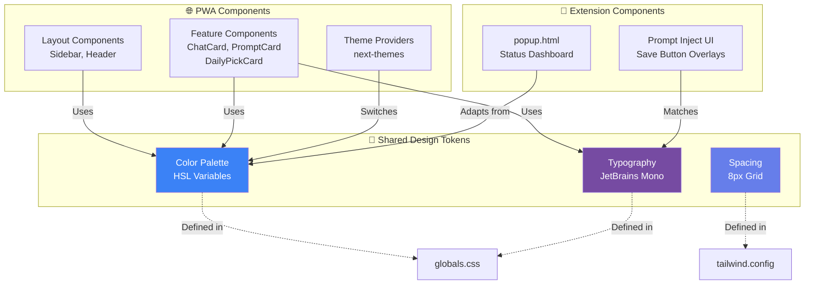

# UI Standards Documentation

**Project**: BrainBox AI Chat Organizer  
**Version**: 2.1.4  
**Design System**: Custom (Tailwind CSS + HSL Variables)  
**Component Library**: Custom components  
**Generated**: 2026-02-03  
**Authority**: Meta-Architect (Priority 1 - Visual Identity)

---

## ⚠️ CRITICAL NOTICE FOR AI AGENTS

**PURPOSE**: This document is the Single Source of Truth for BrainBox visual identity.

**AGENTS MUST**:
1. **Use ONLY** colors from the palette (No ad-hoc colors)
2. **Follow** component blueprints exactly (padding, border-radius, shadows)
3. **Respect** Dark Mode logic (automatic theme switching)
4. **Update** this document BEFORE adding new visual patterns

**Using colors outside the palette** = Brand degradation + inconsistent UX

---

## 1. Color Palette

BrainBox uses an **HSL-based palette** with CSS variables for dynamic theming.

### 1.1 Color System Overview

```mermaid
graph TB
    subgraph Light["☀️ Light Mode"]
        L_BG[Background<br/>hsl(0 0% 100%)<br/>#FFFFFF]
        L_FG[Foreground<br/>hsl(222.2 84% 4.9%)<br/>#020817]
        L_PRIMARY[Primary<br/>hsl(221.2 83.2% 53.3%)<br/>#3B82F6]
        L_CARD[Card<br/>hsl(0 0% 100%)<br/>#FFFFFF]
    end
    
    subgraph Dark["🌙 Dark Mode"]
        D_BG[Background<br/>hsl(222.2 84% 4.9%)<br/>#020817]
        D_FG[Foreground<br/>hsl(210 40% 98%)<br/>#F8FAFC]
        D_PRIMARY[Primary<br/>hsl(217.2 91.2% 59.8%)<br/>#60A5FA]
        D_CARD[Card<br/>hsl(222.2 84% 4.9%)<br/>#020817]
    end
    
    L_BG -->|Theme Switch| D_BG
    L_FG -->|Theme Switch| D_FG
    L_PRIMARY -->|Theme Switch| D_PRIMARY
    L_CARD -->|Theme Switch| D_CARD
    
    style L_PRIMARY fill:#3B82F6,color:#fff
    style D_PRIMARY fill:#60A5FA,color:#000
    style L_BG fill:#FFFFFF,color:#000
    style D_BG fill:#020817,color:#fff
```

### 1.2 Core Colors (Light Mode)

| Variable | HSL Value | HEX Equivalent | Usage |
|----------|-----------|----------------|-------|
| `--background` | `0 0% 100%` | `#FFFFFF` | Page background |
| `--foreground` | `222.2 84% 4.9%` | `#020817` | Primary text color |
| `--primary` | `221.2 83.2% 53.3%` | `#3B82F6` | **Brand color** (buttons, links, focus rings) |
| `--primary-foreground` | `210 40% 98%` | `#F8FAFC` | Text on primary backgrounds |
| `--secondary` | `210 40% 96.1%` | `#F1F5F9` | Secondary buttons, badges |
| `--secondary-foreground` | `222.2 47.4% 11.2%` | `#0F172A` | Text on secondary |
| `--accent` | `210 40% 96.1%` | `#F1F5F9` | Hover states, highlights |
| `--accent-foreground` | `222.2 47.4% 11.2%` | `#0F172A` | Text on accents |
| `--muted` | `210 40% 96.1%` | `#F1F5F9` | Disabled states, placeholders |
| `--muted-foreground` | `215.4 16.3% 46.9%` | `#64748B` | Secondary text |
| `--card` | `0 0% 100%` | `#FFFFFF` | Card backgrounds |
| `--card-foreground` | `222.2 84% 4.9%` | `#020817` | Card text |
| `--popover` | `0 0% 100%` | `#FFFFFF` | Dropdown/modal backgrounds |
| `--popover-foreground` | `222.2 84% 4.9%` | `#020817` | Dropdown text |
| `--border` | `214.3 31.8% 91.4%` | `#E2E8F0` | Border color |
| `--input` | `214.3 31.8% 91.4%` | `#E2E8F0` | Input border |
| `--ring` | `221.2 83.2% 53.3%` | `#3B82F6` | Focus ring (matches primary) |
| `--destructive` | `0 84.2% 60.2%` | `#EF4444` | Delete/error actions |
| `--destructive-foreground` | `210 40% 98%` | `#F8FAFC` | Text on destructive |

### 1.3 Core Colors (Dark Mode)

| Variable | HSL Value | HEX Equivalent | Usage |
|----------|-----------|----------------|-------|
| `--background` | `222.2 84% 4.9%` | `#020817` | Page background |
| `--foreground` | `210 40% 98%` | `#F8FAFC` | Primary text color |
| `--primary` | `217.2 91.2% 59.8%` | `#60A5FA` | **Brand color** (lighter for dark mode) |
| `--primary-foreground` | `222.2 47.4% 11.2%` | `#0F172A` | Text on primary (dark) |
| `--secondary` | `217.2 32.6% 17.5%` | `#1E293B` | Secondary buttons |
| `--secondary-foreground` | `210 40% 98%` | `#F8FAFC` | Text on secondary |
| `--accent` | `217.2 32.6% 17.5%` | `#1E293B` | Hover states |
| `--accent-foreground` | `210 40% 98%` | `#F8FAFC` | Text on accents |
| `--muted` | `217.2 32.6% 17.5%` | `#1E293B` | Disabled states |
| `--muted-foreground` | `215 20.2% 65.1%` | `#94A3B8` | Secondary text |
| `--card` | `222.2 84% 4.9%` | `#020817` | Card backgrounds (matches bg) |
| `--card-foreground` | `210 40% 98%` | `#F8FAFC` | Card text |
| `--popover` | `222.2 84% 4.9%` | `#020817` | Dropdown backgrounds |
| `--popover-foreground` | `210 40% 98%` | `#F8FAFC` | Dropdown text |
| `--border` | `217.2 32.6% 17.5%` | `#1E293B` | Border color |
| `--input` | `217.2 32.6% 17.5%` | `#1E293B` | Input border |
| `--ring` | `224.3 76.3% 48%` | `#2563EB` | Focus ring (darker blue) |
| `--destructive` | `0 62.8% 30.6%` | `#991B1B` | Delete/error actions (darker) |
| `--destructive-foreground` | `210 40% 98%` | `#F8FAFC` | Text on destructive |

### 1.4 State Variations (Auto-Generated)

Tailwind utilities automatically handle state variations:

| State | Class Example | Effect |
|-------|---------------|--------|
| **Default** | `bg-primary` | Uses `--primary` |
| **Hover** | `hover:bg-primary/90` | 90% opacity |
| **Active** | `active:bg-primary/80` | 80% opacity (pressed) |
| **Disabled** | `disabled:bg-muted disabled:text-muted-foreground` | Muted colors, `cursor-not-allowed` |
| **Focus** | `focus-visible:ring-2 focus-visible:ring-ring` | 2px ring in `--ring` color |

### 1.5 Extension Popup Gradient

**File**: [`apps/extension/src/ui/popup.html`](/apps/extension/src/ui/popup.html)

```css
background: linear-gradient(135deg, #667eea 0%, #764ba2 100%);
```

**Colors**:
- Start: `#667eea` (Purple-Blue)
- End: `#764ba2` (Indigo-Purple)

**Button Primary** (white on gradient):
```css
background: white;
color: #667eea; /* Matches gradient start */
```

### 1.6 Platform Colors (Tailwind Tokens)

Mapped in `apps/extension/tailwind.config.ts`. Used for `PlatformBadge` and `QuickAccess` grid.

| Platform | HSL Value | HEX (Approx) | Tailwind Class / Token |
|----------|-----------|--------------|------------------------|
| **ChatGPT** | `142 71% 45%` | `#10a37f` | `text-platform-chatgpt` |
| **Claude** | `25 95% 53%` | `#d97757` | `text-platform-claude` |
| **Gemini** | `217 91% 60%` | `#4285f4` | `text-platform-gemini` |
| **Grok** | `0 0% 100%` | `#FFFFFF` | `text-platform-grok` |
| **Perplexity** | `189 94% 43%` | `#20b2aa` | `text-platform-perplexity` |
| **DeepSeek** | `217 91% 60%` | `#4285f4` | `text-platform-deepseek` |
| **Qwen** | `262 83% 58%` | `#a855f7` | `text-platform-qwen` |
| **LMArena** | `43 96% 56%` | `#f43f5e` | `text-platform-lmarena` |

### 1.7 Glow & Glass Effects

#### 1.7.1 Platform Glow (Extension)
Defined in `apps/extension/src/popup/styles/index.css` via `@layer utilities`.

```css
.glow-[platform]:hover {
  box-shadow: 0 0 20px hsl([platform-hsl] / 0.5);
}
```

#### 1.7.2 Glassmorphism (Shared)
- **Extension**: Uses `bg-glass-bg` (`hsl(222 47% 11% / 0.7)`) and `border-glass-border` (`hsl(0 0% 100% / 0.1)`).
- **Dashboard**: Uses `.glass-card` utility for modular overlays.

---

## 2. Typography

### 2.1 Font Families

**Primary Font**: **JetBrains Mono** (monospace)

**Declaration** ([`apps/dashboard/src/app/globals.css`](/apps/dashboard/src/app/globals.css)):
```css
:root {
  --font-mono: 'JetBrains Mono', monospace;
}

body {
  font-family: var(--font-mono);
  letter-spacing: -0.02em; /* Tighter tracking */
}
```

**Fallback Stack**:
- Extension Popup: `-apple-system, BlinkMacSystemFont, 'Segoe UI', Roboto, sans-serif`

### 2.2 Font Sizes

| Tailwind Class | Size | Usage |
|----------------|------|-------|
| `text-xs` | 0.75rem (12px) | Captions, timestamps |
| `text-sm` | 0.875rem (14px) | Secondary text, badges |
| `text-base` | 1rem (16px) | Body text (default) |
| `text-lg` | 1.125rem (18px) | Subheadings |
| `text-xl` | 1.25rem (20px) | Card titles |
| `text-2xl` | 1.5rem (24px) | Page headings |
| `text-3xl` | 1.875rem (30px) | Hero text |

**Markdown Content** ([`apps/dashboard/src/app/globals.css:88-91`](file:///home/stefanov/Projects/Chat%20Organizer%20Cursor/apps/dashboard/src/app/globals.css#L88-L91)):
```css
.markdown-content {
  font-size: 0.95rem; /* 15.2px */
  line-height: 1.6;
}
```

### 2.3 Font Weights

| Tailwind Class | Weight | Usage |
|----------------|--------|-------|
| `font-normal` | 400 | Body text |
| `font-medium` | 500 | Emphasized text |
| `font-semibold` | 600 | Button text, labels |
| `font-bold` | 700 | Headings |

**Extension Popup Buttons**: `font-weight: 600` (semibold)

---

## 3. Component Blueprints

### 3.1 Button Component

**No dedicated Button component** - Uses inline Tailwind classes.

#### 3.1.1 Primary Button (PWA)

**Visual Spec**:
```tsx
<button className="
  px-4 py-2 
  bg-primary text-primary-foreground 
  rounded-lg 
  font-semibold 
  hover:bg-primary/90 
  active:bg-primary/80 
  focus-visible:ring-2 focus-visible:ring-ring focus-visible:ring-offset-2
  transition-all duration-200
  disabled:bg-muted disabled:text-muted-foreground disabled:cursor-not-allowed
">
  Save Chat
</button>
```

**Breakdown**:
- **Padding**: `px-4 py-2` (16px horizontal, 8px vertical)
- **Background**: Primary color (blue)
- **Text**: Primary foreground (white/light)
- **Border Radius**: `8px` (rounded-lg)
- **Font**: Semibold (600)
- **Hover**: 90% opacity, slight lift
- **Active**: 80% opacity
- **Focus**: 2px ring with 2px offset
- **Disabled**: Muted colors, no pointer

#### 3.1.2 Secondary Button (PWA)

```tsx
<button className="
  px-4 py-2 
  bg-secondary text-secondary-foreground 
  rounded-lg 
  font-medium 
  hover:bg-accent 
  transition-colors duration-200
">
  Cancel
</button>
```

**Difference**: Medium weight font, `bg-secondary` (gray), hover changes background (not opacity).

#### 3.1.3 Extension Popup Button

**Primary** ([`apps/extension/src/popup/App.tsx`](file:///home/stefanov/Projects/Chat%20Organizer%20Cursor/apps/extension/src/popup/App.tsx)):
```css
.btn-primary {
  background: white;
  color: #667eea; /* Matches gradient */
  padding: 12px;
  border-radius: 8px;
  font-weight: 600;
  transition: all 0.2s;
}

.btn-primary:hover {
  transform: translateY(-2px); /* Lift effect */
  box-shadow: 0 4px 12px rgba(0, 0, 0, 0.2);
}
```

**Secondary** ([`apps/extension/src/popup/App.tsx`](file:///home/stefanov/Projects/Chat%20Organizer%20Cursor/apps/extension/src/popup/App.tsx)):
```css
.btn-secondary {
  background: rgba(255, 255, 255, 0.2); /* Glass effect */
  color: white;
}

.btn-secondary:hover {
  background: rgba(255, 255, 255, 0.3);
}
```

### 3.2 Card Component

**Custom Cards** in `features/` directory.

#### 3.2.1 Standard Card (Inferred from ChatCard.tsx)

**Visual Pattern**:
```tsx
<div className="
  bg-card text-card-foreground 
  border border-border 
  rounded-lg 
  p-4 
  shadow-sm 
  hover:shadow-md 
  transition-shadow duration-200
">
  {/* Card content */}
</div>
```

**Breakdown**:
- **Background**: Card color (white/dark)
- **Border**: 1px solid border color
- **Border Radius**: `8px`
- **Padding**: `16px`
- **Shadow**: Small shadow, grows on hover
- **Transition**: Smooth shadow change (200ms)

#### 3.2.2 Glassmorphism Card

**Class**: `.glass-card` ([`apps/dashboard/src/app/globals.css:134-146`](file:///home/stefanov/Projects/Chat%20Organizer%20Cursor/apps/dashboard/src/app/globals.css#L134-L146))

**Light Mode**:
```css
.glass-card {
  background: rgba(255, 255, 255, 0.7); /* 70% white */
  backdrop-filter: blur(10px);
  border: 1px solid rgba(255, 255, 255, 0.3);
  box-shadow: 0 8px 32px 0 rgba(31, 38, 135, 0.07);
}
```

**Dark Mode**:
```css
.dark .glass-card {
  background: rgba(30, 41, 59, 0.4); /* 40% dark slate */
  border: 1px solid rgba(255, 255, 255, 0.05);
  box-shadow: 0 8px 32px 0 rgba(0, 0, 0, 0.3);
}
```

**Usage**: Overlay cards, modals, floating elements.

### 3.3 Input Component

**No dedicated component** - Inline Tailwind.

**Standard Input**:
```tsx
<input className="
  w-full 
  px-3 py-2 
  bg-background text-foreground 
  border border-input 
  rounded-md 
  focus-visible:ring-2 focus-visible:ring-ring focus-visible:ring-offset-2 
  focus-visible:outline-none
  placeholder:text-muted-foreground
  disabled:bg-muted disabled:cursor-not-allowed
" />
```

**Breakdown**:
- **Padding**: `12px` horizontal, `8px` vertical
- **Border**: 1px input color
- **Border Radius**: `6px` (rounded-md = `--radius` - 2px)
- **Focus**: 2px ring, no browser outline
- **Placeholder**: Muted foreground color

### 3.4 Extension Popup Status Card

**Class**: `.status` ([`apps/extension/src/popup/App.tsx`](file:///home/stefanov/Projects/Chat%20Organizer%20Cursor/apps/extension/src/popup/App.tsx))

```css
.status {
  background: rgba(255, 255, 255, 0.2); /* Glass effect */
  border-radius: 8px;
  padding: 12px;
  margin-bottom: 16px;
}

.status-item {
  display: flex;
  justify-content: space-between;
  padding: 8px 0;
  border-bottom: 1px solid rgba(255, 255, 255, 0.1);
}
```

**Pattern**: Glassmorphic container with list items separated by subtle dividers.

---

## 4. Spacing & Layout

### 4.1 Border Radius

**Tailwind Config** ([`tailwind.config.ts:46-50`](file:///home/stefanov/Projects/Chat%20Organizer%20Cursor/tailwind.config.ts#L46-L50)):

| Class | Value | Calculation | Usage |
|-------|-------|-------------|-------|
| `rounded-sm` | `2px` | `--radius` - 4px | Badges, tags |
| `rounded-md` | `6px` | `--radius` - 2px | Inputs |
| `rounded-lg` | `8px` | `--radius` (0.5rem) | **Default** (buttons, cards) |
| `rounded-xl` | `12px` | Tailwind default | Larger containers |
| `rounded-2xl` | `16px` | Tailwind default | Hero sections |

**Base Radius**: `--radius: 0.5rem` (8px)

### 4.2 Shadows

**Tailwind Defaults**:

| Class | Value | Usage |
|-------|-------|-------|
| `shadow-sm` | `0 1px 2px 0 rgb(0 0 0 / 0.05)` | Cards (default) |
| `shadow` | `0 1px 3px 0 rgb(0 0 0 / 0.1)` | Elevated cards |
| `shadow-md` | `0 4px 6px -1px rgb(0 0 0 / 0.1)` | Cards on hover |
| `shadow-lg` | `0 10px 15px -3px rgb(0 0 0 / 0.1)` | Modals, dropdowns |
| `shadow-xl` | `0 20px 25px -5px rgb(0 0 0 / 0.1)` | Prominent elements |

**Extension Popup Primary Button Hover**:
```css
box-shadow: 0 4px 12px rgba(0, 0, 0, 0.2);
```

### 4.3 Spacing Scale

BrainBox uses **Tailwind's default spacing** (based on 0.25rem = 4px):

| Class | Value | Usage |
|-------|-------|-------|
| `p-2` | 8px | Compact padding |
| `p-4` | 16px | **Default** card/button padding |
| `p-6` | 24px | Section padding |
| `gap-2` | 8px | Tight element spacing |
| `gap-4` | 16px | **Default** grid/flex gap |
| `gap-6` | 24px | Loose spacing |

**Extension Popup**: 16px (`padding: 16px;` on body, 12px on status card)

---

## 5. Animations & Transitions

### 5.1 Custom Animation: pulse-scale

**Keyframes** ([`apps/dashboard/src/app/globals.css:62-75`](file:///home/stefanov/Projects/Chat%20Organizer%20Cursor/apps/dashboard/src/app/globals.css#L62-L75)):
```css
@keyframes pulse-scale {
  0%, 100% {
    transform: scale(1);
    opacity: 1;
  }
  50% {
    transform: scale(1.05); /* 5% growth */
    opacity: 0.8;
  }
}

.animate-pulse-scale {
  animation: pulse-scale 0.6s ease-in-out;
}
```

**Usage**: Apply to elements on user interaction (save confirmation, success feedback).

**Example**:
```tsx
<div className="animate-pulse-scale">
  ✅ Chat saved!
</div>
```

### 5.2 Standard Transitions

**Button Hover** (PWA):
```css
transition-all duration-200
/* Equivalent to: transition: all 0.2s; */
```

**Card Shadow**:
```css
transition-shadow duration-200
/* Transitions only box-shadow */
```

**Extension Popup Refresh Button Spin**:
```css
.btn-refresh:active {
  transform: rotate(180deg);
  transition: transform 0.3s;
}
```

**Duration Standard**: `200ms` (0.2s) for most interactions.

---

## 6. Dark Mode Logic

### 6.1 Activation

**Provider**: `next-themes` ([`package.json:37`](file:///home/stefanov/Projects/Chat%20Organizer%20Cursor/package.json#L37))

**Mechanism**:
1. User toggles theme (light/dark/system)
2. `next-themes` adds `.dark` class to `<html>` element
3. CSS variables switch values via `.dark` selector

**Tailwind Config** ([`tailwind.config.ts:3`](file:///home/stefanov/Projects/Chat%20Organizer%20Cursor/tailwind.config.ts#L3)):
```javascript
darkMode: ['class'], // Uses .dark class strategy
```

### 6.2 Color Switching Example

**Light Mode**:
```css
:root {
  --primary: 221.2 83.2% 53.3%; /* #3B82F6 - Brighter blue */
}
```

**Dark Mode**:
```css
.dark {
  --primary: 217.2 91.2% 59.8%; /* #60A5FA - Lighter blue for dark bg */
}
```

**Usage in Components**:
```tsx
<button className="bg-primary">
  {/* Automatically uses #3B82F6 in light, #60A5FA in dark */}
</button>
```

### 6.3 Manual Dark Mode Styles

**Markdown Code Blocks** ([`apps/dashboard/src/app/globals.css:102-105`](file:///home/stefanov/Projects/Chat%20Organizer%20Cursor/apps/dashboard/src/app/globals.css#L102-L105)):
```css
.markdown-content pre {
  background: rgba(15, 23, 42, 0.05); /* Light mode: subtle gray */
}

.dark .markdown-content pre {
  background: rgba(0, 0, 0, 0.3); /* Dark mode: darker */
}
```

**Pattern**: Use `.dark` prefix for overrides not handled by CSS variables.

---

## 7. Iconography

### 7.1 Icon Library

**Primary**: **Lucide React** ([`package.json:33`](file:///home/stefanov/Projects/Chat%20Organizer%20Cursor/package.json#L33))

**Version**: `^0.561.0`

**Import Example**:
```tsx
import { MessageSquare, Folder, Trash2 } from 'lucide-react';

<MessageSquare className="w-5 h-5" />
```

### 7.2 Size Standards

| Tailwind Class | Size | Usage |
|----------------|------|-------|
| `w-4 h-4` | 16px | Inline icons, badges |
| `w-5 h-5` | 20px | **Default** button/card icons |
| `w-6 h-6` | 24px | Emphasized actions |
| `w-8 h-8` | 32px | Hero icons, empty states |

### 7.3 Stroke Width

**Lucide Default**: `strokeWidth={2}` (2px)

**Thinner Icons**:
```tsx
<Trash2 className="w-5 h-5" strokeWidth={1.5} />
```

**Thicker Icons** (emphasis):
```tsx
<AlertCircle className="w-6 h-6" strokeWidth={2.5} />
```

### 7.4 Color Patterns

**Primary Action**:
```tsx
<Save className="w-5 h-5 text-primary" />
```

**Destructive Action**:
```tsx
<Trash2 className="w-5 h-5 text-destructive" />
```

**Muted/Inactive**:
```tsx
<Clock className="w-4 h-4 text-muted-foreground" />
```

**Inherit Parent**:
```tsx
<button className="text-white">
  <Check className="w-5 h-5" /> {/* Inherits white */}
</button>
```

### 7.5 Extension Popup Icons

**Emoji-based** (no Lucide in popup):
- Status indicators: ⚪ (inactive), 🟢 (active), 🔴 (error)
- Refresh button: 🔄
- Header: 🧠 (brain emoji)

**Rationale**: Avoids bundling React in extension popup (vanilla JS).

---

## 8. Markdown Content Styling

### 8.1 Typography Overrides

**Class**: `.markdown-content` ([`apps/dashboard/src/app/globals.css:88-132`](file:///home/stefanov/Projects/Chat%20Organizer%20Cursor/apps/dashboard/src/app/globals.css#L88-L132))

```css
.markdown-content {
  font-size: 0.95rem;
  line-height: 1.6;
}

.markdown-content h1, h2, h3 {
  font-weight: 700;
  margin-top: 1.5rem;
  margin-bottom: 0.75rem;
}

.markdown-content p {
  margin-bottom: 1rem;
}

.markdown-content ul, ol {
  margin-left: 1.5rem;
  margin-bottom: 1rem;
}
```

### 8.2 Code Blocks

**Inline Code**:
```css
.markdown-content code {
  font-family: var(--font-mono);
  background: rgba(15, 23, 42, 0.05);
  padding: 0.2rem 0.4rem;
  border-radius: 0.25rem;
  font-size: 0.85em;
}
```

**Block Code** (`<pre>`):
```css
.markdown-content pre {
  background: rgba(15, 23, 42, 0.05);
  border: 1px solid rgba(0, 0, 0, 0.1);
  border-radius: 0.75rem;
  padding: 1rem;
  overflow-x: auto;
}
```

**Dark Mode Adjustments**:
```css
.dark .markdown-content code {
  background: rgba(255, 255, 255, 0.1);
}

.dark .markdown-content pre {
  background: rgba(0, 0, 0, 0.3);
  border: 1px solid rgba(255, 255, 255, 0.1);
}
```

---

### 9.1 Strategy: Scoped Tailwind
**Problem**: Extension popup needs visual consistency with the PWA but must avoid leakage into host pages or bulky bundles.

**Solution**: Dedicated Tailwind build for the React-based popup.

| Feature | Implementation |
|---------|----------------|
| **Build Tool** | Vite + @crxjs/vite-plugin |
| **Styling** | Tailwind CSS v3 (Utility-first) |
| **Config** | `apps/extension/tailwind.config.ts` |
| **Isolation** | Scoped to `#root` in popup context |

### 9.2 Shared Tokens vs Local Overrides
Extension popup uses a dark-first theme with "glass" tokens for a premium feel:

```typescript
// apps/extension/tailwind.config.ts
colors: {
  glass: {
    bg: 'hsl(222 47% 11% / 0.7)',
    border: 'hsl(0 0% 100% / 0.1)',
  }
}
```

### 9.2 Component Mapping

| Component | PWA Tailwind | Extension Tailwind |
|-----------|--------------|-------------------|
| **Primary Button** | `bg-primary` | `bg-gradient-to-r from-blue-500 to-purple-600` |
| **Card / Panel** | `bg-card` | `bg-glass-bg backdrop-blur-xl` |
| **Text** | `text-foreground` | `text-slate-200` |
| **Borders** | `border-border` | `border-glass-border` |

### 9.3 Dark Mode in Extension
The popup uses a fixed dark glassmorphism theme to ensure high contrast and a premium feel regardless of the host page's appearance.

**PWA**: Full dark mode support via `next-themes`.

---

## 10. Component Hierarchy



### 10.1 Component Ownership

| Component Type | Location | Styling Method |
|----------------|----------|----------------|
| **Layout** | `apps/dashboard/src/components/layout/` | Tailwind classes |
| **Feature Cards** | `apps/dashboard/src/components/features/` | Tailwind + custom classes |
| **Theme Provider** | `apps/dashboard/src/components/providers/` | `next-themes` wrapper |
| **Extension Popup** | `apps/extension/src/popup/` | Tailwind CSS (React) |
| **Prompt Inject UI** | `apps/extension/src/prompt-inject/` | Scoped CSS/JS |

---
**Version**: v2.1.4
