# apps/extension File Tree & Descriptions
**Generated:** 2026-02-09

## 1. Directory Structure

```text
apps/extension/
├── ARCHITECTURE_AUDIT.md
├── README.md
├── content-styles.css
├── manifest.json
├── package.json
├── postcss.config.js
├── tailwind.config.ts
├── tsconfig.json
├── tsconfig.tsbuildinfo
├── vite.config.ts
├── vitest.config.ts
├── icons/
│   ├── icon16.png
│   ├── icon32.png
│   ├── icon48.png
│   └── icon128.png
└── src/
    ├── README.md
    ├── content-styles.css
    ├── manifest.json
    ├── background/
    │   ├── service-worker.ts
    │   └── modules/
    │       ├── authManager.ts
    │       ├── cacheManager.ts
    │       ├── dashboardApi.ts
    │       ├── dynamicMenus.ts
    │       ├── installationManager.ts
    │       ├── messageRouter.ts
    │       ├── networkObserver.ts
    │       ├── syncManager.ts
    │       ├── tabManager.ts
    │       ├── platformAdapters/
    │       │   ├── base.ts
    │       │   ├── chatgpt.adapter.ts
    │       │   ├── claude.adapter.ts
    │       │   ├── deepseek.adapter.ts
    │       │   ├── gemini.adapter.ts
    │       │   ├── grok.adapter.ts
    │       │   ├── index.ts
    │       │   ├── lmarena.adapter.ts
    │       │   ├── lmsys.adapter.ts
    │       │   ├── perplexity.adapter.ts
    │       │   └── qwen.adapter.ts
    ├── content/
    │   ├── content-dashboard-auth.ts
    │   └── inject-gemini-main.ts
    ├── lib/
    │   ├── config.ts
    │   ├── logger.ts
    │   ├── normalizers.ts
    │   ├── platformConfig.ts
    │   ├── rate-limiter.ts
    │   ├── schemas.ts
    │   └── ui.ts
    ├── popup/
    │   ├── App.tsx
    │   ├── index.html
    │   ├── index.tsx
    │   ├── components/
    │   ├── hooks/
    │   └── styles/
    ├── prompt-inject/
    │   └── prompt-inject.ts
    └── types/
        └── global.d.ts
```

---

## 2. File Descriptions

### Root Files
- **ARCHITECTURE_AUDIT.md**: Detailed report on project health, redundancy, and architectural decisions.
- **package.json**: Manages project dependencies, workspace links, and build/test scripts.
- **manifest.json**: Chrome Extension configuration (permissions, host matches, script entry points).
- **vite.config.ts**: Configuration for Vite and CRXJS to handle extension building and hot reloading.
- **vitest.config.ts**: Configuration for the Vitest framework for running unit and integration tests.
- **tsconfig.json**: TypeScript compiler options and path aliases for the extension project.
- **tailwind.config.ts**: Configuration for TailwindCSS utility classes used in the UI.
- **postcss.config.js**: Configuration for PostCSS processing (Autoprefixer, Tailwind).

### Library Files (`src/lib/`)
- **ui.ts**: Unified `BrainBoxUI` class for rendering toasts and folder selections in all platforms.
- **logger.ts**: Centralized logging utility with support for levels and context tagging.
- **config.ts**: Environment-based configuration holding API URLs and version constants.
- **normalizers.ts**: Essential logic for converting disparate platform API responses into a unified schema.
- **schemas.ts**: Zod-based data validation and TypeScript interface definitions for core entities.
- **rate-limiter.ts**: Implements scheduling logic to prevent API flooding and stay within platform limits.
- **platformConfig.ts**: Metadata and configuration (URLs, selectors) for all supported AI platforms.

### Background Modules (`src/background/modules/`)
- **service-worker.ts**: Background entry point that initializes all manager modules on startup.
- **messageRouter.ts**: Core dispatching bridge that routes messages from content scripts to background services.
- **authManager.ts**: Manages the authentication lifecycle, tokens, and verification status with the dashboard.
- **dashboardApi.ts**: Typed HTTP client for calling the primary Next.js backend API endpoints.
- **syncManager.ts**: Manages the persistence queue (IndexedDB) and background retry logic for offline saves.
- **dynamicMenus.ts**: Programmatically creates and updates Chrome context (right-click) menu items.
- **cacheManager.ts**: Optimizes performance by persisting user folders and prompts in local storage.
- **installationManager.ts**: Handles post-install/update workflows like opening onboarding tabs.
- **tabManager.ts**: Keeps track of active Gemini/Claude/ChatGPT tabs for context-aware operations.
- **platformAdapters/index.ts**: Registry and factory for specific AI platform adapter instances.
- **platformAdapters/base.ts**: Abstract class defining the required interface for all platform scrapers.

### Content Scripts (`src/content/`)
- **content-dashboard-auth.ts**: Secure bridge injected into the Dashboard to capture and sync JWT tokens.
- **inject-gemini-main.ts**: Small script injected into the Main World to extract internal page state from Gemini.

---

## 3. Component Dependencies

```mermaid
graph TD
    subgraph "Content World (In Page)"
        CS[Content Scripts] -->|Use| UI[BrainBoxUI]
        CS -->|Capture| RAW[Raw Data]
    end

    subgraph "Background World (Service Worker)"
        MR[Message Router] -->|Calls| AM[Auth Manager]
        MR -->|Calls| DA[Dashboard API]
        MR -->|Calls| PA[Platform Adapters]
        
        PA -->|Use| NM[Normalizers]
        NM -->|Validate| SC[Schemas]
        
        SM[Sync Manager] -->|Persists| IDB[(IndexedDB)]
        SM -->|Retry| DA
    end

    subgraph "Shared Library"
        UI -->|Log| LG[Logger]
        DA -->|Log| LG
        AM -->|Config| CF[Config]
    end

    subgraph "External"
        DA -->|REST| BKD[Backend Dashboard]
    end

    CS ---|chrome.runtime.sendMessage| MR
```


